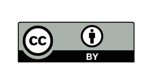

# The PetitCat Project

The PetitCat Project uses open source software combined with open source hardware to enable the Python code of an AI project to interface on a real-time basis via Wi-Fi with lower-level C/C++ compiled code of a robotic embodiment. 
It implements the low-level layers of a Brain-Inspired Cognitive Architecture (BICA) to generate autonomous behaviors.

The project has lower cost software and hardware requirements than robotic projects utilizing more formal frameworks such as ROS2. 
Of more importance, the PetitCat Project readily allows the researcher to customize the project to her/his research requirements, and involves a modest learning curve. 
While the PetitCat Project was initially created to allow symbol grounding, enaction, active inference, predictive coding, and developmental and constructivist learning, it is suitable for a wide range of people, from the student to the serious AI/AGI/BICA researcher.


## Repository architecture

```
.
├── autocat          # The python application
├── docs             # Documentation
├── petitcat_arduino # The arduino application
├── tests            # Test scripts
├── main.py          # Run this program on your PC            
└── README.md        # This file. Read it all!
```

## Getting started

* Clone the projet to your local machine.
* Move file [arduino_secrets.h](docs/first_step/arduino_secrets.h) into folder `peticat_arduino/src/wifi` and specify your wifi parameters in it. 
* Set default value `#define ROBOT_ID 0` or configure your robot's specifics in [Robot_define.h](petitcat_arduino/Robot_define.h).
* Download file [petitcat_arduino.ino](petitcat_arduino/petitcat_arduino.ino) to the robot using the arduino IDE.
* Read the robot's IP address in the arduino IDE terminal.
* Connect your PC to the same wifi as the robot
* Run [test_remote_control_robot.ipynb](tests/test_remote_control_robot.ipynb) or [test_remote_control_robot.py](tests/test_remote_control_robot.py) on your PC to test remote controlling the robot. 
* Configure your arena and the IP address of your robots in [RobotDefine.py](autocat/Robot/RobotDefine.py)
* Run the [main.py](main.py) python application on your PC with the name of your arena and of your robots as arguments. For example: `python -m main chezOlivier 1`


## Documentation 

Test documentation 
* [test_remote_control_robot.md](docs/tests/test_remote_control_robot.md) Helps you test the communication between your PC and your robot.

Full project documentation in English: 
* [The project's wiki](docs/wiki/home.md) Helps you assembly your robot, calibrate it, and run the project.
* [Howard Schneider's full tutorial](docs/overview/Part_1_Easy_to_Read_Overview.md) Step by step explanations for beginners and experienced makers alike. The documentation is intended to give any user a pleasant experience with the project regardless of how seriously they intend to make use of the project.
* [Youtube playlist](https://youtube.com/playlist?list=PLlSPp5EpW5vFb-ZMCr8m0dIOoKEQe9CIE&si=HachYRwgJR8I-BbH) Demonstrations of behaviors. 

Publications
* [Publications](docs/wiki/publications.md)

French additional information:
* [La documentation écrite par les étudiants](docs/first_step/premier_pas.md)

## Related projects

* [Simon Gay's project](https://gaysimon.github.io/robot/robot_navigation_en.html) Simon added a Banana Pi and a binocular camera to study navigation.

## References

Georgeon, O. L., Lurie, D.,  Robertson, P. (2024). 
Artificial enactive inference in three-dimensional world. Cognitive Systems Research, 101234. [doi:10.1016/j.cogsys.2024.101234](https://doi.org/10.1016/j.cogsys.2024.101234).
([PDF](https://hal.science/hal-04587508)).

# License

Copyright 2024 AFPICP and CNRS

Licensed under the Creative Common, CC-BY Version 4.0 (the "License");
you may not use this file except in compliance with the License.
You may obtain a copy of the License at https://creativecommons.org/licenses/by/4.0/ .
Software distributed under the License is distributed on an "AS IS" BASIS,
WITHOUT WARRANTIES OR CONDITIONS OF ANY KIND, either express or implied.




