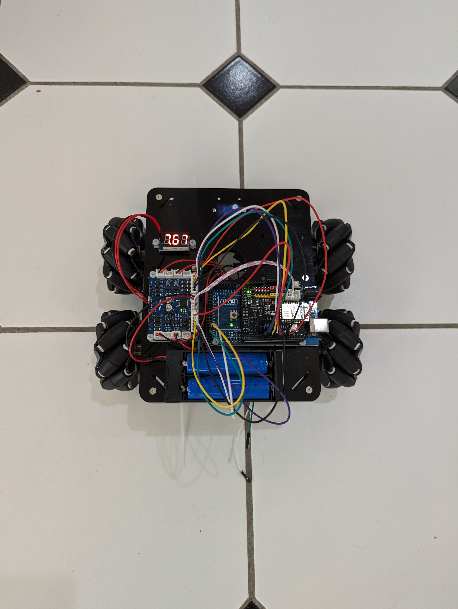
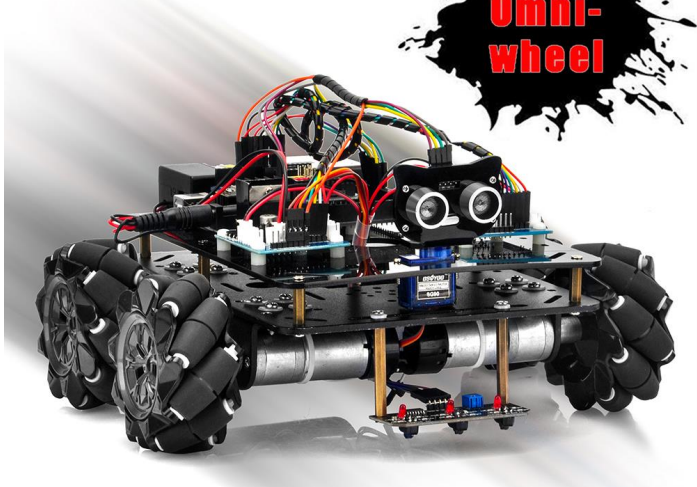
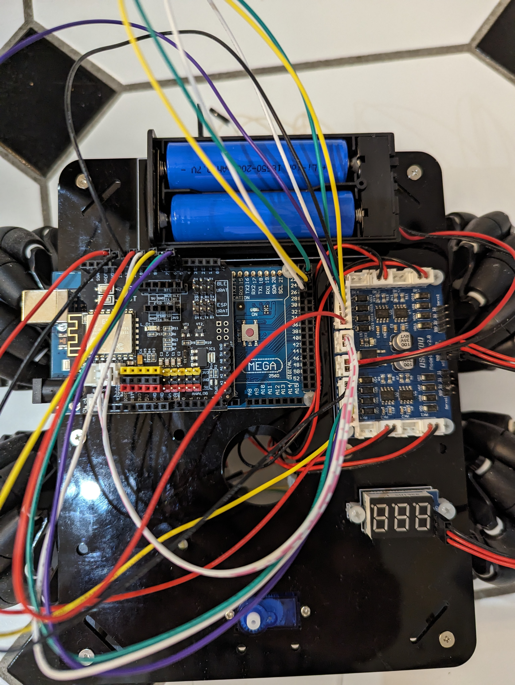
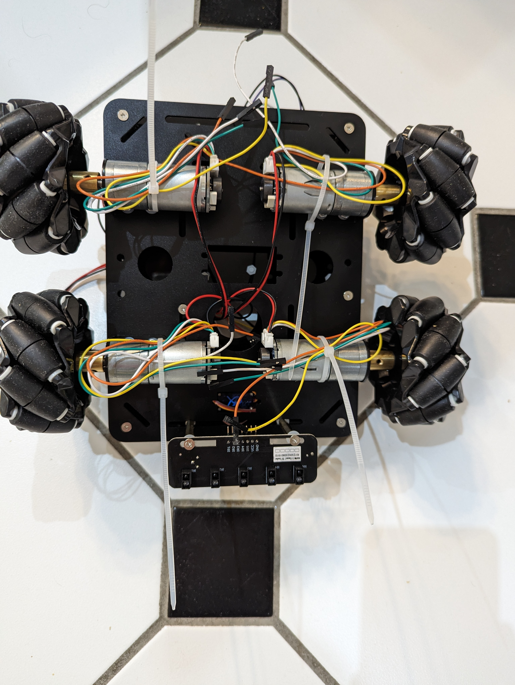
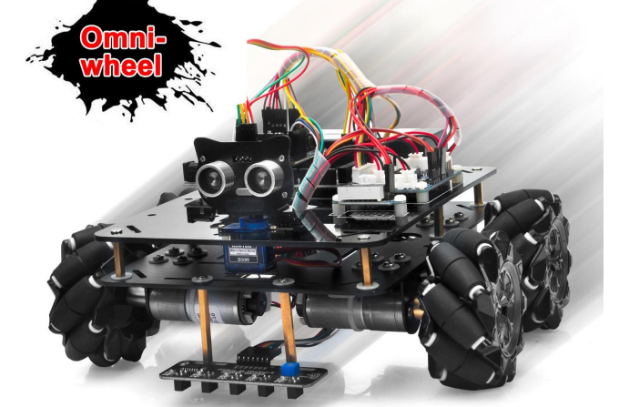
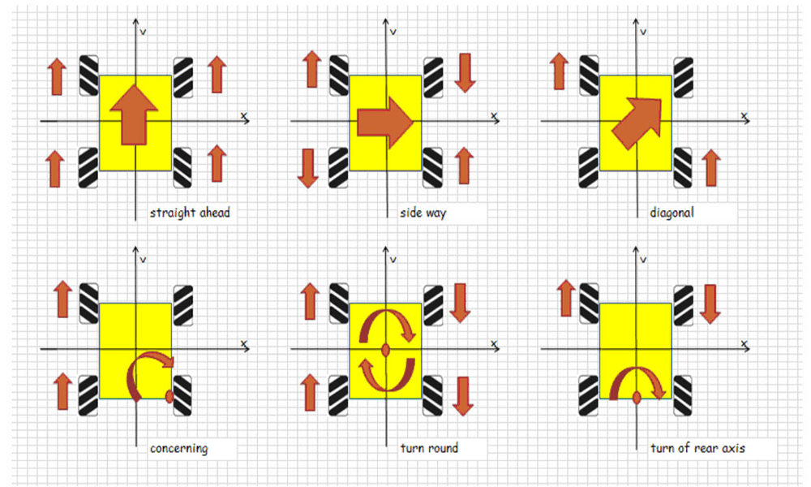
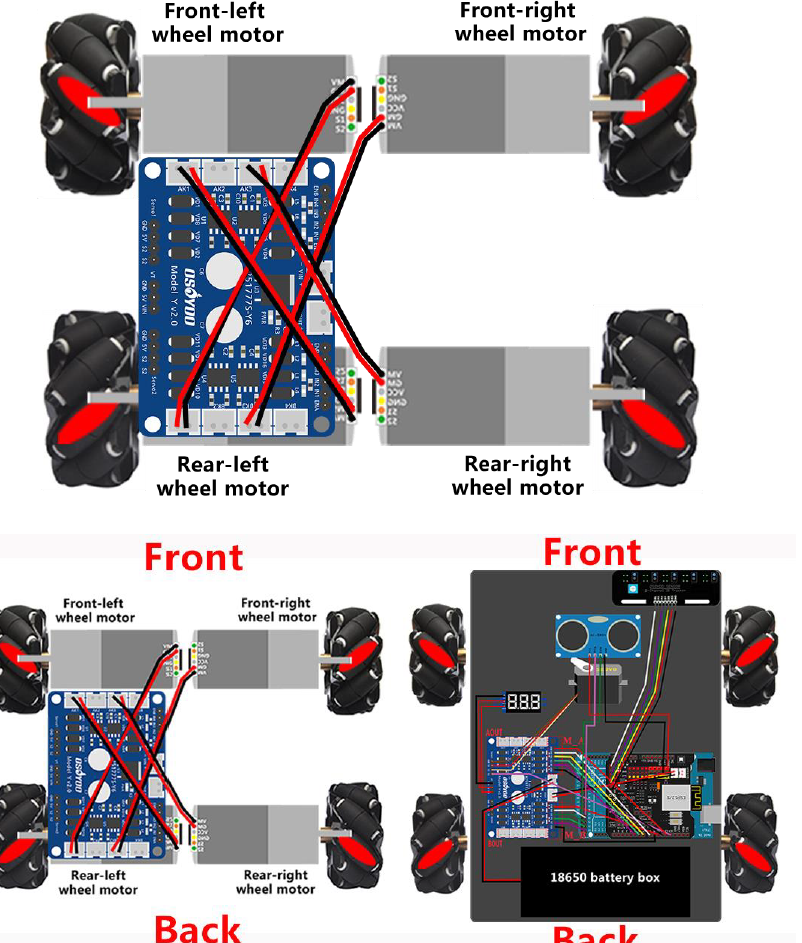

# An Easy-to-Read Overview of the Robot Car Project

Welcome!! Bienvenue!! Tunngasugit!!

(I am in Canada -- these are our official languages -- English, French and a semi-official third (indigenous) language of Inuktitut.)

If you are interested in starting this project, you should read this file first. 

Why? Because it is written from from a first-person viewpoint that tries to answer the big questions of why do this project, how to start, how to implement, and so on. If you think back to learning a new subject in university -- wasn't it better to get tutorial help from a friend who just learned it rather than someone who already knew the subject for twenty years?  That's because the new learner has in his/her brain the steps that need to be overcome, while the experienced person has integrated these steps and may not teach them.
I am that new learner -- trying to figure out how to even start this project. Let me guide you into what I believe you will find will be a very advantageous and satisfying project.

**Why Build a Robot Car?**

Embodiment is crucial to the emergence of real AGI, as well as understanding the operation of the mammalian brain.
For a good overview of the importance of grounding your AI/AGI please consider my paper:
[cca5 inductive analogical soln to grounding problem](https://www.sciencedirect.com/science/article/abs/pii/S1389041722000493?via%3Dihub) [archive preprint](https://github.com/howard8888/insomnia/blob/master/analogical%20inductive%20preprint.pdf)

Even if Tesla Bots, for sake of example, were available, you wouldn't want to use such a complex system for the prototype stages of your AI/AGI project or theoretical project. You want a capable but simple enough robotic system that you have direct access to via Python, which is what this robotic car project allows. You will now have an embodiment to use with your AI/AGI. Even if you work mainly theoretically, the robotic car project can be very useful in terms of demonstrations and proof of concept.

**Step #1 -- Decide if you want to do the Project**

Your first step should be to decide to build this robotic car project. Are you working on an AI/AGI project that it could be useful for? (Actually, it is probably useful for most projects, including LLMs.) Do you have an interest in robotics and would like to see an interface to an AI project?

In terms of monetary cost expect to spend about US$200 on the project (I know the Amazon.com prices are not this high, but shipping to other countries, extra parts from AliExpress, etc will push up the price). 

In terms of your required electronics expertise, very little is needed if everything gets assembled correctly and all parts are working. If you want to modify the design, if there is more advanced troubleshooting, then of course more is better.

In terms of your required software expertise, only a minimal amount is needed to make the robot work. For example, you need to be comfortable moving around files and running Python code. The Arduino IDE and code you can install and copy without great expertise. Of course, if you have the time, you can spend more hours getting more expertise in the Arduino ecosystem. As well, you will need more expertise in Python if you want to use the robot car for your own research project.

**Step #2 -- Purchase the Robot Car kit**

I assume you already have a Windows, Linux or Mac computer to use with this project. I used a Windows PC, and thus I will be describing my experience from a Windows point of view. However, running Arduino and Python code within Linux or Mac environments should be straightforward if that's what you are using.

There are two purchases to consider:
1 - Purchasing the Robot Car Kit

2 - Purchasing the extra electronic parts

In this section we will talk about purchasing the Robot Car kit.
Although I am in Canada, and although the business office representing Osoyoo is actually based in Canada (however the robot kit parts are manufactured in Asia), it is much easier to order from the USA Amazon website:

Product title: OSOYOO Omni-directinal Mecanum Wheels Robotic Car Kit for Arduino Mega2560 Metal Chassis DC Motor DIY STEM Remote Controlled Educational Mechanical DIY Coding for Teens Adult
Product cost (at time of writing):  US$119.99   (plus about $25 to ship to Canada, but free shipping within USA if you have Prime)
link:  [amazon product link](https://www.amazon.com/OSOYOO-Omni-directinal-Controlled-Educational-Mechanical/dp/B0821DV5GJ/ref=sr_1_2?crid=1S643UFKFPI0E&keywords=osoyoo+omni+directional+mecanum+wheels+robot+car+kit+for+arduino&qid=1703129510&sprefix=osoyoo+omni-direction%2Caps%2C97&sr=8-2)

Troubleshooting note:  If you are able to allocate sufficient research funds, I would advise purchasing two kits so troubleshooting any issues with the hardware becomes easier. (Disclosure: I did not. I purchased a single kit with the expectation that I could get efficient Amazon.com delivery of a second kit should I need it.)

**Please purchase this exact model noted above** unless you want to make modifications to the code on your own.

In countries outside of Canada and USA, I would still recommend considering Amazon for easy delivery in certain countries where the Amazon service is efficient. In other countries consider the Osoyoo website:
[osoyoo website](https://osoyoo.com/)

Note: The Amazon website says this is a kit for teens while the Osoyoo website shows 5 years old building robotic kits (albeit simpler ones). Please keep in mind you are not buying this kit to produce a project for your high school science fair. You are buying this kit to have a grounded physical embodiment of an AI/AGI system which you then can use with tens of thousands lines of your Python code.

**Step #3 -- Purchase the extra electronic parts**

You may not need these extra navigation parts immediately, but since they are purchased from AliExpress and generally delivered from China via slow delivery means (given that the sum total of the parts is about US$30), you may want to order these parts once you decide to go ahead with the project.

I will provide the exact AliExpress link I used to purchase these extra navigation components:

[flight control sensor](https://www.aliexpress.com/item/1005003478577853.html?spm=a2g0o.order_detail.order_detail_item.3.1437f19cTglF4n)

[optional hex socket set screws](https://www.aliexpress.com/item/1005003699221015.html?spm=a2g0o.order_detail.order_detail_item.3.edeef19cPldfHc)

[optional board spacers](https://www.aliexpress.com/item/1005004818109229.html?spm=a2g0o.order_detail.order_detail_item.3.7b0cf19cGpkdzc)

[RGB sensor](https://www.aliexpress.com/item/1005003484925759.html?spm=a2g0o.order_detail.order_detail_item.3.4f67f19cQhDc0g)

[optional suspension modification](https://www.aliexpress.com/item/4001179419287.html?spm=a2g0o.order_detail.order_detail_item.4.4793f19cXElsA8)

Troubleshooting note:  If you are able to allocate sufficient research funds, I would advise purchasing two sets of electronic parts so troubleshooting any issues with the hardware becomes easier. (Disclosure: I did not.) 

**Step #4 -- Receiving the Robot Car Kit -- Finding the Documentation**

A few days (or day -- Amazon.com is very efficient) have gone by and a package arrives at your lab, office (or home perhaps). It's the Osoyoo robotic car kit.

Open the box, and make sure that all the parts are there and are in good condition. (Mine were -- everything included and seemed brand new and in good condition.)

There is a cardboard sheet with a list of parts in Japanese -- you can use it and exercise your brain to learn some new symbols (assuming you don't read/write Japanese) and think about Harnad's concepts of symbols and grounding, e.g., [grounding problem](https://www.sciencedirect.com/science/article/abs/pii/S1389041722000493?via%3Dihub)
Or... you can turn the cardboard sheet over and read it in English :)

There is a little manual with the car. However, it really only serves the purpose of telling you to go online and look at the manual(s) there:
[Osoyoo manual](https://osoyoo.com/?p=49235)

Hmm.... what version is my robotic car kit? The manual says there are three versions 1.1, 1.2, 1.3 which are distinguished as follows:

*If you received a black acrylic board and 3-point tracking module, please download the V1.1 manual.*
https://osoyoo.com/manual/V1.1metal-mecanum.pdf

*If you received a transparent acrylic board, please download the V1.2 manual.*
https://osoyoo.com/manual/V1.2metal-mecanum.pdf

*If you received a black acrylic board and 5-point tracking module, please download the V1.3 manual.*
https://osoyoo.com/manual/V1.3metal-mecanum.pdf_*

Well... the picture of the robot on the front of all three manuals is identical, showing a 3-point tracking module.

But, the robot I received has a black acrylic board and 5-point tracking module. As well, the cardboard parts list I received says "M2" which I assume is a Model 2 version.

Ok... let's work backwards from the online manual to the Oyosoo hosting site and let's see if there are other models listed.... yes indeed, there is a Model 2. Thus, I will assume that I have model 2 and thus I will download the M2 manual. Therefore, this overview of the robot car will be from the perspective of the M2 model.

I think this is reasonable as I purchased my kit from Amazon November 2023, and I assume it is already 2024 or later when you the reader are reading this, and most likely you will have a later model as well. Also, it seems that the models and versions are somewhat similar, so my overview should be useful to you regardless of the model that you have. (Look at the version number on your parts list. Also match your robot to the descriptions above. If you have a version 1, i.e., 1.1, 1.2, or 1.3 version robot kit, then download one of the manuals listed agove.)  

For myself and those of you with a Model 2 robot kit (which should be most users in the future, if not a more advanced model) we should download this PDF manual:
 [model 2 PDF manual](https://osoyoo.com/manual/202000600-m2.pdf)

Great -- the robot shown on the cover the manual matches the car I received:

The online version of this manual has a useful parts list which links to the Osoyoo website to buy replacement parts:
[online Model 2.0 manual](https://osoyoo.com/2022/07/05/v2-metal-chassis-mecanum-wheel-robotic-for-arduino-mega2560-introduction-model-2021006600/#4)

**Step #5 -- Overview of the Parts and of the Documentation** 

Ok... at this point you've downloaded the correct PDF manual for your robot car kit.
Again, as noted above --I am using the Model 2 manual in my overview of the robot car:  [model 2 PDF manual](https://osoyoo.com/manual/202000600-m2.pdf)

Before we start constructing the robot car, let's take a look at some of the parts and then quickly do an overview of the documentation. 

There is a metal bottom chassis where the drive motors will be attached.  (Note that the straps are still loose until the assembly is completed and wires are tucked away.) When assembled it will look like this:

Note that there is a separate drive motor for each of the four wheels. Note also there there is no steering apparatus. This is because these are Ilon Mecanum wheels  (or "omni wheels") that can go forwards and backwards, but also sideways. Note that the wheels are constructed of rollers at an angle of 45 degrees to the axis of rotation.

On top of this metal bottom plate there will be a top acrylic plate. The electronics will all be mounted on this top acrylic plate.

With regard to the electronics, note that there are three main electronics boards included. One of them is the motor driver board -- this board will control the motors attached to each wheel. Then there is the Mega2560 Arduino board. If you have not worked with Arduino before I will show you all the steps involved -- very easy. The Arduino board is the computer board essentially controlling the robotic car. Into the Arduino board there is a Wifi shield (Esp8266) which will give the system Wifi access. There is a USB cable which plugs into the Arduino board and forms an easy to use interface with your laptop enabling you later to send your software to the Arduino board.

There are some smaller electronics boards also, e.g., Bluetooth module, tracking sensor module, etc. We will discuss them as we use them.

When assembled the acrylic board on the top of the robot car will look like this:

Note the blue lithium batteries. In the kit parts there should be a battery charger along with its USB cable which can charge these batteries.

Before we start building the robot car, let's have a quick look at the documentation (always a good idea no matter what project you are working on).

The PDF Model M2.0 documentation is divided into five "lessons." 

Lesson 1 -- Assembly of the mechanical parts and the electronic parts, and installing the Arduino IDE -- at this point you will have a functioning robot car that you can try out with the self test Arduino code that comes with the robot car.

Lesson 2 -- Use of the ultrasonic and servomechanism modules to avoid objects -- you can see the sensors mounted on the servo in the cover image. (I have not yet mounted these sensors.)

Lesson 3 -- Use of the 5-point tracking sensor to follow a black track line -- you can see these sensors in the cover image as well as in the underside photo of my assembled robot car.

Lesson 4 -- Bluetooth interface to the robot car -- this board has not been installed in the Wifi shield yet but will allow Bluetooth interfacing.

Lesson 5 -- Wifi interface to the robot car -- the Wifi shield has already been installed in photo showing the electronics of my assembled robot car.

**Step #6 -- Assembly of Parts on the Underside of the Chassis** 

-Follow the instruction manual to bolt into place the motor holders. The install the jackscrews and couplings on the motors, and install the motors as shown in the manual. There are nylon tie wraps to hold the extra wires. Note that these motors (one for each wheel) have hall sensors (the white, yellow, orange, green lines) but they are apparently not being used and are just tucked away. Only the ground black and power red wires will go to the electronics through the center hole in the chassis.

-Pay attention when you are installing the Mecanum wheels -- follow the orientation shown in the manual.

-Then install the tracking sensor (which should be a 5-point one in the Model 2) to the chassis as shown.

Assembled chassis (Note that the straps are still loose until the assembly is completed and wires are tucked away.) When assembled it will look like this:

**Step #7 -- Assembly of Electronic Parts on the Acrylic Board above the chassis** 

-Follow the instruction manual to prepare the acrylic board and then instll the electronic modules as shown.

-To avoid static damage to the electronic components I would strongly advise doing these steps near a sink. Hold onto one of the water pipes to ground yourself and then you can do an operation. Then ground yourself again with each operation. It's ok to let go of the water pipe when you insert the electronics -- if you're not walking around it's unlikely you'll build up much static in a few seconds.

-Follow the manual very carefully to orientate the electronic modules as shown.

-Then follow the manual and insert the wires connecting the motors to the motor control board.

