# Part II: An Easy-to-Read Overview of the Robot Car ("PetitCat") Project: Modifying for Python Control

##

Initial draft Feb 15, 2024 

(This is a public document that can be modified by others who have access -- if anything doesn't make sense, please ignore. A year from now, for example, I may not be aware of the full contents of this document any longer or what is still current.) 
(No use of high voltage or anything dangerous is specified in this document.) (One demonstration involves flashing an LED light at high speed -- seizure warnings are given and an alternative demonstration is given for sensitive individuals.)
(Any illustrations are my own, generated by OpenAI GPT4, or taken from open technical sites. Reproduction is limited for "fair use" or else not allowed if prohibited by law.)

(Questions, corrections, suggestions? -- please contact me via my GitHub link.
Howard Schneider -- Feb 15, 2024)
##
-
-
-
-

The PetitCat Project
-
- (generated by Open AI GPT4/DALL-E which unfortunately could not correct the spelling despite ten regenerations where it was asked to spell it "PetitCat")
-
-

Welcome!! Bienvenue!! Tunngasugit!!

(I am in Canada -- these are our official languages -- English, French and a semi-official third (indigenous) language of Inuktitut.)

You have already built your Osoyoo Robot Car and learned how to modify and upload its software (well.... at least you learned how to change some parameters). 

If you have not done Part I, i.e., building and using the Osoyoo Robot Car then please read the document "An Easy to Read Overview of the Robot Car Project: The Basics" 

This is the "Part I":

https://github.com/OlivierGeorgeon/osoyoo/blob/master/docs/Easy_to_Read_Overview.md

In this second part (i.e., "Part II") to our adventure, we will now turn the toy-like robot car into a serious Python controlled autonomous robot.

In the following part (i.e., "Part III"), we will then use our Python-controlled robot car for AI/Cognitive Science experiments and demonstrations.

Saddle up!! Let's get going on the most exciting part of our journey....

-
-

**Step #1 -- The Big Picture: The PetitCat Project**

Ok.... you are in the saddle, riding high on your horse. Now it's time to survey the landscape before moving on....

As noted above, in Part I you already built your Osoyoo Robot Car. You learned how to use the Arduino IDE to upload software to the robot car, and how to control the car from your cellphone via the Wi-Fi in your house or workplace. You also learned a little bit about the software running on the Arduino and how to modify some of the parameters in the Arduino code.

In this Part II you will learn how to transform your Osoyoo Robot Car into a robot car which any of your Python programs will be able to control and communicate with. We call this project the "PetitCat" project or the "Robot Car" project or the "Osoyoo Robot Car" project -- they all mean the same thing and may be used at different places in the documentation. 

(In the following Part III you will then learn how to use your Python-controlled robot car for AI/Cognitive Science experiments and demonstrations.)

In this Step #1 of Part II we will consider the big picture, i.e., what are the basic components behind this PetitCat project (i.e., Python-program connected robot car project). In the subsequent steps of this Part II, we will implement the details, and get the robot car controlled and communicating with your Python programs.

The PetitCat Project is an open-source project based on the work of Prof Olivier Georgeon and his colleagues and students at UCLY Lyon Catholic University. 

The big picture (i.e., overview) of the project is: The Python module PetitCat.py (or test_remote_control_robot.py -- see below about redundant nomenclature) running as a Python module as part of your Python program on your desktop/laptop communicates via Wi-Fi to the robot car. The Arduino program PetitCat.ino compiled to Arduino code running on the Arduino board on the robot car communicates via Wi-Fi with PetitCat.py (or "PetitCatMain.py" depending on nomenclature used). 

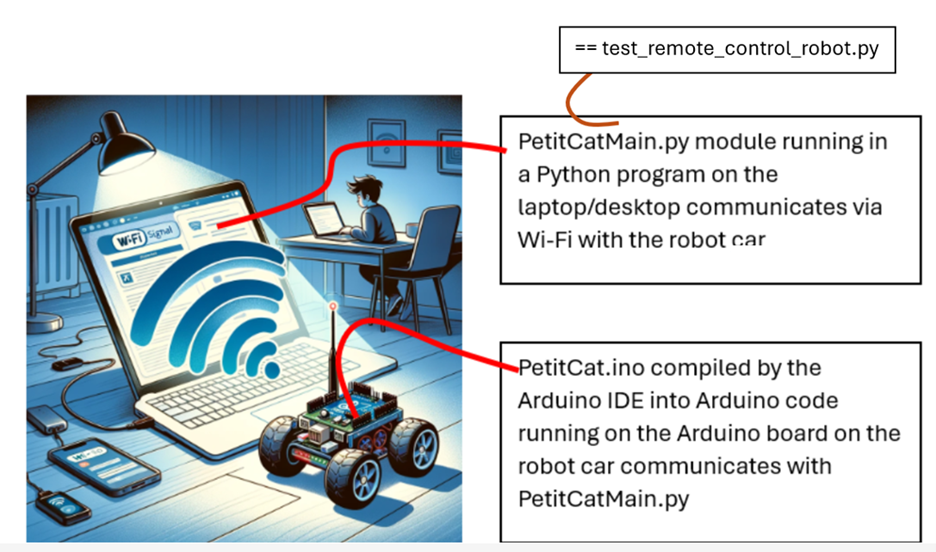

Nomenclature

As this project evolves, names used to describe various parts of the project may change, although they will describe the same piece of code or the same folder of code, etc.

Let's review the nomenclature of the project, i.e., the names referring to different parts of the project.

-Overall project:

The "PetitCat" project == the "Robot Car" project == the "Osoyoo Robot Car" project 

-GibHub folder for project:   https://github.com/OlivierGeorgeon/osoyoo

-Python main file:

PetitCat.py == PetitCaMain.py == PetitCatTester.py == test_remote_control_robot.py

-GitHub folder for Python files: /osoyoo/tests/

https://github.com/OlivierGeorgeon/osoyoo/tree/master/tests

---> Go to this GitHub folder. If you click open PetitCat.py == PetitCaMain.py == PetitCatTester.py == test_remote_control_robot.py you see the standard library files PYthon will import automatically. 

-Arduino board main file:

PetitCat.ino == autocat_enacter.ino == petitcat_arduino.ino

-GitHub folder for Arduino files:

/osoyoo/petitcat_arduino/

https://github.com/OlivierGeorgeon/osoyoo/blob/master/petitcat_arduino/petitcat_arduino.ino

---> Go to this GitHub folder. You will see that in addition to the main code PetitCat.ino == autocat_enacter.ino there are a good number of header .h and code .cpp files. All these will need to be cloned and copied into the IDE later. 

-
-
-
-

**Step #2 -- Using your House/Workplace Wi-Fi to Communicate with the Robot Car**

In Part I in one of the last Steps we created a Wi-Fi server ("hotspot") out of the Arduino board's Wi-Fi shield, and we logged our smartphone into this Wi-Fi server ("hotspot"). Then we used an app on our phone to control the robot car via a Wi-Fi linkage between the two.

In this new step we make the robot car act as an ordinary device on our home/workplace LAN (local area network). This is just a tiny bit more complicated (actually, really not.... if your Wi-Fi does not have strange security layers it should work well) than before, but more useful. Indeed, in Part II for communication of the robot car with our Python program, we will want every device (i.e, the Arduino board Wi-Fi and the desktop/laptop Wi-Fi ) to log into the same LAN (local area network).

In this Step #2 we will not be doing any programming of our own, but use the software already prepared by Osoyoo.

Before you start this step you need to find out the following information about the Wi-Fi in your house/workplace:

-SSID -- this is the name of your network, e.g., if the name of the network you log into is "Jones" then your SSID is "Jones".

-Pasword -- this is your password you use to log into your network, e.g., if the password to log into your Wi-Fi is "test1234" then your password is "test1234".

Go to Lesson 5 in the Osoyoo Manual.

---Hardware Installation--

The Wi-Fi shield was installed into the Arduino board above when the robotic car was first built. Thus, there should not be anything for you to do with regard to hardware installation.

--Wiring Installation--

Similarly, we already made the wiring changes in the Step in Part I when we tried out the Wi-Fi board. Thus, there should not be anything for you do now with regard to wiring.

Previously (should already be done) wiring changes to make:

-Remove the connections from the Wi-Fi B_TX and B_RX.

-Now connect D18 and D19 to E_RX and E_TX on the Wi-Fi board.

(Note. In the picture below the orange wire actually is going to E_TX and then the male-male hacked connection and then to D19, and similarly the yellow wire is going to E_RX and then to D18 via the other male-to-male hacked connection, which is a reveral of the yellow and orange in the schematic diagram, i.e., colors are reversed, but the wiring is the same.)

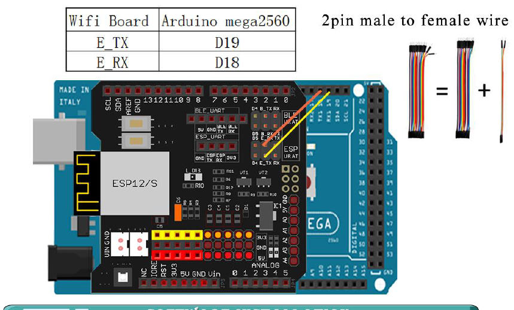

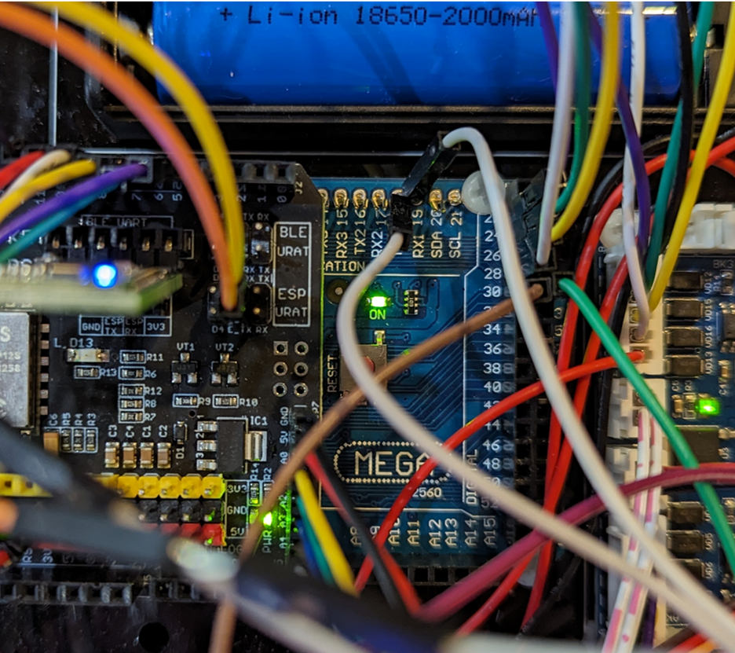

--Software Installation--

--Library Software--

We already added this library software in the Step in Part I when we tried out the Wi-Fi board. Thus, there should not be anything for you do now with regard to loading library software.

In case you did not do this or the Arduino IDE was re-installed:

In this step there is now an extra requirement to download and update an Arduino library zip file.

-download the library zip file from the link provided in the Osoyoo Manual Lesson 5 
(In the Manual version I was using the link went to:  http://osoyoo.com/driver/mecanum_metal_chassis/for_mega2560/WiFiEsp-master.zip )
A folder WiFiEsp-master.zip will download

-virus scan the file always after downloading and before clicking or using

-Open up the Arduino IDE (similar to above in earlier steps) but this time click Sketch, Library, Add ZIP Library, select WiFiEsp-master.zip

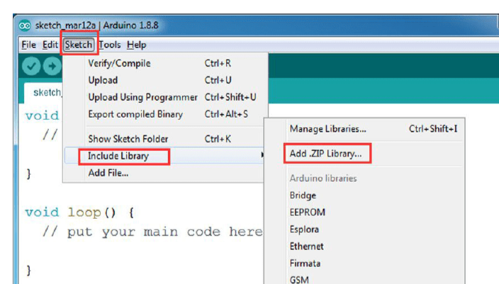
Lesson5b Arduino code being compiled and uploaded to the robot car -- with this new code the robot car's Wi-Fi board will log onto your house/workplace Wi-Fi

--Wi-Fi Software--

Just like the other Steps in Part I (i.e., "Lessons" in the Osoyoo manual) there is demo software that will work with the Wi-Fi shield in your robotic car. We will use Osoyoo software for this Step. (However, later for controlling the robot car from our Python program we will be using our own created software, not Osoyoo's software.)

-The link shown in the manual works fine -- you will download a folder containing m2-lesson5.ino which will work with the Arduino development environment (IDE). The manual also shows you what some of the Arduino IDE screens will look like.

-Unlike the other lessons, in this lesson there is a lesson5a and a lesson5b software demos.  In the lesson5a demo the Wi-Fi board on the robot car becomes the Wi-Fi access point ("hotspot" is the term used by the Osoyoo manual) and your cellphone becomes the client. We already did this in one the Steps towards the end of Part I.

In the lesson5b demo the Wi-Fi board on the robot car becomes a node (i.e., a client) in the LAN where the robot car is operating -- we will specify the LAN's router's Wi-Fi SSID and password to the robot car, but still end up using the cellphone app to control the car. ---> WE WILL TRY OUT LESSON5B DEMO SOFTWARE NOW.  

-Ok... when you unzip folder m2-lesson5 folder, you will see the folder m2-lesson5b

-Always virus scan files when you download them and when you extract them.

-Then open the Arduino IDE exactly as described in Part I. As well, the manual shows several screens of the Arduino IDE. Make sure your Arduino IDE is configured exactly like before (i.e., correct Arduino board is specified).

-Click 'Open' and load in m2-lesson5b.ino

-Then attach the USB cable to the Arduino board connector on the robot car, exactly like you did in Part I Steps when we uploaded software to the car's Arduino board. (The power on your robot car should be turned off -- the cable will supply power to the Arduino board. )

--> YOU NEED TO MODIFY THIS SOFTWARE

You now need to tell the software what your Wi-Fi SSID and password are.

For example, if the name of the network you log into is "Jones" then your SSID is "Jones" and if the password to log into your Wi-Fi is "test1234" then your password is "test1234".

--> Look at lines 180 and 181 (or equivalent lines if the software has changed since the time of this writing).  Modify the lines as follows:

char ssid[] = "Jones"

char pass[] = "test1234"

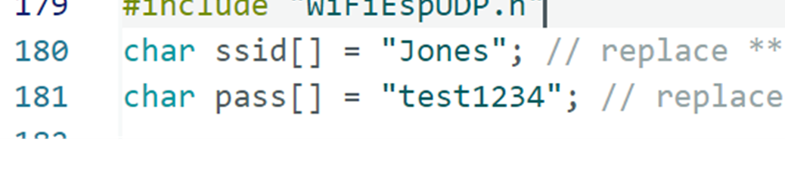

-Now click the upload arrow (green arrow inside a circle at the top left corner).

-The software in m2-lesson5b.ino (modified with your Wi-Fi SSID and password) will now be uploaded to the Arduino board in your robotic car.

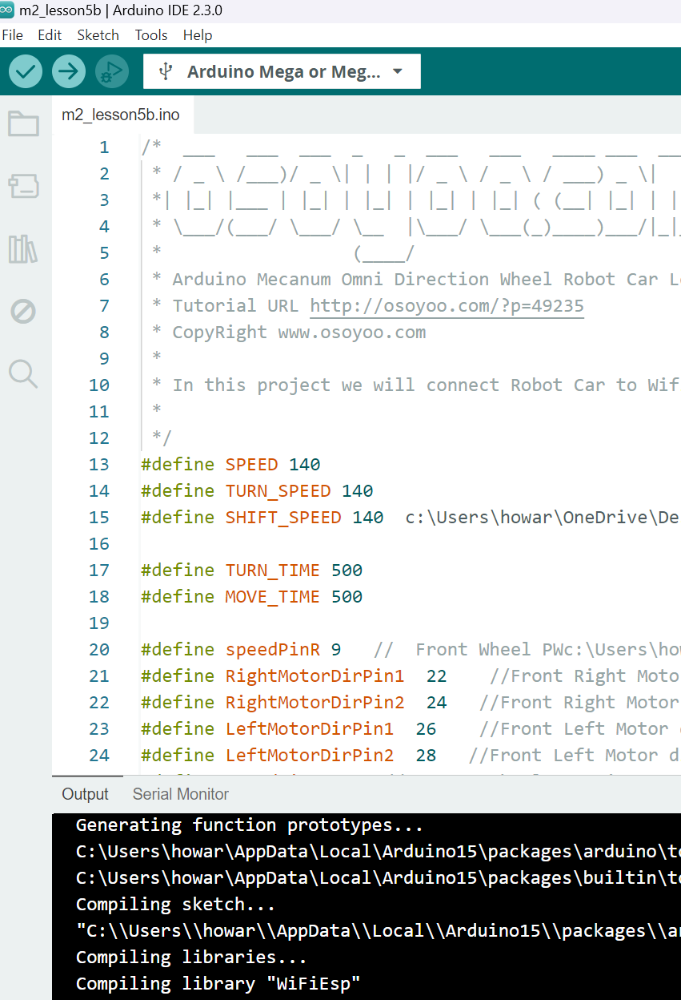

-Now open the Serial Monitor on the Arduino IDE. You will see something like this written:

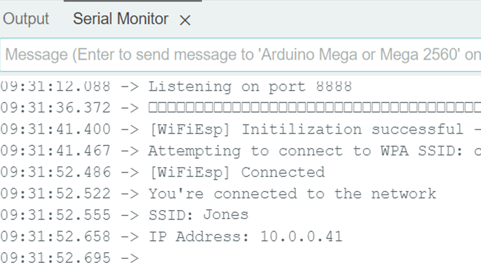

Wite down the IP address you, in this example, it would be "10.0.0.41" -- you will need this address for the App running on your smartphone -- it will tell the App where the robot car is connected.

--Phone APP software--

We already add the phone app software in the Step in Part I when we tried out the Wi-Fi board. Thus, there should not be anything for you do now with regard to installing new app's on your smartphone. However, you will have to change the settings, as shown below. IMPORTANT: You must change the settings in the smartphone App since the robot car is no longer a hotspot but is logged onto your home/workplace Wi-Fi now.

In case you did not do this or you un-installed the app from your phone:

-If you have an Apple phone then you will go to the Apple Store

-However, since I have an Android phone (Pixel 7) I will go to the Google Play store

-The Osoyoo Manual Lesson 5 advises to search "Osoyoo Wifi UDP Robot Car Controller"

-Unfortunately when I do this search (Feb 9, 2024) the only app that appears in the Google Play store is "Osoyoo IoT UDP Robot APP" -- well, better than nothing, and maybe it will do the same thing.... so this app is installed on my Android cellphone

---> Your smartphone App is installed. (Whether it is called "Osoyoo Wifi UDP Robot Car Controller" or "Osoyoo IoT UDP Robot APP").

Now we have to go to the settings section of the phone App.

-Ok we open the Osoyoo IoT UDP Robot APP

-Then go to Settings and enter the IP address we saw in the Serial Monitor. In this example, we would enter "10.0.0.41" (you will enter, of course, the IP address your Serial Monitor showed you -- this is the address the robot car is using).

-You can leave the other settings such as the default Ports unchanged

Your smartphone App should now be able to control your robot car. Let's try it out.

-Ok...now go to the main page of the app.

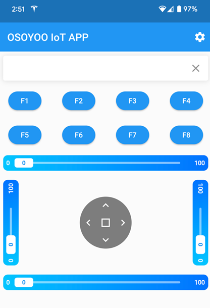

-Ok... turn on the robot car

-Now, let's click a button on the app.... go forward

The car goes forward.

Click backwards, left and right.

They all work .... we can control the robot car via Wi-F i -- this time with both the robot car and cellphone attached to the same house/workplace Wi-Fi router.

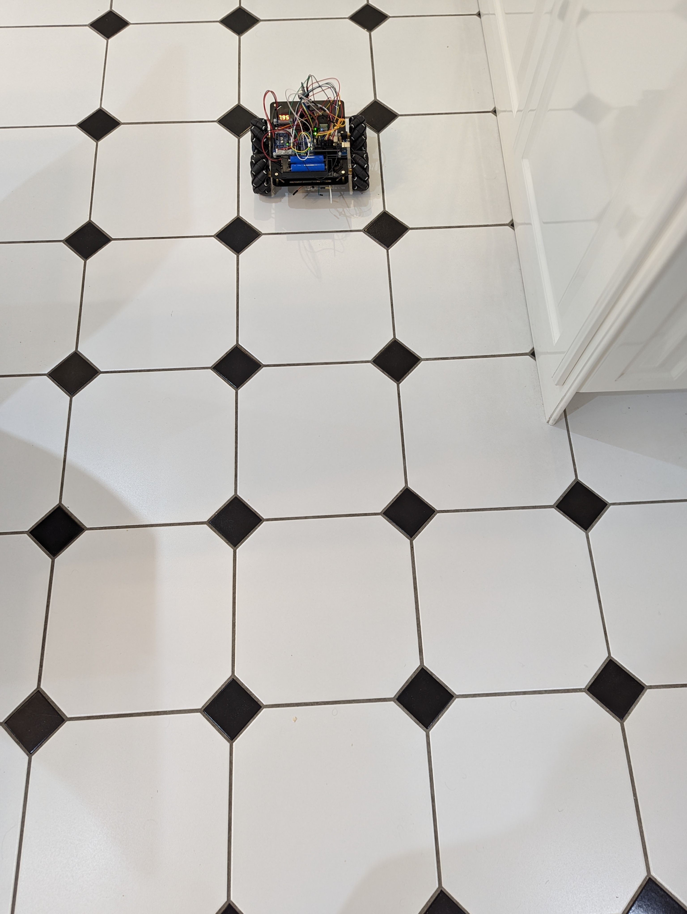

Success :)  

Celebrate.... because we will be moving onto more technical details in a few moments.....

For a moment, you can pretend you just created a great new robot to be used on the Star Ship Enterprise (NCC-1701-D, of course). Picard is most pleased with your genius, and invites you for a cup of tea, Earl Grey, of course. 

-
-
-
-

**Step #3 --Getting More Experience with the Arduino IDE -- The Library Manager**

In this Step we will learn how to use the Arduino IDE library manager, and we will then install some of the Arduino libraries that our PetitCat project code will later need to use.

An Arduino library is essentially C++ code consisting of various C++ classes and functions that perform some related function. For example, a Wi-Fi library would provide functionality with regard to sending and receiving information via Wi-Fi. For example, a JSON library would provide functionality with regard to JSON operations. (JSON is a popular data format which simply consists of (key:value) pairs. However, the key-value pairs can be nested and structured and held in arrays. Although verbose, it is human readable.) For example, a JSON library would help with parsing JSON data, generating JSON data and processing JSON data.

--Installing Libraries from within the Arduino IDE Ecosystem--

Your Arduino IDE should still be on from the previous step. (If not, open up the Arduino IDE.)

If you go to Tools you can click "Manage Libraries..."  or you can just click the icon on the left column of the page where you see a bunch of library books.

The "Library Manager" will now appear in a column to the left of the code.

You can use the Library Manager to add and remove libraries from your Arduino projects.

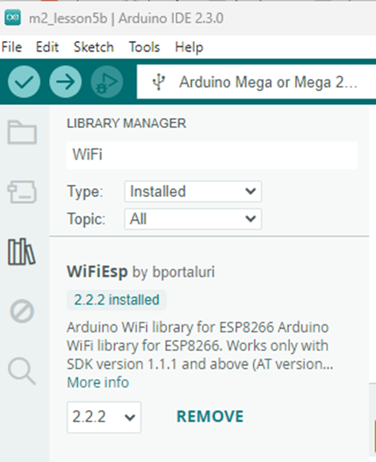

You already installed in Part I (when we were getting the robot car to communicate via Wi-Fi and act as its own hotspot server) the library WiFiESP. You can see in the illustration above that this library is already installed in your Arduino IDE.  (If it is not, then please install it along with the other librares we will install below.)

We want to install a JSON library also. Search for JSON (or you can go through all the libraries available, although that takes a good amount of time). Choose "Arduino_JSON by Arduino" and click to install it.

Do the same for the "Adafruit TCS34725 by Adafruit" library, and click to install it. There will be a question about dependencies -- generally you should respond 'Yes' since the libary may need some of these dependencies at some point in order to function. (This library will be used later for an additional color sensor we will be attaching to the robot car.)

Thus at this point when you search for Installed libraries you should see this on the Library Manager:

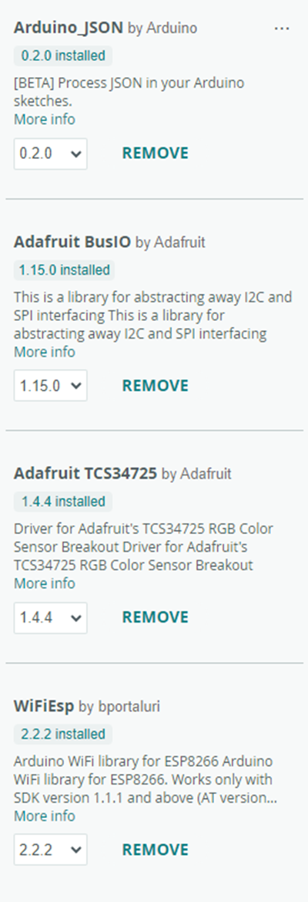

--Manually Installing Third-Party Libraries --

There is another library you must install -- the HLC5883L compass function library. (The HMC5883L is a three-axis (x,y,z) digital compass/magnetometer module that is installed and used later as part of the project. It is based on orthogonally situated magnetoresistive sensors. It provides raw data related to measured magnetic fields and does not adjust the outputs for variations in the Earth's magnetic field required for more accurate navigation. By the 1800's ships housed the ship's compass in a binnacle which contained soft iron spheres or sometimes actual magnets to help counteract the ship's magnetic fields -- something you can see if you ever look at old ships or visit museums. In modern ships there is GPS correction of the compass to deal with the deviations in the field in different locations on Earth.)

Go to the GitHub repository Arduino-HMC5883L

https://github.com/jarzebski/Arduino-HMC5883L

Save the repository as a zip file.  (If you are not sure how to do this, see a few paragraphs below where I show you step-by-step how to clone the GitHub repository onto your computer, make it a zip file and then include it as a new library.)

On the Arduino IDE click 'Sketch' and then 'Include Library' then 'ADD Zip Library'. Then select the zip file for the repository. This will get stored as a new library in your IDE.

There is still another library you must install -- the MPU6050 inertial measurement unit (IMU) library. (We will later add an IMU hardware board to the project.) 

(The MPU-6050 uses MEMS (microelectromechanical system) integrated circuit fabrication technology to create a 3-axis (x,y,z) gyroscope and accelerometer in a single chip. The gyroscope measures the rotational velocity which allows navigation information with regard to spins and orientation. The accelerometer measures accelerations along the orthogonal axes. By mathematically integrating the accelerations they can be converted to velocity and by further integration they can be converted to change in position. Keep in mind the accelerometer will measure the acceleration due to gravity, and it is necessary to distinguish between accelerations measured due to gravity from accelerations due to movement of the robot car.)

Go to the GitHub repository Arduino-MPU6050

https://github.com/jarzebski/Arduino-MPU6050

You need to copy this repository into a zip file.

Here is a quick way.

Make sure you have Git installed on your computer. 

https://git-scm.com/downloads

(Git is a version control system, i.e., tracks changes being made to the source code as software is developed. In the early days of software development, people would have to back up this and that part of their programs, either manually or via simple batch files. It often became quite complicated to keep track what changes were backed up and where, in order to recover, for example, software to an earlier version if there were some issues with the current version. Then automated version control systems started to appear. Git is a distributed version control system (each developer actually has a complete copy of the repository and all the software changes made to the code in it, and thus a software developer can work offline without immediate access to some central computer server holding the code). Git was created by Linus Torvalds (famous as being the creator and lead developer of the Linux operating system) for developers to use while working on pieces of the Linux system, and became a standard software tool used in the industry. Git allows easy branching and merging of pieces of the software with automatic documentation of who committed what pieces of software.)

At the command line (e.g., Windows in my case) write: 

>git clone https://github.com/jarzebski/Arduino-MPU6050

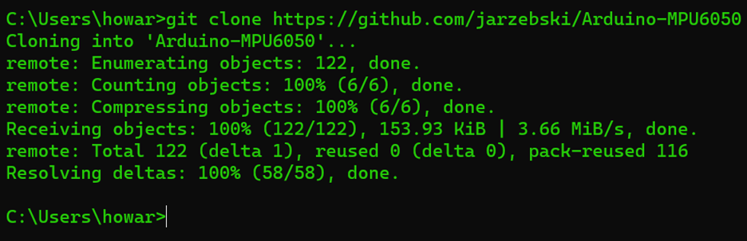

You will now see on your computer (Windows PC in my case) a folder with the repository copied.

Now use WinZip or an equivalent zip tool to zip the folder. In my case I ended up with the file "Arduino-MPU6050.zip"

As mentioned above, on the Arduino IDE click 'Sketch' and then 'Include Library' then 'ADD Zip Library'. Then select the zip file for the repository which will be "Arduino-MPU6050.zip". This will get stored as a new library in your IDE.

--See What Libraries Have Been Installed--

If you click Sketch, Include Libraries, you will see at the bottom of the menu a list of "Contributed Libraries':

Adafruit BusIO

Adafruit TCS34725

Arduino JSON

Aduino-HMC5883L

Arduino-MPU6050

Wifi-Esp

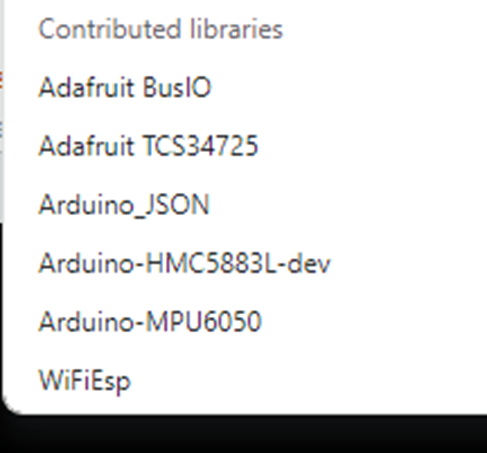

At the time of this writing the project is specified to use these libraries:

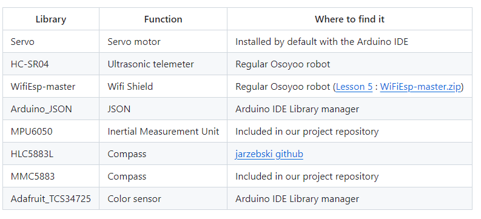

-
-
-
-

In Step 4, we describe experiments where there is a relatively fast flashing light. There is a risk in sensitive individuals of triggering seizures (as well as migraines). If this applies to you or you have any risk towards seizures, do NOT flash the light at high speed -- instructions are given below for flashing the LED at a much lower rate. (Triggering seizures in photosensitive individuals is increased by exposure to a frequency of 5 to 30 Hertz (it can still occur at 40 Hertz), bright lights, high contrast, and the duration of exposure. A frequency of 0.125 Hertz (one gentle turn on of the LED every 8 seconds) in a well-lit room is used in the alternative demonstration.)

WARNING: This is written for an intended target audience of educated researchers in cognitive science and artificial intelligence, who might be interested in a theoretical aspect of approaching cognition as a means to help them learn new coding/system details. It is not written as a do-it-yourself therapeutic project and it is not written for those not educated in the field. 

-

**Step #4 --Simple C/C++ Coding and (Possibly) Preventing Dementia**

No, this section title is not a typo. Keep reading, and see how with acquiring very simple C/C++ knowledge (which most readers probably already have) one could possibly prevent or delay Alzheimer's (and possibly other types of) dementia with the robot car. (CAUTION: We will only do this theoretically as part of learning some new coding. We will NOT build anything therapeutic or anything to be used seriously.)

As we discussed in Part I, the Arduino IDE uses a C++ compiler (the GNU GCC toolchain for the particular microcontroller being used) -- it compiles C and C++ code. Thus, Arduino programs are really C/C++ code.

Learning to code in C and C++ is beyond the scope of this tutorial, and in any case most readers probably already have some experience in this area. However, this and the next Step (or two.... pending editing of how much material to include) is just to make sure that readers with limited experience in C/C++  feel a bit more comfortable with the code (as well as some idiosyncracies about Arduino program structure). 

C is the original procedural C programming language. C++ is a more modern object-oriented programming language with a richer set of features (particularly in memory management) and in its standard library. We will not be distinguishing between the two in this and the next Steps since the compiler will compile both sets of code. (C# is similar to C++. It was created by Microsoft in the late 1990s and originally developed for Windows platforms and Microsoft's .NET ecosystem, although it can now run on macOS and Linux. We will not be discussing it here.)

On a technical note, the Arduino IDE looks at what type of board you are trying to run your Sketch (i.e., '.ino' file) (which is really C/C++ code) on. If an AVR microcontroller board is chosen (Arduino Uno, Mega or Nano board) then the AVR GCC compiler is used. If the microcontroller board is based on an ARM microcontroller (e.g., the Arduino Duet) then it uses the ARM version of the GCC compiler, and so on. In the case of an AVR microcontroller (such as the board which is used by the robot car of this project, at the time of this writing) the following compiler toolchain components (or within actual GCC components) are used:
- Preprocessor prepares the code for compilation (e.g., includes libraries, considers compilation directives, etc)
- Compiler AVR-GCC converts the preprocessed source code into assembly language for the target AVR microcontroller
- Assembler AVR-AS converts the assembly language code into machine code object files -- occurs for each source file in a project
- Linker AVR-LD links the object files from the different Sketch files, libariers and the Arduino core code, into a single executable file, ensuring the machine code will correctly map to the AVR microcontroller's memory spaces, producing an ELF (executable and linkable format) file
- AVR-OBJCOPY then converts the ELF file into a HEX file which is a text representation of the binary data which will be loaded into the Arduino microcontroller's flash memory
- Uploader tool AVRDUDE then transfers the HEX file to the microcontroller's flash memory by communicating with the bootloader on the Arduino AVR-microcontroller board

In the Arduino IDE, when 'Upload' is clicked in the IDE then above sequence of compile and upload steps occur.

The Arduino CLI (available as a download from the Arduino website) allows compiling and uploading Arduino code at the command line, without the use of the IDE. Or, the usage of the above individual tools can be used at the commmand line, e.g., avr-gcc to compile and link files, avr-objcopy to convert to a HEX listing, and avrdude to upload the HEX file to the Arduino AVR-based microcontroller board. However, here we only consider the usage of the Arduino IDE to compile and upload code to the robot car's Arduino board.

For readers with no background in C/C++ consider the many excellent and free (or some at small fees) courses and tutorials available online. However, the tutorial in this and the next Step(s) will give you some exposure to C/C++ in particular for the Arduino projects.

You do not need to be able to code in C/C++. The purpose of the PetitCat project is to construct an interface that will allow your thousands of lines of Python code to communicate with the robot car, and then use this ability for various cognitive science/AI experiments and demonstrations. However, given that the robot car is powered by C/C++ code, understanding a tiny bit about C/C++ can be helpful in understanding how we make the robot car communicate with the Python programs.

Ok... above it was written "....Keep reading, and see how with acquiring very simple C/C++ knowledge you can possibly prevent or delay Alzheimer's (and possibly other types of) dementia with the robot car."  You may be thinking, 'Was this just clickbait to keep me reading your boring paragraphs?'  Well.... no :)  Ok.... so then you may think, 'Are you going to write now that by using my brain to learn something new (like the material in your boring paragraphs above and learning some C/C++ coding below) that will prevent or delay dementia and my brain will stay extra healthy?'  Well... maybe. Any intellectual stimulation is good for the brain and lots of studies indicate it may indeed keep the brain much healthier throughout the lifetime. But, no... it's not this. We will really build a more definitive prevention of Alzheimer's (possibly -- research is still lacking -- read the cautions below -- this is just for fun, not for real medical use!!) with our robot car project.

Synchronous acitivity of large groups of neurons generate oscillatory electrical signals which can be measured on the scalp of the head (EEG). It is believed that the synchronous activity of neurons allows different parts of the brain to communicate with each other. (Although.... if you want to consider a more nuanced look at the subject, consider reading- Schneider, H. (2022). Causal cognitive architecture 3: a solution to the binding problem. Cognitive Systems Research, 72, 88-115.) In dementias we see pertubation of the EEG rhythms believed to be needed for cognition. A number of studies have shown that stimulation in the 40-Hz "gamma" EEG range of oscillations can improve Alzheimer's Disease symptoms in mouse models of the disease (Chan, D., Suk, H. J., Jackson, B., Milman, N. P., Stark, D., Beach, S. D., & Tsai, L. H. (2021). Induction of specific brain oscillations may restore neural circuits and be used for the treatment of Alzheimer's disease. Journal of Internal Medicine, 290(5), 993-1009.) A study on humans also showed similar results (e.g., Chan, D., Suk, H. J., Jackson, B. L., Milman, N. P., Stark, D., Klerman, E. B., ... & Tsai, L. H. (2021). Gamma frequency sensory stimulation in probable mild Alzheimer’s dementia patients: results of a preliminary clinical trial.) (There is a warning in the next paragraph -- if this warning has been deleted please do not build this project without reading.)

There is an LED on the Arduino board already wired up to digital output D13. If we flash this at 40Hz there will be a 40Hz visual stimuli which if we look at could (theoretically) prevent and improve dementias. (But.... again.... you should not do this because the research is still incomplete and there are actually dangers of staring at 40Hz signals such as risks of triggering seizures in sensitive individuals, triggering migraines in certain individuals, causing eye strain, and the potential for unknown effects. The reason medical research is done is because sometimes treatments end up causing more harm than good. We are building this project just for fun, not for medical usage!! We will just build a demonstration circuit, but not use it for any therapeutic purpose. As well, if there is any risk of seizures, please use the alternative much slower demonstration.)

(Note: "GENUS" is not a typo for "Genius" but stands for Gamma-Entrainment-Using-Sensory stimuli at 40 Hz)

Ok.... let's start writing our program to flash an LED at 40Hz (and improve cognitive function maybe?) (CAUTION: We will only do this theoretically as part of learning some new coding. We will NOT build anything therapeutic or anything to be used seriously.)

Go to the Arduino IDE. Click File. Click New Sketch. A new window should pop up on your screen. (You can close the Arduino IDE screen in the background.)

Ok.... the LED on the Arduino board on the robot car is wired up to digital pin output 13 already (i.e., it is already soldered directly on the board from the factory -- no discrete wires are necessary). Even if you have much experience coding in C/C++ how do you get the LED to start flashing?  Writing a C/C++ program for Arduino is similar but still different enough than writing C/C++ code that goes to a monitor or other computers.

If you look closely at the Wi-Fi shield there is an "LED13"  (the printing is scraped off a bit in the photo below) on this shield which reflects the state of the D13 pin:

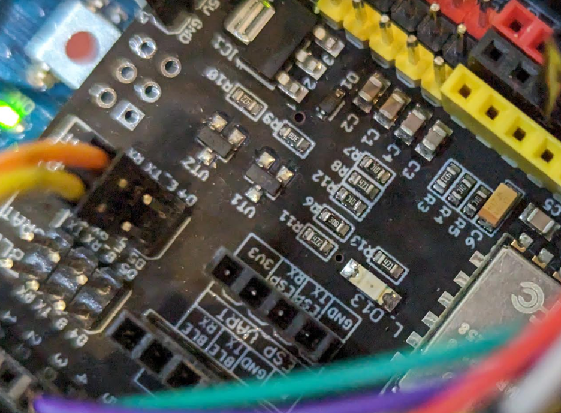

First of all, all Arduino programs need to have a setup() function and a loop() function. (In my Arduino IDE, when I click new sketch I actually get an Arduino code template with these two functions already in place, albeit empty with no lines of code inside.)

The setup() function runs only once when the Arduino board is powered up (or reset). After the setup() function finishes its programmed tasks (i.e., whatever you tell it to do) it then automatically calls the loop() function.

The loop() function runs over and over again (hence, its name of 'loop'). In our case, we want the Arduino board to flash an LED (for a fraction of second, but long enough to see hopefully) and then wait a certain delay. At that point the code gets to the end of the loop and starts again. We program the delay so that the loop runs 40 times each second, and thus the LED is flashing at 40Hz (which was our goal above.)

Before you start coding this project your Arduino IDE screen should look like this:

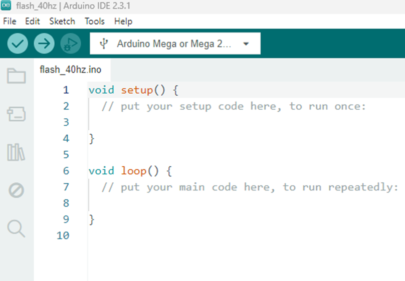

You can name the Sketch (i.e., program) whatever you'd like -- just click on the right side to the tabs and rename the tab. As you can see I called my program (i.e., my Sketch) "flash_40Hz". (You don't have to, and can use the default name the Arduino IDE choses for you.)

Even if you have coded in C/C++ before, the Arduino board uses particular functions. Let's review some of them right now.

-pinMode(pin, mode) -- It tells Arduino IDE that a specific pin should be configured to behave as an input (mode=INPUT) or an output (mode=OUTPUT).

-digitalWrite(pin, value) -- It tells a particular pin on the Arduino board to go to value=LOW or value=HIGH. If value is HIGH then the pin will go to 5 volts (the voltage used in the Arduino board in the robot car) and thus if an LED is attached the LED will turn on. If the vlaue is LOW then the pin will go to ground (i.e., 0 volts).

-delay(value) -- It tells the Arduino microcontroller to stop running the program for the specified delay (in milliseconds) and then once the delay period is over to continue executing the program.
(An advanced way of doing this is using the millis() function to return the number of milliseconds that have elapsed and so the Arduino board can be checking other inputs or doing other things rather than just totally shutting down, as occurs with the delay() function.)

-Also, in C/C++ coding and in Arduino programs, a double forward slash, i.e., //, means a comment -- text you write which is for other human programmers (or you at a later time when you might have forgotten what the code is supposed to do), and which the computer ignores

-Also, in C/C++ coding and in Arduino programs, lines of code typically end with a semicolon, i.e., ;  (although if a loop or if/then is being specified then after the 'if', 'for' or 'while' keyword, there will be braces, e.g.,  for (int i =0; i<5; i++) { ...... lines of code here }

Now that you know what the structure of an Arduino program looks like and now that you know these very important functions (well, important for programming Arduino boards), try to write an Arduino program that blinks the LED on the robot car's Arduino board.

This is what my program looks like:

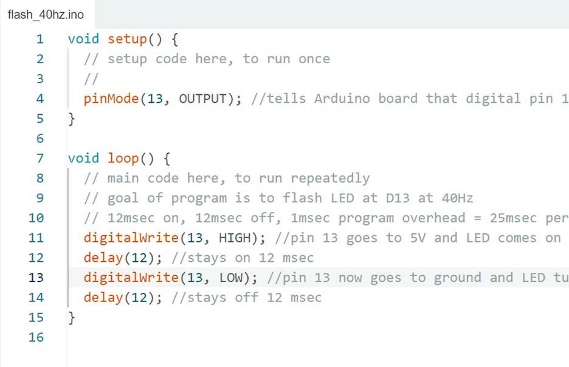

-
-

Although the LED is low-power, this still represents a relatively fast flashing light. There is a risk in sensitive individuals of triggering seizures (as well as migraines). If this applies to you or you have any risk towards seizures, do NOT flash the light at high speed -- instructions are given below for flashing the LED at a much lower rate. (Triggering seizures in photosensitive individuals is increased by exposure to a frequency of 5 to 30 Hertz  (it can still occur at 40 Hertz), bright lights, high contrast, and the duration of exposure. A frequency of 0.125 Hertz (one gentle turn on of the LED every 8 seconds) in a well-lit room (to reduce contrast) is used in the alternative demonstration.)

WARNING: This is written for an intended target audience of educated researchers in cognitive science and artificial intelligence, who might be interested in a theoretical aspect of approaching cognition as a means to help them learn new coding/system details. It is not written as a do-it-yourself therapeutic project and it is not written for those not educated in the field.

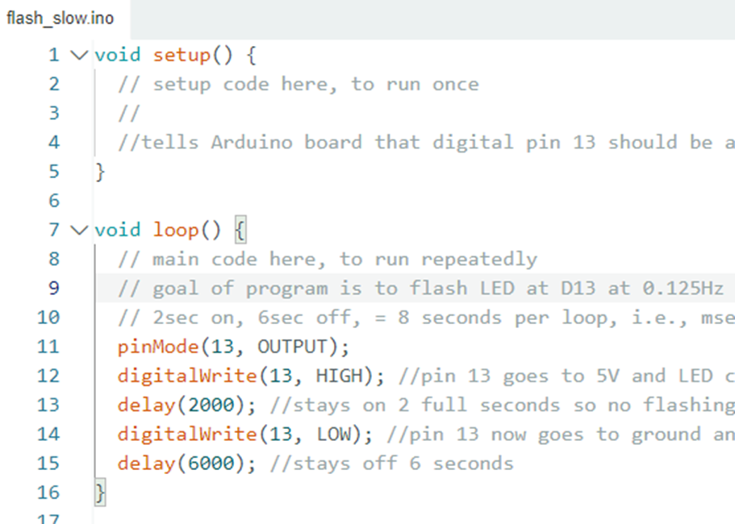

Alternative code to consider if you are at photosensitive risk for seizures. Also use the demonstration in well-lit room to reduce contrast with the brightness of the LED. Also, do not stare at the LED and do not look at it for very long.

-
-

Click the green right facing arrow at the top of the screen (i.e., compile and upload code to the Arduino board).

The red LED on the Wi-Fi shield (reflecting the status of the D13 pin) will now flash at 40Hz. (Or if you did the alternative demonstration, it will gently come on for 2 seconds and then go off for 6 seconds, and repeat.) DO NOT STARE AT THE LED. USE IN A WELL LIT-ROOM. READ THE WARNINGS ABOVE BEFORE BUILDING.

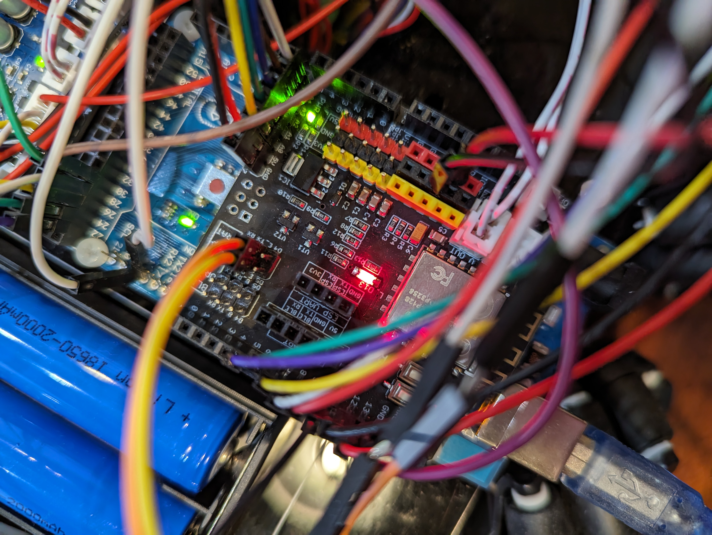

Some people may perceive the  40Hz LED to be continuously on rather than flashing. (The threshold for most of the population to perceive a flashing light is from 15-60Hz.) It also depends on the environment in which the LED is viewed in. PLEASE DO NOT STARE AT THE LED. PLEASE DO NOT LOOK AT FOR LONG PERIODS OF TIME. PLEASE USE IN A WELL-LIT ROOM. PLEASE HEED ALL WARNINGS GIVEN ABOVE.

In any case, in theory such an apparatus would stimulate the brain at 40Hz which might enhance  cognitive function. However, as mentioned above, this is just a fun project to make learning some new systems details more interesting. Maybe this technology can really help or prevent or delay Alzheimer's Disease and other cognitive impairments, or maybe medical research will prove it to be ineffective, despite positive trials at the time of writing. It was just considered theoretically here to help make learning some new coding interesting. (Please do not use in any serious manner.)

For safety, we will now change the code to the safer alternative demonstration of flashing at 0.125Hertz, i.e., once per 8 seconds.

While some people may not be able to see flashing at 40 Hertz, at 0.125 Hertz you should be able to see the light come on and go off. If you can't see this now, then you need to troubleshoot the code and the Arduino board.

Ok.... let's experiment with the code syntax and the compiler a little bit. WARNING: Frequency should be at 0.125Hertz for all these experiments.

I left off the semi-colon at line 4. What will the compiler do? You should try this too.

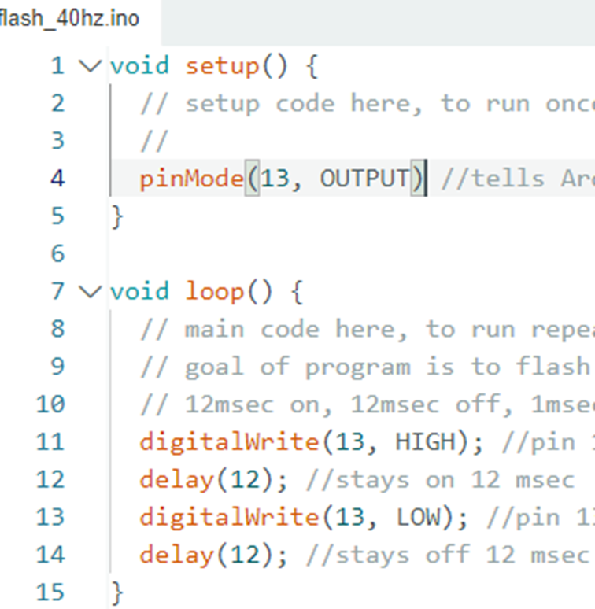

Note: Image is taken from older code. Please make the flash rate 0.125Hertz for these compiler experiments.
-

Here's what happens when I click the green upload arrow on the Arduino IDE:

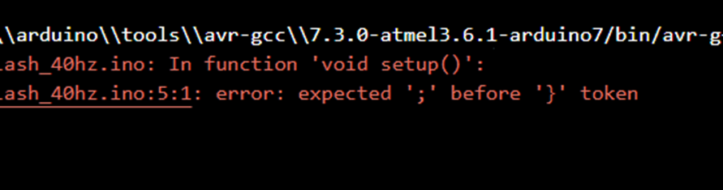

Restore the code, i.e., put the semi-colon back at the end of line 4, and press the upload button. Now everything should compile and upload to the Arduino board successfully.

Let's try something else. In line 13 write 'low' rather than 'LOW' in the delay() function. Click the upload button. What happens?

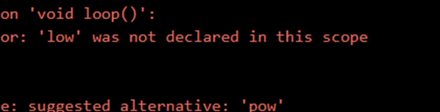

The program is expecting to see something it knows the value of. It doesn't know what 'low' means in this function.

Restore your code. Now move line 4 (i.e, pinMode) and insert it after line 10. Thus, instead of calling it once at the start of the program you will call it each loop. It is more efficient to just call it once at the start of the program, but this should work too. Give it a try. Upload the program.

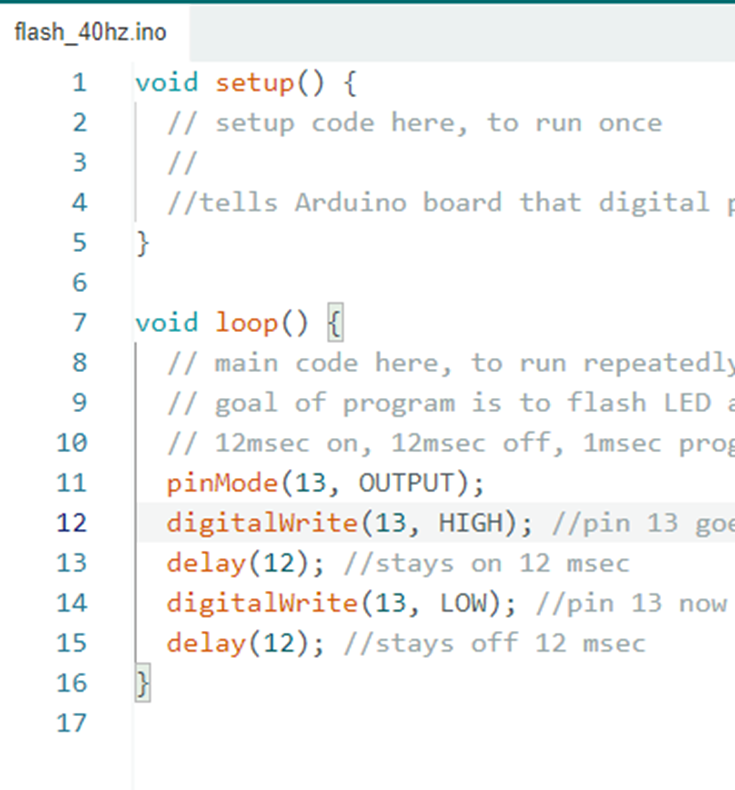

Note: Image is taken from older code. Please make the flash rate 0.125Hertz for these compiler experiments.
-

It should work ok.

There is no code in the setup() function. Let's remove it. (Which you can do by commenting it out.) You should try this too:

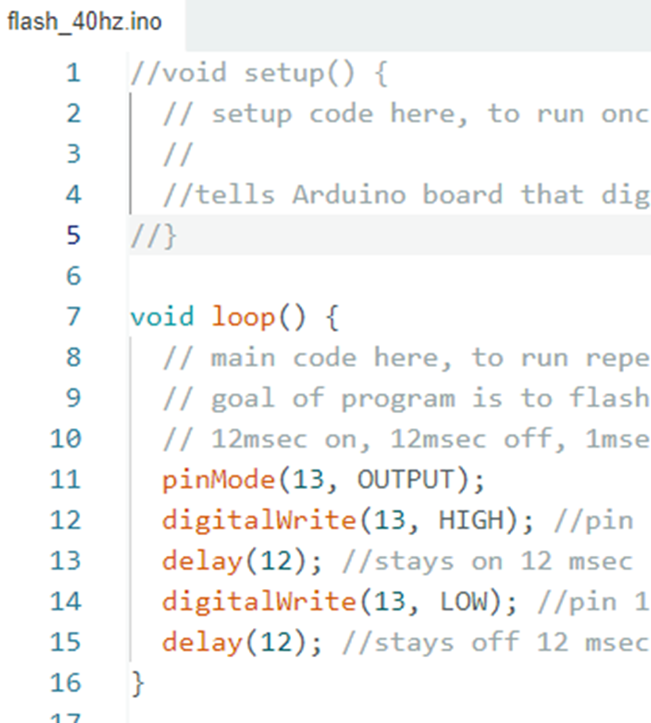

Note: Image is taken from older code. Please make the flash rate 0.125Hertz for these compiler experiments.
-

Now click the button to compile and upload the code. What happens?

You will get a compilation error. When the code is linked together by the compiler toolchain, it expects to see a setup() function.

Restore your code, i.e., uncomment the setup() function. Everything should work well now again, i.e., the code compiles and uploads to the Arduino board.

-
-
-
-

**Step #5 --Simple Electronics Is All You Need (to do great things with the robot car project)**

--The Incredible Complexity of the Electronics Behind the Arduino Board--

No, the electronics in the Arduino board is not simple. (Note: If English is not your first language, or if you are an automated grammar checker, you are probably saying the grammar is incorrect here. However, the word "electronics" really means at this point in common usage "electronics technology" which is correctly treated as non-plural.) It (i.e., the electronics in this Arduino board) actually represents an incredible fusion of human scientific and engineering knowledge. Making chips requires advanced mathematics, advanced chemical engineering, advanced materials science, advanced quantum mechanics, advanced radio frequency electrical engineering, advanced circuit electrical engineering, advanced computational design, advanced optical physics, advanced manufacturing engineering, and on and on. It is a triumph of human creativity and cooperation to produce the commonplace chips (these days) we can inexpensively have running the Arduino boards such as the one used in the robot car project.

The chip (i.e., integrated circuit microcontroller) on the Arduino board in the robot car project is an 8-bit chip architecture. (In general, 8-bit means the chip has a data bus width and registers of 8 bits in width, i.e., it handles data in 8 bit chunks. However, the address bus in almost all 8 bit chips are wider than 8 bits since addressing only 256 bits would be very limiting.)

Microprocessor integrated circuits (again, representing an incredible fusion of human scientific and engineering knowledge -- far from simple electronics) came out in the 1970s. The Intel 4004 was released in 1971. It was a 4-bit chip (i.e., processed data in 4 bit chunks). However, by 1972 the Signetic 2650 had been designed (although for commercial reasons it was not sold until 1975 -- a delay which hurt its prospects of success) -- this 8-bit chip tried to duplicate the circuits found on expensive minicomputers.

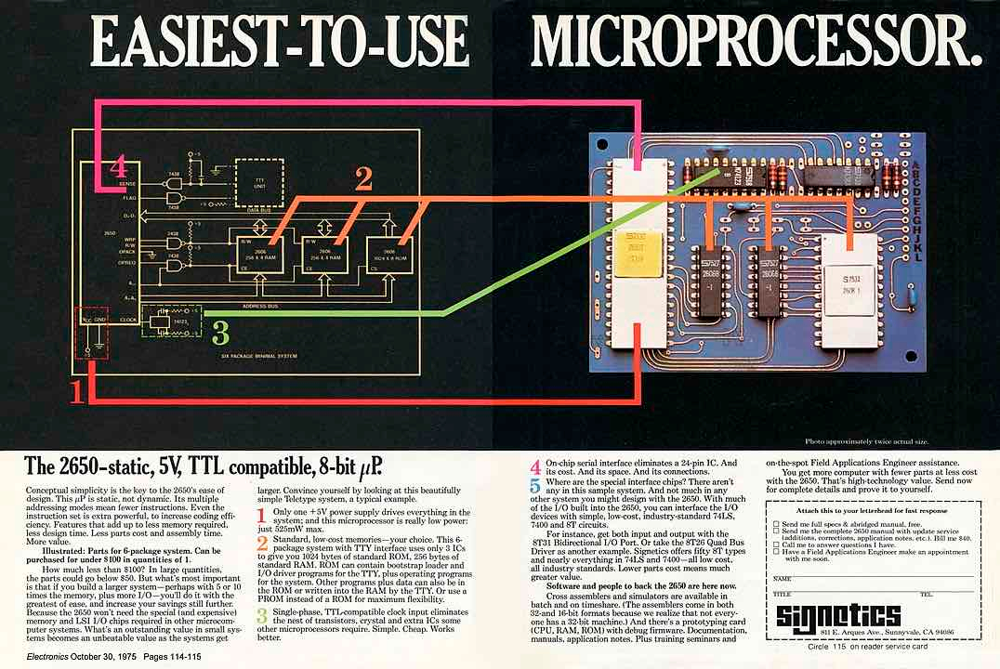

The Intel 8008 quasi-8-bit microprocessor was released in 1972. It used 10,000nm silicon sized elements, ran at a clock speed of 0.5MHz. Then in 1974 the Intel 8080 was released -- a more robust 8-bit microprocessor design. The 8080 is often credited with starting the personal computer (PC) industry. For example, the Altair 8800 (based on the 8080 chip) was on the cover of the January 1975 issue of Popular Electronics. For example, Bill Gates and Paul Allen started Microsoft writing a version of BASIC for the Altair 8800. 

The chip in the Arduino Mega board on the robot car project is an ATmega2560 chip. It is an 8-bit chip but reflects the exponential improvements in chipmaking that have occurred since the release of older 8-bit chips such as the Intel 8008 and Intel 8080. As noted above, the Intel 8008 was fabricated with element sizes (i.e., elements of the silicon photolithographed, where the size refers to the smallest half-pitch of a feature, typically the gate length of a transistor) of 10 microns or 10,000 nanometers. In contrast, current, for example, Apple A16 chips use 4nm element size (actually equivalent element size, this is a FinFET process in more than one dimension). 

The ATmega2560 chip is made by MicroChip Technology which does not reveal the manufacturing technology details but the chip is a modern chip believed to be fabricated at the 90nm or 65nm node (i.e. equivalent) feature size (very economical node sizes at the time of this writing versus the very expensive 4nm node size discussed above used by Apple for the A16), in contrast to the 10,000nm element size used by the first Intel 8008 (quasi) 8-bit chips. As well the ATmega2560 has a host of modern features such as including  within the one chip all the components needed for flash memory, SRAM, digital input and output, analog input and output, etc. 

--SIMPLE ELECTRONICS IS ALL YOU NEED (SOMETIMES)--

Understanding of the complex technologies that allow inexpensive chips to power the Arduino board in the robot car is not required, but should be appreciated. And thus we move onto the title of this section, that due to the complex technologies doing all the hard work for us behind the scenes, all we really need to know is simple electronics to do great things with the Arduino board powering our robot car project. 

(Reality check-- Simple electronics is fine for now. But in reality, whenever you want to do interesting projects in the real world in any subject, more knowledge is always better, including more knowledge of electronics.)

If you vaguely recall the electronics you learned in high school physics class (or an after-school program perhaps, or on your own somewhere in your academic journey), that is more than enough to do amazing things with the Arduino board.

You should know how to build a circuit, e.g., attach a light bulb to one end of a battery, and the other end to the other end of the battery so that you have a circuit.

You should know Ohm's law. If you attach an LED (as opposed to a light bulb) to a battery you will also need a resistor to reduce the current (otherwise the LED will burn out from a very high current that flows). Ohm's law says:  V = IR where V is the voltage in volts, I the current in amps, and R is the resistance in ohms. If you have not seen this before it is better to think about it as I = V/R. Think about I current as the flow of a water. The higher the water is (V voltage) then the more flow will occur down the river. However, the higher the resistance to the flow, e.g., rocks, earth, etc (R resistance), then the less current that flows.

For example, if we want to attach a green LED to the 5volt output of the Arduino board, then what resistor should be in series with the LED?

A green LED has a voltage drop of about 2 volts therefore there will be 3 volts pushing current around the circuit. A simple green LED generally runs properly at 20mA. Therefore by Ohms law R = V/I = 3volts/20mA = 3volts/.02A = 150 ohms. Thus, we would want a 150-ohm resistor in series with the green LED.

The brown line on the resistor means '1'. The next green line means '5'. The next brown line means 1 zero after that, i.e., 150 ohms. (The last gold line means the resistor is +/- 5% of this value):

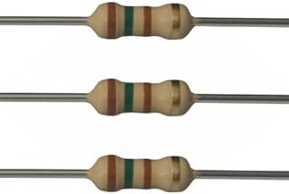

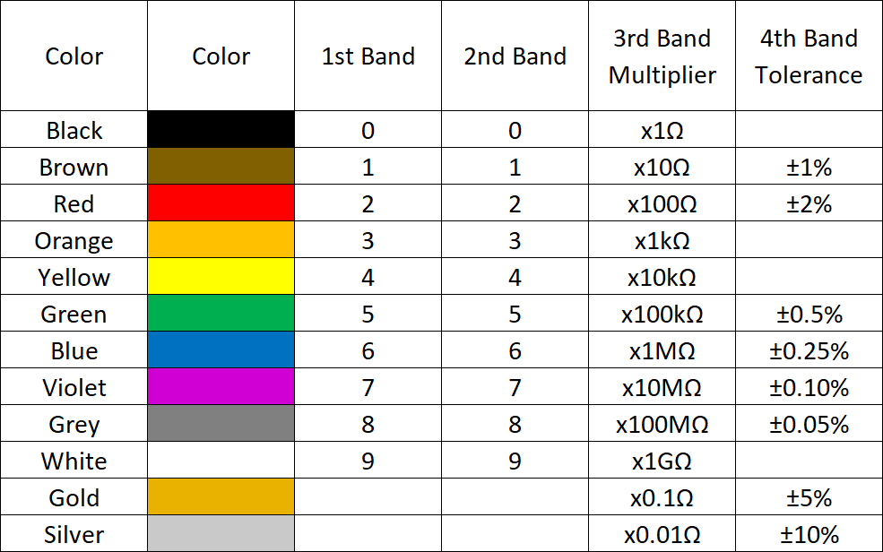

This is a circuit with a voltage source, a switch at the positive side of the battery, a resistor, and an LED. When the switch closes the LED comes on. You can think of a digital output of the Arduino board as the switch with a 5 Volt positive voltage on it. When the digital output goes 'HIGH' on the Arduino board, it effectively closes like the mechanical switch does (although it doesn't have any mechanical moving parts, of course) and current flows around in this circuit.

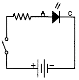

Note that the flat surface of the LED goes to the negative part of the power source/battery, while the other lead goes to the positive part of the power source/battery.

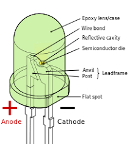

--WIRING A NEW LED TO THE ARDUINO BOARD--

Buy a green LED and a 150-ohm resistor. These components are very cheap and readily available (e.g., Amazon, local electronics parts distributors, etc) although you may have to buy ten LED's and 10 resistors or some other similar quantity. Buy a small electronics jumper cable (if you don't have one in your toolbox or workshop) -- also inexpensive and readily available (and also usually hard to buy just one, but you will need to buy a larger quantity). (These are small gauge wires with alligator clips on either end. They are not the huge car battery "jumpers" people often associate the word with.)

We want to program the Arduino board on the robot car to flash this LED once every 8 seconds, i.e., at 0.125 Hertz. 

Ok....let's first figure out the electronics.

Digital I/O pin 4 on the board seems unused at the moment. Let's put the positive lead of the green LED into digital pin #4.

Note: I have some 220 ohm resistors in my electronics workshop but no 150 ohm resistors. Even though we calculated 150 ohms, 220 ohms should be fine. (I = 3 voltage drop on the resistor/220 ohms = 14 mA of current through the resistor and through the LED -- this is adequate to light up the LED.)

Let's put one of the leads of the (220 ohm) resistor into the GND (ground) pin which you can see labelled at the 4th pin from the right edge (i.e., the edge closest to the USB socket). Then let's attach the other lead of the resistor to the negative lead of the LED with the jumper cable.

(This photo was taken after the code was written and uploaded to the Arduino -- the green LED was on while the photo was snapped. Note the black electronics jumper attaching to the negative lead of the LED with the other lead of the resistor.

You should buy these parts and build this circuit. This is considered very simple electronics and you should feel comfortable with this level of electronics hands-on experience.

Ok.... now we need to program the Arduino to flash this new green LED once every 8 seconds.

Open up the Arduino IDE. Load the previous code which flashed the on-board LED at D13 once every 8 seconds. Modify the code so that it will work instead on flashing the LED at pin D4.

This is my code:

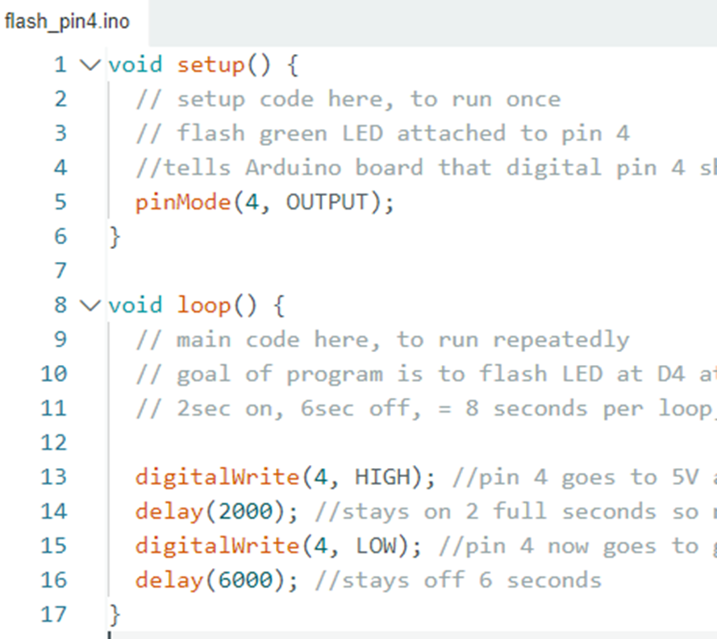

Let's see what happens.....

Success!! The new green LED flashes once each 8 seconds.

You have mastered simple C/C++ coding for the Arduino and simple electronics for the Arduino. You should feel great -- it's ok to throw yourself another celebration :)

-
-
-
-

**Step #6 --Getting More Experience with the Arduino Coding -- r**

Before moving on to consider the Arduino and Python code of the PetitCat project, getting a bit more experience with Arduino coding may be helpful. Again, while you are not expected to do C/C++ coding for the the PetitCat project (indeed, the purpose of PetitCat is to abstract away the C/C++/Arduino coding and let you interface your Python code to the robot car project), learning a bit more simple coding can help you better understand what the project code is doing.

In this Step we will learn .....

# under construction#
information below taken from Olivier's GitHub documentation, and will be incorporated into the documentation

# 1   install libraries into IDE #

This project uses the following libraries:

Library	Function	Where to find it
Servo		Installed by default with the Arduino IDE
HC-SR04	Ultrasonic telemeter	Regular Osoyoo robot
WifiEsp-master	Wifi Shield	Regular Osoyoo robot (Lesson 5 : WiFiEsp-master.zip)
Arduino_JSON	JSON	Arduino IDE Library manager
MPU6050	Inertial Measurement Unit	Included in our project repository
HLC5883L	Compass	jarzebski github
MMC5883	Compass	Included in our project repository

nformation about these libraries
MPU6050
I adapted the MPU6050 library by Korneliusz Jarzebski and included it in this project. I had to add a timeout to avoid freezing the main loop if the MPU6050 is not responding. This seems to happen because of the noise caused by the motors. In file MPU6050.cpp, I added this line after Wire.begin() in line 38 (documentation here):

Wire.setWireTimeout( 25000, true);
Also, I had to edit the MPU6050.cpp to prevent it from aborting the initialization process when the address is not 0x68:

Modif MU6050_library

Figure 2: Comment the return false; in line 56

After looking at a few alternatives, I chose this library because it was also provided with my Arduino kit by Elegoo. It is provided in the arduino-kits-support-files. The file Mega_2560_The_Most_Complete_Starter_Kit contains the whole pedagogical material, including the electronic wiring diagram.

Arduino_JSON
Install Arduino_JSON by Arduino from the library manager: Install_Arduino_json

Don't mistake it with the library ArduinoJSON by Benoit Blanchon.

HMC5883L
This library handles the compass chip HMC5883L implemented in some of the GY-86 imu cards, It is available at https://github.com/jarzebski/Arduino-HMC5883L.

HMC5883L Figure 3: The IMU card with the compass chip labeled L883/2131.

If your compass chip begins with L883, include the following lines in robot_define.h for your robot:

#define ROBOT_HAS_MPU6050  true
#define ROBOT_COMPASS_TYPE 1
MMC5883L
This library handles the compass chip Duinotech MMC5883L implemented in some imu cards. I followed the article by David Such that lists the different compass chips. I adapted this library from his repo.

IMU Figure 4: The IMU card with the compass chip labeled 5883/601X.

If your compass chip begins with 5883, include the following lines in robot_define.h for your robot:

#define ROBOT_HAS_MPU6050  true
#define ROBOT_COMPASS_TYPE 2
Local parameters
Wifi
In the autocat_enacter\src\wifi folder, next to the WifiCat.cpp and WifiCat.h files, create the file arduino_secrets.h

To let the robot connect to your own wifi as a station (STA), arduino_secrets.h must contain:

#define SECRET_WIFI_TYPE "STA"
#define SECRET_SSID "<your wifi SSID>"
#define SECRET_PASS "<your password>"
Alternatively, to let the robot provide its own wifi osoyoo_robot as an access point (AP), arduino_secrets.h must contain:

#define SECRET_WIFI_TYPE "AP"

# 2 load autocat_enacter.ino sketch and associated files #

/*
 
 Upload autocat_enacter.ino to the OSOYOO robot car

  2023
    Olivier Georgeon
  Spring 2022
   Titouan Knockart, Université Claude Bernard (UCBL), France
  BSN2 2021-2022
   Aleksei Apostolou, Daniel Duval, Célien Fiorelli, Geordi Gampio, Julina Matouassiloua
  Teachers
   Raphaël Cazorla, Florian Tholin, Olivier Georgeon
  Bachelor Sciences du Numérique. ESQESE. UCLy. France

 Inspired form Arduino Mecanum Omni Direction Wheel Robot Car http://osoyoo.com/?p=30022
*/

#include <Arduino_JSON.h>
#include "src/wifi/WifiCat.h"
#include "Action_define.h"
#include "Floor.h"
#include "Head.h"
#include "Imu.h"
#include "Interaction.h"
#include "Led.h"
#include "Robot_define.h"
#include "Sequencer.h"

Floor FLO;
Head HEA;
Imu IMU;
WifiCat WifiCat;
Led LED;
Sequencer SEQ(FLO, HEA, IMU, LED, WifiCat);

int interaction_step = 0;
int interaction_direction = 0;
Interaction* INT  = nullptr;  // The interaction type will depend on the action received from the PC

void setup()
{
  // Initialize serial for debugging

  Serial.begin(9600);
  Serial.println("Serial initialized");

  // Initialize the LEDs

  LED.setup();

  // First attempt to initialize IMU

  IMU.setup();
  Serial.println("-- IMU initialized");

  // Connect to the wifi board

  WifiCat.begin();

  // Second attempt to initialize IMU (try again because sometimes it fails the first time)
  // Perhaps something to do with the order in which the imu registers are written.

  IMU.setup();
  Serial.println("-- IMU initialized");

  // Initialize the automatic behaviors

  FLO.setup();
  Serial.println("-- Wheels initialized");

  HEA.setup();
  Serial.println("-- Head initialized");

  Serial.println("--- Robot is ready ---");

  pinMode(TOUCH_PIN, INPUT_PULLUP);
}

void loop()
{
  // Control the built-in led and the emotion led

  LED.update();

  // Behavior Floor Change Retreat

  FLO.update(interaction_direction);

  // Behavior Head Echo Alignment

  HEA.update();

  // Behavior IMU

  IMU.update(interaction_step);

  // Watch for message received from PC. If yes, starts the interaction

  if (interaction_step == INTERACTION_DONE)
    INT = SEQ.update(interaction_step, INT);

  // Update the current interaction and return INTERACTION_DONE when done

  if (INT != nullptr)
  {
    interaction_step = INT->update();
    interaction_direction = INT->direction();
  }
  else
    interaction_direction = DIRECTION_FRONT;
}

# 3 wifi #

In the autocat_enacter\src\wifi folder, next to the WifiCat.cpp and WifiCat.h files, create the file arduino_secrets.h

To let the robot connect to your own wifi as a station (STA), arduino_secrets.h must contain:

#define SECRET_WIFI_TYPE "STA"
#define SECRET_SSID "<your wifi SSID>"
#define SECRET_PASS "<your password>"
Alternatively, to let the robot provide its own wifi osoyoo_robot as an access point (AP), arduino_secrets.h must contain:

#define SECRET_WIFI_TYPE "AP"
The robot's IP address will show in the serial terminal:

# 4 PetitCat #

Test the PetitCat Robot
This page explains how to test the PetitCat robot using the PetitCatTester.py file. Alternatively, you can use the PetitCatTester.ipynb notebook.

#!/usr/bin/env python
#Olivier Georgeon, 2023.
#This code is used to teach Developmental AI.
#Requires:
#- A PetiCat robot https://github.com/OlivierGeorgeon/osoyoo/wiki

import socket
import keyboard
import sys
import json

UDP_IP = "192.168.4.1"
UDP_TIMEOUT = 5  # Seconds

class PetitCatTester:
    def __init__(self, ip, time_out, port=8888):
        self.IP = ip
        self.port = port
        self.socket = socket.socket(socket.AF_INET, socket.SOCK_DGRAM)
        self.socket.settimeout(time_out)
        self.clock = 0
        self.focus_x = None
        self.focus_y = None
        self.color = None
        self.duration = None
        self.angle = None
        self.span = None

    def enact(self, _action_string):
        """ Sending the action string, waiting for the outcome, and returning the outcome bytes """
        _outcome = None  # Default if timeout
        # print("sending " + action)
        self.socket.sendto(bytes(_action_string, 'utf-8'), (self.IP, self.port))
        try:
            _outcome, address = self.socket.recvfrom(512)
        except socket.error as error:  # Time out error when robot is not connected
            print(error)
        return _outcome

    def send(self, _action):
        """Format the action string for the notebook"""
        command_dict = {'clock': self.clock, 'action': _action}
        if self.focus_x is not None:
            command_dict['focus_x'] = self.focus_x
        if self.focus_y is not None:
            command_dict['focus_y'] = self.focus_y
        if self.color is not None:
            command_dict['color'] = self.color
        if self.duration is not None:
            command_dict['duration'] = self.duration
        if self.angle is not None:
            command_dict['angle'] = self.angle
        _action_string = json.dumps(command_dict)
        print("Sending packet:", _action_string)
        _outcome = self.enact(_action_string)
        print("Received packet:", _outcome)
        if _outcome is not None:
            self.clock += 1
        print("Next clock:", self.clock)
        return _outcome

#Test the wifi interface by controlling the robot from the console
#Provide the Robot's IP address as a launch argument
#py PetitCatTester.py 192.168.8.242
if__name__ == '__main__':
    robot_ip = UDP_IP
    if len(sys.argv) > 1:
        robot_ip = sys.argv[1]
    else:
        print("Please provide your robot's IP address")
    print("Connecting to robot: " + robot_ip)
    print("Action keys: 1: Turn left, 2: Backward, 3: Turn right, 4: Swipe left, 6: Swipe right, 8: Forward, -: Scan")
    print("Ctrl+C and ENTER to abort")
    osoyoo_wifi = PetitCatTester(robot_ip, UDP_TIMEOUT)
    clock = 0
    action = ""
    while True:
        print("Press action key:")
        action = keyboard.read_key().upper()
        action_string = '{"clock":' + str(clock) + ', "action":"' + action + '"}'
        print("Sending packet:", action_string)
        outcome = osoyoo_wifi.enact(action_string)
        print("Received packet:", outcome)
        if outcome is not None:
            clock += 1

Run the test
Switch on the robot and read its IP address in the Arduino IDE terminal.

Make sure your PC is connected to the same wifi as the robot.

Clone this project or download the file PetitCatTester.py.

Run PetitCatTester.py with the IP address of you robot as an argument. For example:

py PetitCatTester.py 192.168.8.242
Press the action keys. The robot executes your commands. Your python terminal displays the logs as in Figure 1.

PetitCatTester Figure 1: The trace showing the enaction of three interactions

When you press a key, the program sends the command packet to the robot via UDP. The field "clock" is an incremental number. The field "action" is your key. The robot executes your command and returns the outcome packet.

If the wifi connection fails, the timeout is triggered and the outcome packet is None. The clock is not incremented.

If the robot receives a command packet containing a clock equal to the clock previously received, it does not re-execute the command, and it immediately resends the latest outcome packet.

Table 1 summarizes the recognized actions. The choice of keys was made for a standard keyboard numerical pad. These actions are interrupted if the robot detects a black line on the floor or an impact against an obstacle.

Table 1: Main recognized commands

Action key	Command
1	Turn in the spot to the left by 45°
2	Move backward during 1000ms
3	Turn in the spot to the right by 45°
4	Swipe left during 1000ms
6	Swipe right during 1000ms
8	Move forward during 1000ms
-	Scan the environment with the head
Main command fields
Table 2 summarizes the main fields of the command packet sent to the robot. To try the optional fields, you must modify PetitCatTester.py. Some optional fields only apply to some commands indicated in the Command column.

Field	Command	Status	Description
"clock"	all	Required	The incremental number of the interaction since startup.
"action"	all	Required	The action code
"focus_x"	all except -	Optional	The x coordinates of the focus point in mm
"focus_y"	all except -	Optional	The y coordinates of the focus point in mm
"color"	all	Optional	The color code of the emotion led: 0: off, 1: white, 2: green, 3: bleue, 4: red, 5: orange.
"duration"	2, 4, 8	Optional	The duration of the translation in milliseconds
"angle"	1	Optional	The angle of rotation in degrees. Negative angles turn right
"span"	-	Optional	The span of the saccades during the scan in degrees
During the interaction, the robot will keep its head towards the focus point defined by "focus_x" and "focus_y" coordinates.

# 5 IMU Board (or possibly as an earlier step) mods  #

HMC5883L
This library handles the compass chip HMC5883L implemented in some of the GY-86 imu cards, It is available at https://github.com/jarzebski/Arduino-HMC5883L.

HMC5883L Figure 3: The IMU card with the compass chip labeled L883/2131.

If your compass chip begins with L883, include the following lines in robot_define.h for your robot:

#define ROBOT_HAS_MPU6050  true
#define ROBOT_COMPASS_TYPE 1
MMC5883L
This library handles the compass chip Duinotech MMC5883L implemented in some imu cards. I followed the article by David Such that lists the different compass chips. I adapted this library from his repo.

IMU Figure 4: The IMU card with the compass chip labeled 5883/601X.

If your compass chip begins with 5883, include the following lines in robot_define.h for your robot:

#define ROBOT_HAS_MPU6050  true
#define ROBOT_COMPASS_TYPE 2

# 6 install IMU and Color Sensor #
parts to install:

HMC5583L compass chip in GY-86 IMU (inertial measurement) card (??) or MC5883L chip (?? to check)

Connect the IMU card to the wifi Shield following Table 2 and Figure 1. Note that the calibration offset varies significantly depending on the position of the card on the robot.

Table 2: IMU Wiring

GY-86 Imu	MEGA2560 Wifi Shield
Vcc	3v3
GND	GND
SCL	SCL
SDA	SDA

able 2: PIN connection

TCS34725	MEGA2560	
3v3	3v	On the Wifi Shield, yellow slots
GND	GND	On the Wifi Shield, black
SDA	SDA 20	
SCL	SCL 21	
LED	53	Digital output
More information on the TCS34725 adafruit webpage.

Color sensor (TCS34725 ?? to check)  
Use the "long" two-hole version of the TCS34725. It has two LEDs, and the holes miraculously match holes on the robot platform (Figure 4). Wire it to the Arduino MEGA according to Table 2. Use PINs 20 and 21 for SDA and SCL because the other SDA and SCL PINs are used for the IMU. They are the same. For the power line, I used the 3v yellow PINs on the Wifi Shield. Alternatively, the VIN PIN can be connected to a 5V PIN (red).

Table 2: PIN connection

TCS34725	MEGA2560	
3v3	3v	On the Wifi Shield, yellow slots
GND	GND	On the Wifi Shield, black
SDA	SDA 20	
SCL	SCL 21	
LED	53	Digital output
More information on the TCS34725 adafruit webpage.

# 7 Emotion LED #

-did not buy yet the part but readily available locally

Figure 5: RGB LED with flat side on the left. The cathode is the longest lead.
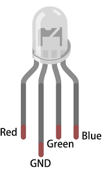

Table 3: RGB LED connections

RGB LED		MEGA2560 / Wifi shield
Blue		2
Green		3
GND	10kΩ resistor	GND
Red		5

Figure 6: The common cathode RGB LED on pins 2, 3, 5, and its cathode connected to the ground via a 10kΩ resistor. Flat side on the right.
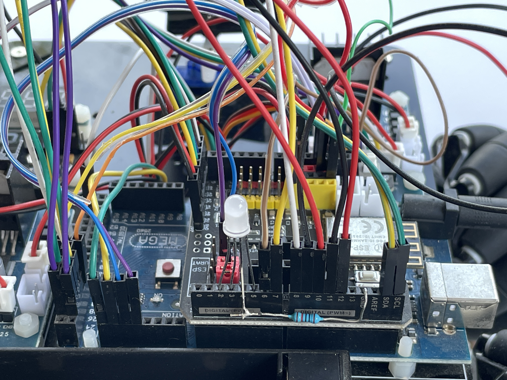

