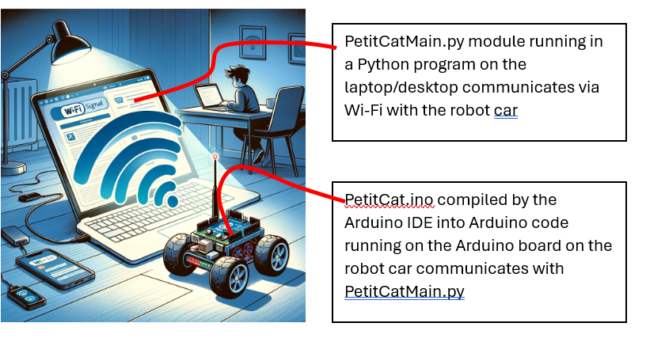
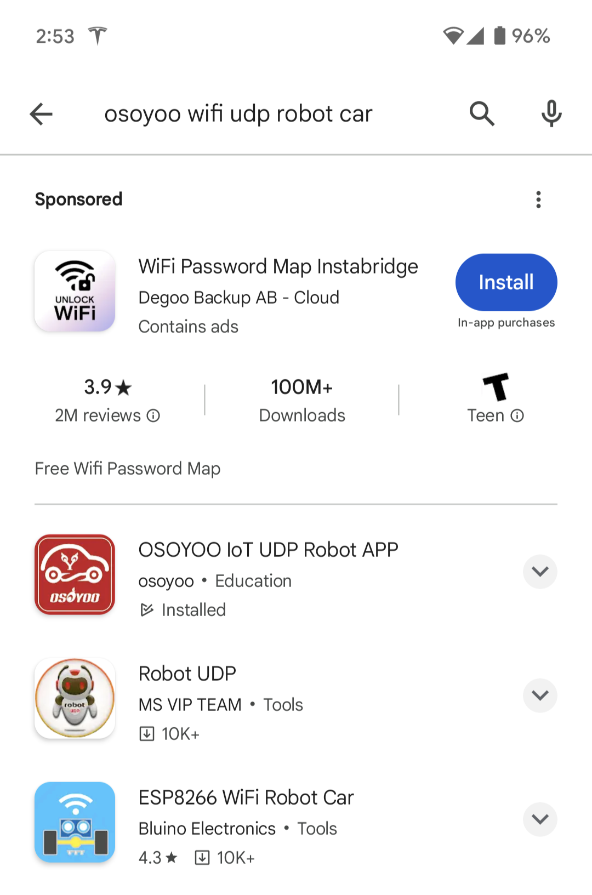
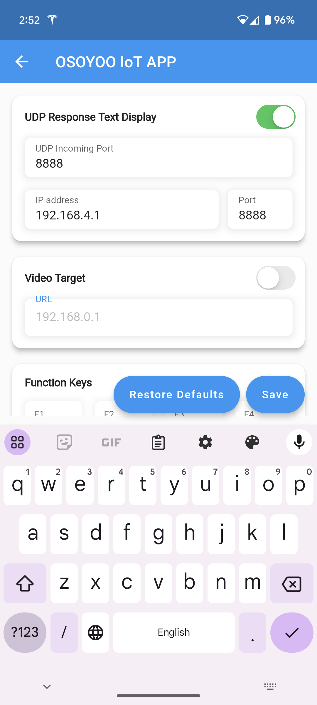
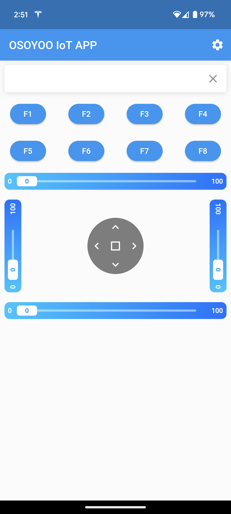
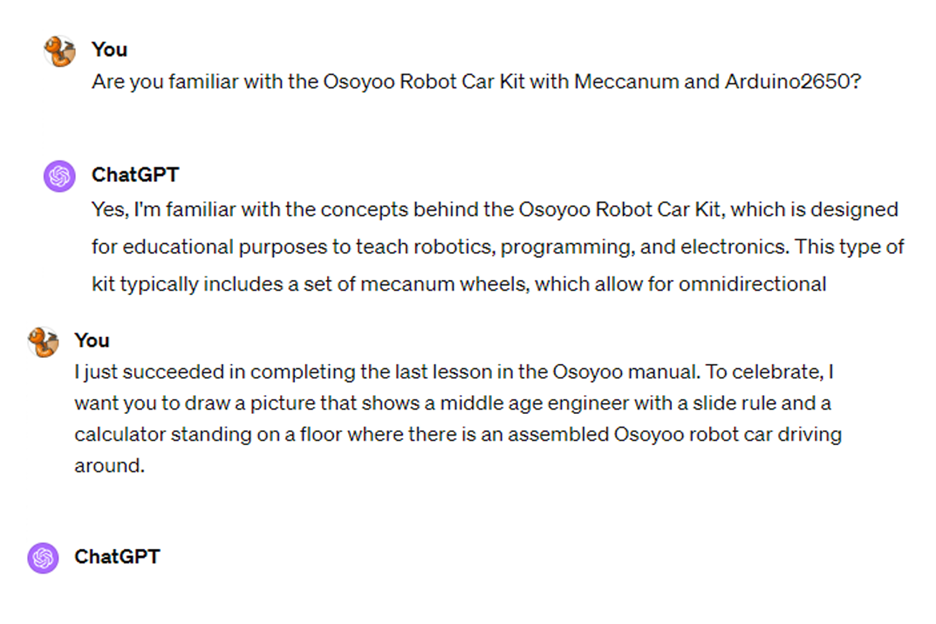

# Part II: An Easy-to-Read Overview of the Robot Car ("PetitCat") Project: Modifying for Python Control

##

Initial draft Feb 15, 2024

(This is a public document that can be modified by others who have access -- if anything doesn't make sense, please ignore. A year from now, for example, I may not be aware of the full contents of this document any longer or what is still current.) 
(No use of high voltage or anything dangerous is specified in this document.)
(The use of a horseback ride below is only a metaphor -- horses are pretty big in real life and quite scary to get on and even more scary to fall off:) (Any illustrations are my own, generated by GPT4, or taken from open technical sites. Reproduction is limited for "fair use" or else not allowed if prohibited by law.)

(Questions, corrections, suggestions? -- please contact me via my GitHub link.)
Howard Schneider -- Feb 15, 2024
##
-
-
-
-

The PetitCat Project (generated by GPT4 which unfortunately could not correct the spelling despite ten regenerations)
-
-
-
-

Welcome!! Bienvenue!! Tunngasugit!!

(I am in Canada -- these are our official languages -- English, French and a semi-official third (indigenous) language of Inuktitut.)

You have already built your Osoyoo Robot Car and learned how to modify and upload its software (well.... at least you learned how to change some parameters). 

If you have not done Part I, i.e., building and using the Osoyoo Robot Car then please read the document "An Easy to Read Overview of the Robot Car Project: The Basics" 

This is the "Part I":

https://github.com/OlivierGeorgeon/osoyoo/blob/master/docs/Easy_to_Read_Overview.md

In this second part (i.e., "Part II") to our adventure, we will now turn the toy-like robot car into a serious Python controlled autonomous robot.

In the following part (i.e., "Part III"), we will then use our Python-controlled robot car for AI/Cognitive Science experiments and demonstrations.

Saddle up!! Let's get going on the most exciting part of our journey....

-
-
-
-

**Step #1 -- The Big Picture: The PetitCat Project**

As noted above, in Part I you already built your Osoyoo Robot Car. You learned how to use the Arduino IDE to upload software to the robot car, and how to control the car from your cellphone via the Wi-Fi in your house or workplace. You also learned a little bit about the software running on the Arduino and how to modify some of the parameters in the Arduino code.

In this Part II you will learn how to transform your Osoyoo Robot Car into a robot car which any of your Python programs will be able to control and communicate with. We call this project the "PetitCat" project or the "Robot Car" project or the "Osoyoo Robot Car" project -- they all mean the same thing and may be used at different places in the documentation. 

In this Step #1 of Part II we will consider the big picture, i.e., what are the basic components behind this PetitCat project (i.e., Python-program connected robot car project). In the subsequent steps of this Part II, we will implement the details, and get the robot car controlled and communicating with your Python programs.

The PetitCat Project is an open-source project based on the work of Prof Olivier Georgeon and his colleagues and students at UCLY Lyon Catholic University. 

The big picture (i.e., overview) of the project is: The Python module PetitCat.py running as a Python module as part of your Python program on your desktop/laptop communicates via Wi-Fi to the robot car. The Arduino program PetitCat.ino compiled to Arduino code running on the Arduino board on the robot car communicates via Wi-Fi with PetitCat.py.

Nomenclature

As this project evolves, names used to describe various parts of the project may change, although they will describe the same piece of code or the same folder of code, etc.

Let's review the nomenclature of the project, i.e., the names referring to different parts of the project.

-Overall project:

The "PetitCat" project == the "Robot Car" project == the "Osoyoo Robot Car" project 

-Python main file:

PetitCat.py == PetitCaMain.py == PetitCatTester.py

-Arduino board main file:

PetitCat.ino == autocat_enacter.ino

-GitHub folder for Python files:

/PetitCat_python == /TestROS   

https://github.com/OlivierGeorgeon/TestROS

---> Go to this GitHub folder. If you click open PetitCat.py == PetitCaMain.py == PetitCatTester.py you see the standard library files PYthon will import automatically. 

-GitHub folder for Arduino files:

/PetitCat_arduino == /osoyoo/autocat_enacter

https://github.com/OlivierGeorgeon/osoyoo/tree/master/autocat_enacter

---> Go to this GitHub folder (following the link in the line above). You will see that in addition to the main code PetitCat.ino == autocat_enacter.ino there are good number of header .h and code .cpp files. All these will need to be cloned and copied into the IDE later. 

As well, the library Arduino_JSON will have to be added later to the Arduino IDE via the IDE's Library Manager.

-
-
-
-

**Step #2 -- Using your House/Workplace Wi-Fi to Communicate with the Robot Car**

In Part I in one of the last Steps we created a Wi-Fi server ("hotspot") out of the Arduino board's Wi-Fi shield, and we logged our smartphone into this Wi-Fi server ("hotspot"). Then we used an app on our phone to control the robot car via a Wi-Fi linkage between the two.

In this new step we make the robot car act as an ordinary device on our home/workplace LAN (local area network). This is just a tiny bit more complicated (actually, really not.... if your Wi-Fi does not have strange security layers it should work well) than before, but more useful. Indeed, in Part II for communication of the robot car with our Python program, we will want every device (i.e, the Arduino board Wi-Fi and the desktop/laptop Wi-Fi ) to log into the same LAN (local area network).

In this Step #2 we will not be doing any programming of our own, but use the software already prepared by Osoyoo.

Before you start this step you need to find out the following information about the Wi-Fi in your house/workplace:

-SSID -- this is the name of your network, e.g., if the name of the network you log into is "Jones" then your SSID is "Jones".

-Pasword -- this is your password you use to log into your network, e.g., if the password to log into your Wi-Fi is "test1234" then your password is "test1234".

Go to Lesson 5 in the Osoyoo Manual.

---Hardware Installation--

The Wi-Fi shield was installed into the Arduino board above when the robotic car was first built. Thus, there should not be anything for you to do with regard to hardware installation.

--Wiring Installation--

Similarly, we already made the wiring changes in the Step in Part I when we tried out the Wi-Fi board. Thus, there should not be anything for you do now with regard to wiring.

Previously (should already be done) wiring changes to make:

-Remove the connections from the Wi-Fi B_TX and B_RX.

-Now connect D18 and D19 to E_RX and E_TX on the Wi-Fi board.

(Note. In the picture below the orange wire actually is going to E_TX and then the male-male hacked connection and then to D19, and similarly the yellow wire is going to E_RX and then to D18 via the other male-to-male hacked connection, which is a reveral of the yellow and orange in the schematic diagram, i.e., colors are reversed, but the wiring is the same.)

--Software Installation--

--Library Software--

We already add this library software in the Step in Part I when we tried out the Wi-Fi board. Thus, there should not be anything for you do now with regard to loading library software.

In case you did not do this or the Arduino IDE was re-installed:

In this step there is now an extra requirement to download and update an Arduino library zip file.

-download the library zip file from the link provided in the Osoyoo Manual Lesson 5 
(In the Manual version I was using the link went to:  http://osoyoo.com/driver/mecanum_metal_chassis/for_mega2560/WiFiEsp-master.zip )
A folder WiFiEsp-master.zip will download

-virus scan the file always after downloading and before clicking or using

-Open up the Arduino IDE (similar to above in earlier steps) but this time click Sketch, Library, Add ZIP Library, select WiFiEsp-master.zip

--Wi-Fi Software--

Just like the other Steps in Part I (i.e., "Lessons" in the Osoyoo manual) there is demo software that will work with the Wi-Fi shield in your robotic car. We will use Osoyoo software for this Step. (However, later for controlling the robot car from our Python program we will be using our own created software, not Osoyoo's software.)

-The link shown in the manual works fine -- you will download a folder containing m2-lesson5.ino which will work with the Arduino development environment (IDE). The manual also shows you what some of the Arduino IDE screens will look like.

-Unlike the other lessons, in this lesson there is a lesson5a and a lesson5b software demos.  In the lesson5a demo the Wi-Fi board on the robot car becomes the Wi-Fi access point ("hotspot" is the term used by the Osoyoo manual) and your cellphone becomes the client. We already did this in one the Steps towards the end of Part I.

In the lesson5b demo the Wi-Fi board on the robot car becomes a node (i.e., a client) in the LAN where the robot car is operating -- we will specify the LAN's router's Wi-Fi SSID and password to the robot car, but still end up using the cellphone app to control the car. ---> WE WILL TRY OUT LESSON5B DEMO SOFTWARE NOW.  

-Ok... when you unzip folder m2-lesson5 folder, you will see the folder m2-lesson5b

-Always virus scan files when you download them and when you extract them.

-Then open the Arduino IDE exactly as described in Part I. As well, the manual shows several screens of the Arduino IDE. Make sure your Arduino IDE is configured exactly like before (i.e., correct Arduino board is specified).

-Click 'Open' and load in m2-lesson5b.ino

-Then attach the USB cable to the Arduino board connector on the robot car, exactly like you did in Part I Steps when we uploaded software to the car's Arduino board. (The power on your robot car should be turned off -- the cable will supply power to the Arduino board. )

--> YOU NEED TO MODIFY THIS SOFTWARE

You now need to tell the software what your Wi-Fi SSID and password are.

For example, if the name of the network you log into is "Jones" then your SSID is "Jones" and if the password to log into your Wi-Fi is "test1234" then your password is "test1234".

Look at lines 180 and 181 (or equivalent lines if the software has changed since the time of this writing).  Modify the lines as follows:

char ssid[] = "Jones"

char pass[] = "test1234"

-Now click the upload arrow (green arrow inside a circle at the top left corner).

-The software in m2-lesson5b.ino (modified with your Wi-Fi SSID and password) will now be uploaded to the Arduino board in your robotic car.

# under construction#

--Phone APP software--

We already add the phone app software in the Step in Part I when we tried out the Wi-Fi board. Thus, there should not be anything for you do now with regard to installing new app's on your smartphone.

In case you did not do this or you un-installed the app from your phone:

Ok.... now we need the Osoyoo mobile app to access the common house/workplace Wi-Fi  which both your cellphone and the robot car will use to communicate with each other.

--Installing the Osoyoo Mobile App--

-If you have an Apple phone then you will go to the Apple Store

-However, since I have an Android phone (Pixel 7) I will go to the Google Play store

-The Osoyoo Manual Lesson 5 advises to search "Osoyoo Wifi UDP Robot Car Controller"

-Unfortunately when I do this search (Feb 9, 2024) the only app that appears in the Google Play store is "Osoyoo IoT UDP Robot APP" -- well, better than nothing, and maybe it will do the same thing.... so this app is installed on my Android cellphone

-Ok we open the Osoyoo IoT UDP Robot APP

-Then go to Settings and enter the IP address this app should access (since we want it to access the Wi-Fi board on the robot car)

-Ok...now go to the main page of the app.

-Ok... turn on the robot car

-Now, let's click a button on the app.... go forward

The car goes forward.

Click backwards, left and right.

They all work .... we can control the robot car via Wi-F i -- this time with both the robot car and cellphone attached to the same house/workplace Wi-Fi router.

Success :)

-
-
-
-

# under construction#
information below taken from Olivier's GitHub documentation, and will be incorporated into the documentation

# 1   install libraries into IDE #

This project uses the following libraries:

Library	Function	Where to find it
Servo		Installed by default with the Arduino IDE
HC-SR04	Ultrasonic telemeter	Regular Osoyoo robot
WifiEsp-master	Wifi Shield	Regular Osoyoo robot (Lesson 5 : WiFiEsp-master.zip)
Arduino_JSON	JSON	Arduino IDE Library manager
MPU6050	Inertial Measurement Unit	Included in our project repository
HLC5883L	Compass	jarzebski github
MMC5883	Compass	Included in our project repository

nformation about these libraries
MPU6050
I adapted the MPU6050 library by Korneliusz Jarzebski and included it in this project. I had to add a timeout to avoid freezing the main loop if the MPU6050 is not responding. This seems to happen because of the noise caused by the motors. In file MPU6050.cpp, I added this line after Wire.begin() in line 38 (documentation here):

Wire.setWireTimeout( 25000, true);
Also, I had to edit the MPU6050.cpp to prevent it from aborting the initialization process when the address is not 0x68:

Modif MU6050_library

Figure 2: Comment the return false; in line 56

After looking at a few alternatives, I chose this library because it was also provided with my Arduino kit by Elegoo. It is provided in the arduino-kits-support-files. The file Mega_2560_The_Most_Complete_Starter_Kit contains the whole pedagogical material, including the electronic wiring diagram.

Arduino_JSON
Install Arduino_JSON by Arduino from the library manager: Install_Arduino_json

Don't mistake it with the library ArduinoJSON by Benoit Blanchon.

HMC5883L
This library handles the compass chip HMC5883L implemented in some of the GY-86 imu cards, It is available at https://github.com/jarzebski/Arduino-HMC5883L.

HMC5883L Figure 3: The IMU card with the compass chip labeled L883/2131.

If your compass chip begins with L883, include the following lines in robot_define.h for your robot:

#define ROBOT_HAS_MPU6050  true
#define ROBOT_COMPASS_TYPE 1
MMC5883L
This library handles the compass chip Duinotech MMC5883L implemented in some imu cards. I followed the article by David Such that lists the different compass chips. I adapted this library from his repo.

IMU Figure 4: The IMU card with the compass chip labeled 5883/601X.

If your compass chip begins with 5883, include the following lines in robot_define.h for your robot:

#define ROBOT_HAS_MPU6050  true
#define ROBOT_COMPASS_TYPE 2
Local parameters
Wifi
In the autocat_enacter\src\wifi folder, next to the WifiCat.cpp and WifiCat.h files, create the file arduino_secrets.h

To let the robot connect to your own wifi as a station (STA), arduino_secrets.h must contain:

#define SECRET_WIFI_TYPE "STA"
#define SECRET_SSID "<your wifi SSID>"
#define SECRET_PASS "<your password>"
Alternatively, to let the robot provide its own wifi osoyoo_robot as an access point (AP), arduino_secrets.h must contain:

#define SECRET_WIFI_TYPE "AP"

# 2 load autocat_enacter.ino sketch and associated files #

/*
 
 Upload autocat_enacter.ino to the OSOYOO robot car

  2023
    Olivier Georgeon
  Spring 2022
   Titouan Knockart, Université Claude Bernard (UCBL), France
  BSN2 2021-2022
   Aleksei Apostolou, Daniel Duval, Célien Fiorelli, Geordi Gampio, Julina Matouassiloua
  Teachers
   Raphaël Cazorla, Florian Tholin, Olivier Georgeon
  Bachelor Sciences du Numérique. ESQESE. UCLy. France

 Inspired form Arduino Mecanum Omni Direction Wheel Robot Car http://osoyoo.com/?p=30022
*/

#include <Arduino_JSON.h>
#include "src/wifi/WifiCat.h"
#include "Action_define.h"
#include "Floor.h"
#include "Head.h"
#include "Imu.h"
#include "Interaction.h"
#include "Led.h"
#include "Robot_define.h"
#include "Sequencer.h"

Floor FLO;
Head HEA;
Imu IMU;
WifiCat WifiCat;
Led LED;
Sequencer SEQ(FLO, HEA, IMU, LED, WifiCat);

int interaction_step = 0;
int interaction_direction = 0;
Interaction* INT  = nullptr;  // The interaction type will depend on the action received from the PC

void setup()
{
  // Initialize serial for debugging

  Serial.begin(9600);
  Serial.println("Serial initialized");

  // Initialize the LEDs

  LED.setup();

  // First attempt to initialize IMU

  IMU.setup();
  Serial.println("-- IMU initialized");

  // Connect to the wifi board

  WifiCat.begin();

  // Second attempt to initialize IMU (try again because sometimes it fails the first time)
  // Perhaps something to do with the order in which the imu registers are written.

  IMU.setup();
  Serial.println("-- IMU initialized");

  // Initialize the automatic behaviors

  FLO.setup();
  Serial.println("-- Wheels initialized");

  HEA.setup();
  Serial.println("-- Head initialized");

  Serial.println("--- Robot is ready ---");

  pinMode(TOUCH_PIN, INPUT_PULLUP);
}

void loop()
{
  // Control the built-in led and the emotion led

  LED.update();

  // Behavior Floor Change Retreat

  FLO.update(interaction_direction);

  // Behavior Head Echo Alignment

  HEA.update();

  // Behavior IMU

  IMU.update(interaction_step);

  // Watch for message received from PC. If yes, starts the interaction

  if (interaction_step == INTERACTION_DONE)
    INT = SEQ.update(interaction_step, INT);

  // Update the current interaction and return INTERACTION_DONE when done

  if (INT != nullptr)
  {
    interaction_step = INT->update();
    interaction_direction = INT->direction();
  }
  else
    interaction_direction = DIRECTION_FRONT;
}

# 3 wifi #

In the autocat_enacter\src\wifi folder, next to the WifiCat.cpp and WifiCat.h files, create the file arduino_secrets.h

To let the robot connect to your own wifi as a station (STA), arduino_secrets.h must contain:

#define SECRET_WIFI_TYPE "STA"
#define SECRET_SSID "<your wifi SSID>"
#define SECRET_PASS "<your password>"
Alternatively, to let the robot provide its own wifi osoyoo_robot as an access point (AP), arduino_secrets.h must contain:

#define SECRET_WIFI_TYPE "AP"
The robot's IP address will show in the serial terminal:

# 4 PetitCat #

Test the PetitCat Robot
This page explains how to test the PetitCat robot using the PetitCatTester.py file. Alternatively, you can use the PetitCatTester.ipynb notebook.

#!/usr/bin/env python
#Olivier Georgeon, 2023.
#This code is used to teach Developmental AI.
#Requires:
#- A PetiCat robot https://github.com/OlivierGeorgeon/osoyoo/wiki

import socket
import keyboard
import sys
import json

UDP_IP = "192.168.4.1"
UDP_TIMEOUT = 5  # Seconds

class PetitCatTester:
    def __init__(self, ip, time_out, port=8888):
        self.IP = ip
        self.port = port
        self.socket = socket.socket(socket.AF_INET, socket.SOCK_DGRAM)
        self.socket.settimeout(time_out)
        self.clock = 0
        self.focus_x = None
        self.focus_y = None
        self.color = None
        self.duration = None
        self.angle = None
        self.span = None

    def enact(self, _action_string):
        """ Sending the action string, waiting for the outcome, and returning the outcome bytes """
        _outcome = None  # Default if timeout
        # print("sending " + action)
        self.socket.sendto(bytes(_action_string, 'utf-8'), (self.IP, self.port))
        try:
            _outcome, address = self.socket.recvfrom(512)
        except socket.error as error:  # Time out error when robot is not connected
            print(error)
        return _outcome

    def send(self, _action):
        """Format the action string for the notebook"""
        command_dict = {'clock': self.clock, 'action': _action}
        if self.focus_x is not None:
            command_dict['focus_x'] = self.focus_x
        if self.focus_y is not None:
            command_dict['focus_y'] = self.focus_y
        if self.color is not None:
            command_dict['color'] = self.color
        if self.duration is not None:
            command_dict['duration'] = self.duration
        if self.angle is not None:
            command_dict['angle'] = self.angle
        _action_string = json.dumps(command_dict)
        print("Sending packet:", _action_string)
        _outcome = self.enact(_action_string)
        print("Received packet:", _outcome)
        if _outcome is not None:
            self.clock += 1
        print("Next clock:", self.clock)
        return _outcome

#Test the wifi interface by controlling the robot from the console
#Provide the Robot's IP address as a launch argument
#py PetitCatTester.py 192.168.8.242
if__name__ == '__main__':
    robot_ip = UDP_IP
    if len(sys.argv) > 1:
        robot_ip = sys.argv[1]
    else:
        print("Please provide your robot's IP address")
    print("Connecting to robot: " + robot_ip)
    print("Action keys: 1: Turn left, 2: Backward, 3: Turn right, 4: Swipe left, 6: Swipe right, 8: Forward, -: Scan")
    print("Ctrl+C and ENTER to abort")
    osoyoo_wifi = PetitCatTester(robot_ip, UDP_TIMEOUT)
    clock = 0
    action = ""
    while True:
        print("Press action key:")
        action = keyboard.read_key().upper()
        action_string = '{"clock":' + str(clock) + ', "action":"' + action + '"}'
        print("Sending packet:", action_string)
        outcome = osoyoo_wifi.enact(action_string)
        print("Received packet:", outcome)
        if outcome is not None:
            clock += 1

Run the test
Switch on the robot and read its IP address in the Arduino IDE terminal.

Make sure your PC is connected to the same wifi as the robot.

Clone this project or download the file PetitCatTester.py.

Run PetitCatTester.py with the IP address of you robot as an argument. For example:

py PetitCatTester.py 192.168.8.242
Press the action keys. The robot executes your commands. Your python terminal displays the logs as in Figure 1.

PetitCatTester Figure 1: The trace showing the enaction of three interactions

When you press a key, the program sends the command packet to the robot via UDP. The field "clock" is an incremental number. The field "action" is your key. The robot executes your command and returns the outcome packet.

If the wifi connection fails, the timeout is triggered and the outcome packet is None. The clock is not incremented.

If the robot receives a command packet containing a clock equal to the clock previously received, it does not re-execute the command, and it immediately resends the latest outcome packet.

Table 1 summarizes the recognized actions. The choice of keys was made for a standard keyboard numerical pad. These actions are interrupted if the robot detects a black line on the floor or an impact against an obstacle.

Table 1: Main recognized commands

Action key	Command
1	Turn in the spot to the left by 45°
2	Move backward during 1000ms
3	Turn in the spot to the right by 45°
4	Swipe left during 1000ms
6	Swipe right during 1000ms
8	Move forward during 1000ms
-	Scan the environment with the head
Main command fields
Table 2 summarizes the main fields of the command packet sent to the robot. To try the optional fields, you must modify PetitCatTester.py. Some optional fields only apply to some commands indicated in the Command column.

Field	Command	Status	Description
"clock"	all	Required	The incremental number of the interaction since startup.
"action"	all	Required	The action code
"focus_x"	all except -	Optional	The x coordinates of the focus point in mm
"focus_y"	all except -	Optional	The y coordinates of the focus point in mm
"color"	all	Optional	The color code of the emotion led: 0: off, 1: white, 2: green, 3: bleue, 4: red, 5: orange.
"duration"	2, 4, 8	Optional	The duration of the translation in milliseconds
"angle"	1	Optional	The angle of rotation in degrees. Negative angles turn right
"span"	-	Optional	The span of the saccades during the scan in degrees
During the interaction, the robot will keep its head towards the focus point defined by "focus_x" and "focus_y" coordinates.

# 5 IMU Board (or possibly as an earlier step) mods  #

HMC5883L
This library handles the compass chip HMC5883L implemented in some of the GY-86 imu cards, It is available at https://github.com/jarzebski/Arduino-HMC5883L.

HMC5883L Figure 3: The IMU card with the compass chip labeled L883/2131.

If your compass chip begins with L883, include the following lines in robot_define.h for your robot:

#define ROBOT_HAS_MPU6050  true
#define ROBOT_COMPASS_TYPE 1
MMC5883L
This library handles the compass chip Duinotech MMC5883L implemented in some imu cards. I followed the article by David Such that lists the different compass chips. I adapted this library from his repo.

IMU Figure 4: The IMU card with the compass chip labeled 5883/601X.

If your compass chip begins with 5883, include the following lines in robot_define.h for your robot:

#define ROBOT_HAS_MPU6050  true
#define ROBOT_COMPASS_TYPE 2

# 6 install IMU and Color Sensor #
parts to install:

HMC5583L compass chip in GY-86 IMU (inertial measurement) card (??) or MC5883L chip (?? to check)

Connect the IMU card to the wifi Shield following Table 2 and Figure 1. Note that the calibration offset varies significantly depending on the position of the card on the robot.

Table 2: IMU Wiring

GY-86 Imu	MEGA2560 Wifi Shield
Vcc	3v3
GND	GND
SCL	SCL
SDA	SDA

able 2: PIN connection

TCS34725	MEGA2560	
3v3	3v	On the Wifi Shield, yellow slots
GND	GND	On the Wifi Shield, black
SDA	SDA 20	
SCL	SCL 21	
LED	53	Digital output
More information on the TCS34725 adafruit webpage.

Color sensor (TCS34725 ?? to check)  
Use the "long" two-hole version of the TCS34725. It has two LEDs, and the holes miraculously match holes on the robot platform (Figure 4). Wire it to the Arduino MEGA according to Table 2. Use PINs 20 and 21 for SDA and SCL because the other SDA and SCL PINs are used for the IMU. They are the same. For the power line, I used the 3v yellow PINs on the Wifi Shield. Alternatively, the VIN PIN can be connected to a 5V PIN (red).

Table 2: PIN connection

TCS34725	MEGA2560	
3v3	3v	On the Wifi Shield, yellow slots
GND	GND	On the Wifi Shield, black
SDA	SDA 20	
SCL	SCL 21	
LED	53	Digital output
More information on the TCS34725 adafruit webpage.

# 7 Emotion LED #

-did not buy yet the part but readily available locally

Figure 5: RGB LED with flat side on the left. The cathode is the longest lead.

Table 3: RGB LED connections

RGB LED		MEGA2560 / Wifi shield
Blue		2
Green		3
GND	10kΩ resistor	GND
Red		5

Figure 6: The common cathode RGB LED on pins 2, 3, 5, and its cathode connected to the ground via a 10kΩ resistor. Flat side on the right.

