##

Initial draft Feb 15, 2024

(This is a public document that can be modified by others who have access -- if anything doesn't make sense, please ignore. A year from now, for example, I may not be aware of the full contents of this document any longer or what is still current.)
(No use of high voltage or anything dangerous is or should be specified in this document.) (Any illustrations are my own, generated by OpenAI GPT4 and modified by myself, or taken from open technical sites. Reproduction is limited for "fair use" or else not allowed if prohibited by law. Software/documentation/logo belongs/(c)/tm the PetitCat project/creators but is allowed for "fair use" or else not allowed if prohibited by law. Usage is "as is" -- user should consider and treat as experimental.)

(Questions, corrections, suggestions? -- please contact me: hschneidermd@alum.mit.edu 
Howard Schneider -- Feb 15, 2024)
##

# An Easy-to-Read Overview of the Robot Car ("PetitCat") Project
# Part I

-

-

<h2 style="font-size: 24px;">The PetitCat Project </h2>

The "Easy-to-Read Overview" of the project is divided into five parts:
(Note: At the time of writing. The number of parts may increase in the future.)

**Part I:** The Basics: Assembly, Software and Using

**Part II:** Modifying the Robot Car for Python Control

**Part III:** Active Inference of the Robot Car

**Part IV:** Integration of PetitCat with a Causal Cognitive Architecture

**Part V:** Integration of PetitCat with a Large Language Model

The PetitCat documentation is written so that anyone with a basic education can read it and understand it. Having a deeper breadth of knowledge in software development, AI, or cognitive science, can, of course, allow greater appreciation for certain aspects of the project.

-Part I does not require any specialized background knowledge. You should be familiar with moving files around in either your Windows, Mac or Linux desktop/laptop computer. Other than that, no specialized knoweldge is needed. Part I is perfectly fine for high school students and hobbyists.

-Part II may be fine for high school students, college students and hobbyists as well, given a willingness of some effort to learn things here and there. However, the documentation will guide you on this learning journey. The lower level software of the PetitCat project is written in C/C++ in the Arduino IDE. You don't need to know these languages or environment in order to use Python with the project. However, we provide a very basic C/C++/Arduino tutorial which may be sufficient for most readers who do want to have a bit more control over the Arduino board coding. We just touch upon the Python control of the project at the end of Part II, so you are not expected to have much Python knowledge in this part, unless you want to start modifying the Python files.

-Part III really only requires some knowledge of Python. You do not have to be an expert developer. More important, is perhaps a background in AI or cognitive science. However, there is no real background prerequisite here. Regardless of the reader's background, we provide gentle tutorials on a number of topics, and guide the learner through the concepts of active inference and implementing it in the PetitCat project.

-Part IV has similar requirements. In this part we take a functioning system, i.e., the PetitCat robot car and software, and integrate it with a cognitive architecture. The result is a true grounded system capable of autonomous operation. Again, in this part, only intermediate (or even novice) Python coding abilities are required. 

-In Part V we will add the full capabilities (depending on software releases and licensing) of a large language model (GPT4 at the time of this writing) into the PetitCat cognitive architecture robot car system. Again, in this part, only intermediate (or even novice) Python coding abilities are required. However, we will gently guide you through the project, so that you end up with a super-human intelligent grounded autonomous robot system.

-
-

# Part I: The Basics

-
-

Welcome!! Bienvenue!! Tunngasugit!!

(I am in Canada -- these are our official languages -- English, French and a semi-official third (indigenous) language of Inuktitut.)  

If you are interested in starting this project, you should read this file first. 

Why? Because it is written from a first-person viewpoint that tries to answer the big questions of why do this project, how to start, how to implement, and so on. If you think back to learning a new subject in university -- wasn't it better to get tutorial help from a friend who just learned it rather than someone who already knew the subject for twenty years?  That's because the new learner has in his/her brain the steps that need to be overcome, while the experienced person has integrated these steps and may not teach them.
I am that new learner -- trying to figure out how to even start this project. Let me guide you into what I believe you will find will be a very advantageous and satisfying project.

 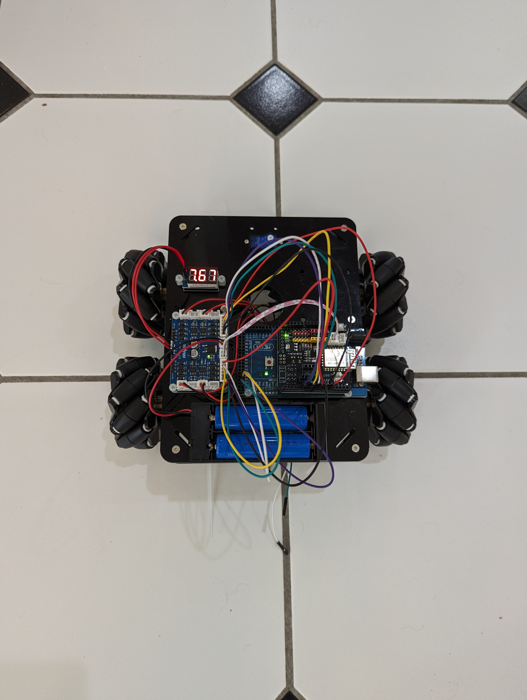

**Artificial Cognition, i.e., Why Build a Robot Car?**

Artificial Cognition is an interdisciplinary field that designs and understands computational models and devices that are based on cognitive processes such as perception, reasoning, learning, problem-solving and decision-making. It obviously is inspired by human cognitive skills and the human brain. 

Key areas of Artificial Cognition include cognitive architectures (a computational framework based on the human mind and brain), knowledge representation (how to model information about the world), perception (how to interpret stimuli from the external world), learning (systems should learn from experiences and through such adaptations improve performance in the future), and logical reasoning. 

Grounding is a key part of Artificial Cognition. In perceiving the world, grounding connects the internal symbols the system has with actual sensory inputs from the environment. In performing actions on the world, internal symbols can similarly be understood. There also can be other types of grounding such as social grounding where internal symbols are given meaning with relation to social effects of the group. 

Embodiment is often crucial to Artificial Cognitive as well as the emergence of real AGI, as well as understanding the operation of the mammalian brain.

Embodiment technically means to give an AI program some way to sense the environment and some way to act on the environment. However, in a practical sense, it means to give your AI program a physical body. While embodiment does not guarantee grounding, again in a practical sense, it almost always allows it. For example, an embodiment such as a robot car allows your AI program to have sensors and thus perceive the environment. It allows your AI program to have actuators and thus act on the world. Thus the internal symbolic representations (even if abstractly in neural networks) of your AI program can be linked to real-world external objects and actions. 

Embodiment also goes beyond this. For example, by having a robot body, your AI program can learn in context, i.e., it can associate the stimuli that the environment provides and the actions the robot performs, with the outcome that results. As well, the robot, i.e., the embodiment for your AI program, can get immediate feedback on an action it performs, and thus it can continually improve the links between symbols and their effect on the environment.

##
Tip: When you click links in these Overview document files, right-click so that you open up a new browser page.

(In the Windows Chrome browser, for example, right-clicking the link and then choosing "Open link in new tab" will place the linked web page in a new tab -- very convenient for looking at when you are ready, and then deleting when you are done. You are still in the same place in this Overview document.)

(Otherwise, this page may be replaced by the clicked page. Then you will have to press the back arrow to come back here and then find this spot again in the document.)

(Yes... this image has tiny little spelling mistakes or other weird things the reader can notice -- it was created by generative AI and suffers from having made-up features, as is common with this technology at the time of writing.)

 

##

For a good overview of the importance of grounding your AI/AGI please consider my paper:

[cca5 inductive analogical soln to grounding problem](https://www.sciencedirect.com/science/article/abs/pii/S1389041722000493?via%3Dihub) 

[archive preprint](https://github.com/howard8888/insomnia/blob/master/analogical%20inductive%20preprint.pdf)

For a good overview of the field of Artifical Cognition please consider this recent paper:

[https://www.frontiersin.org/articles/10.3389/fncom.2024.1349408/full](https://www.frontiersin.org/articles/10.3389/fncom.2024.1349408/full)

For a paper on using the PetitCat project for Enactive Inference by Dr Georgeon and colleagues, please consider this recent paper:

[https://www.sciencedirect.com/science/article/pii/S1389041724000287?dgcid=author](https://www.sciencedirect.com/science/article/pii/S1389041724000287?dgcid=author)

(We will discuss the concept of active inference in a later Part of the documentation. The main idea behind active inference, as developed by psychiatrist and neuroimaging expert Karl Friston, is that organisms keep a stable state by minimizing "free energy" which is related to prediction errors in their models of the world. (If you recall your high school chemistry classes, Gibbs Free Energy is whether a chemical reacton will occur spontaneously, i.e., a system's potential to perform work. When a system is in equilibrium, the free energy is minimized. If you studied thermodynamics in university, then you have a more detailed understanding of free energy, e.g., Helmholtz, Boltzmann, etc.  Friston's use of free energy is similar, where there is minimal mismatch between an organism's prediction of the world and what they perceive of the real world, and thus the organism stays in a stable, equilibrium state as such in its environment. If there is a mismatch detected, then the organism will adapt its behavior to minimize this prediction error.) Thus, the organism is constantly updating its internal modle of the world in order to minimize prediction errors with regard to the actual sensory signals coming in from the real world. Enactivism is related to a philosophy that emphasizes the active role an organism has in shaping its perception and cognition, i.e., it does not simply process information in the act of perception, but is deeply grounded in its environment, and by interacting with its environment, it shapes it perceptions and model of the world. Thus, in enactive inference, cognition must be embodied and grounded such the organism creates its own reality by interactions with the environment. Enactive inference generally is considered to focus more on the embodied interaction than the internal models of active inference. We will discuss these concepts in later Parts of the documentation, but the interested reader should consult Georgeon and colleagues' paper above.)

##
Note to hobbyists, high school students, even computer scientists without a background in cognitive science:

You do not need to understand the above few paragraphs to build the robot car and even use it in your own projects, even AI ones. However, doing so can be advantageous to better understanding the background of this project as well as aspects of cognition.

##

-

**Why Not Use a More Professional Experimental Robot?**

Even if Tesla Bots, for sake of example, were available, you wouldn't want to use such a complex system for the prototype stages of your AI/AGI project or theoretical project. You want a capable but simple enough robotic system that you have direct access to via Python, which is what this robotic car project allows. You will now have an embodiment to use with your AI/AGI. Even if you work mainly theoretically, the robotic car project can be very useful in terms of demonstrations and proof of concept. (Although....in the future if the price point drops enough and the API's of such robots are friendly enough (while financial cost is considered carefully, complexity cost of a project is often underestimated -- for many AI/AGI researchers you want to focus on your main area of research, not interfacing an embodiment to your project), perhaps the PetitCat project can allow more interesting humanoid embodiments for your AI/AGI research.)

 

There is also the issue of cost. For example, a cognitive robot used in many laboratories (and seen in the paper above on Artificial Cognition) is the iCub robot. It is a reasonable small size and can be interfaced to AI programs. However, the cost a single iCub robot is approximately  €250,000 (source Wikipedia at the time of writing). Or, another robot that can be interfaced to your AI projects is Boston Dynamics robot dog Spot. However, its cost is approximately US$75,000 (source Wikipedia at the time of writing). (The Boston Dynamics humanoid Atlas is currrently not available for sale, but it would similarly be quite costly.)  In contrast, the cost of the PetitCat project is about $100-$200 with all the optional accessories. 

 

 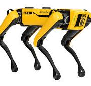

 

Hanson Robotics has sophisticated very humanoid-like robots that some R&D institutions use. The Sophia and Einstein models are quite famous. 

 

A very promising android-like robot is the Phoenix model from Sanctuary AI.

 

The list of android-like robots being developed at this time has become extensive and too long to include here. However, two android-like robots recently seen in the press are the Figure01 from Figure AI and the NVIDIA Groot. Again, such models are orders of magnitude more expensive than the total $100- $200 cost of the PetitCat project.

 

 

At the time of writing Unitree has been getting much press about its G1 humanoid robot which is to sell for US$16,000 (albeit, not available at the time of writing and unknown when it will be available) and has the following specifications:  super-flexibility to do any human work, weight 35-47kg,  and can run at about 7km/h. Again, availability is unknown but when the price point drops for this and similar robots, given a reasonable complexity level, then perhaps in the future the PetitCat project can be applied to more interesting embodiments for your AI and AGI research.

 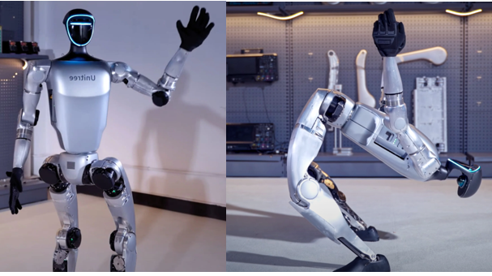

-

**Why Not Use ROS2?** 

 The Robot Operating System (ROS) is a collection of software frameworks to take care of the low-level management of a robotic system. For example, it can abstract away aspects of the hardware being used, it can control the low-level operations of the robot and coordinate communication between different operations. ROS was released in 2007 and ROS2 was released in 2017. ROS2 is open source.

 However, ROS2, despite its name, is not an operating system, but must be run on top of another operating system, usually Linux. Thus, there is a need for a full computer system board in the PetitCat project if ROS2 is used. As well, ROS2 is many times more complex than the Arduino-based software used in the PetitCat project. 

 Thus, to keep the costs of the PetitCat project down (i.e., total costs of under US$200, including the extras) and to keep the complexity of the project down (the goal is to have an easy-to-implement robotic system that you can use with your AGI project), it was decided not to use ROS2. Instead an Arnduino microcontroller board along with the Arduino IDE (which compiles and pushes machine code onto the board) is used resulting in lower costs and less complexity in interfacing your AGI project to a robotic embodiment. Note that most of your AGI project code will run on a desktop/laptop/server PC running in Python, not in the machine code in the Arduino microcontroller board. However, the PetitCat project allows communication between the Arduino board and the Python software running on your desktop/laptop/server.

-

Future robotic embodiments are interesting to consider but the reality is that the PetitCat project will allow the AI/AGI researcher to interface his/her project to an embodiment for under $200 in parts and for a very reasonable complexity cost in the present.

-

<h1 style="font-size: 24px;">Step #1 -- Decide if you want to do the Project</h1>

Your first step should be to decide to build this robotic car project. Are you working on an AI/AGI project that it could be useful for? (Actually, it is probably useful for most projects, including LLMs. Please read above about grounding and about artificial cognition.) Do you have an interest in robotics and would like to see an interface to an AI project? 

In terms of monetary cost expect to spend about US$150-$200 on the project (I know the Amazon.com prices are not this high, but shipping to other countries, extra parts from AliExpress, etc will push up the price). (If you purchase duplicate parts, which can be useful for troubleshooting, then double the costs.)

In terms of your required electronics expertise, very little is needed if everything gets assembled correctly and all parts are working. If you want to modify the design, if there is more advanced troubleshooting, then of course more is better.

In terms of your required software expertise, only a minimal amount is needed to make the robot work. For example, you need to be comfortable moving around files and running Python code. The Arduino IDE and code you can install and copy without great expertise (I will show you how below). Of course, if you have the time, you can spend more hours getting more expertise in the Arduino ecosystem (which involves C/C++ code). As well, you will need more expertise in Python if you want to use the robot car for your own research project.

Do not worry. Regardless of your skill level, this manual will gently guide you through the various parts of the project. You will accomplish amazing things. Have confidence in yourself. Have confidence in this manual. Have confidence in this project.

Are you ready?

Don't be hesitant. Climb up on that horse and start your journey. Saddle up!! 

 

-
-
-
-

<h1 style="font-size: 24px;">Step #2 -- Purchase the Robot Car kit</h1>

I assume you already have a Windows, Linux or Mac computer to use with this project. I used a Windows PC, and thus I will be describing my experience from a Windows point of view. However, running Arduino and Python code within Linux or Mac environments should be straightforward if that's what you are using.

There are two purchases to consider:
1 - Purchasing the Robot Car Kit

2 - Purchasing the extra electronic parts

In this section we will talk about purchasing the Robot Car kit.
Although I am in Canada, and although the business office representing Osoyoo is actually based in Canada (however the robot kit parts are manufactured in Asia), it is much easier to order from the USA Amazon website:

Product title: OSOYOO Omni-directional Mecanum Wheels Robotic Car Kit for Arduino Mega2560 Metal Chassis DC Motor DIY STEM Remote Controlled Educational Mechanical DIY Coding for Teens Adult
Product cost (at time of writing):  US$119.99   (plus about $25 to ship to Canada, but free shipping within USA if you have Prime)
link:  [amazon product link](https://www.amazon.com/OSOYOO-Omni-directinal-Controlled-Educational-Mechanical/dp/B0821DV5GJ/ref=sr_1_2?crid=1S643UFKFPI0E&keywords=osoyoo+omni+directional+mecanum+wheels+robot+car+kit+for+arduino&qid=1703129510&sprefix=osoyoo+omni-direction%2Caps%2C97&sr=8-2)

Troubleshooting note:  If you are able to allocate sufficient research funds, I would advise purchasing two kits so troubleshooting any issues with the hardware becomes easier. (Disclosure: I did not. I purchased a single kit with the expectation that I could get efficient Amazon.com delivery of a second kit should I need it.)

**Please purchase this exact model noted above** unless you want to make modifications to the code on your own.

In countries outside of Canada and USA, I would still recommend considering Amazon for easy delivery in certain countries where the Amazon service is efficient. In other countries consider the Osoyoo website:
[osoyoo website](https://osoyoo.com/)

Note: The Amazon website says this is a kit for teens while the Osoyoo website shows 5 years old building robotic kits (albeit simpler ones). Please keep in mind you are not buying this kit to produce a project for your high school science fair. You are buying this kit to have a grounded physical embodiment of an AI/AGI system which you then can use with tens of thousands of lines of your Python code.

-
-
-
-

<h1 style="font-size: 24px;">Step #3 -- Purchase the Extra Electronic Parts</h1>

You may not need these extra navigation parts immediately, but since they are purchased from AliExpress and generally delivered from China via slow delivery means (given that the sum total of the parts is about US$30), you may want to order these parts once you decide to go ahead with the project.

I will provide the exact AliExpress link I used to purchase these extra navigation components:

[flight control sensor](https://www.aliexpress.com/item/1005003478577853.html?spm=a2g0o.order_detail.order_detail_item.3.1437f19cTglF4n)

[optional hex socket set screws](https://www.aliexpress.com/item/1005003699221015.html?spm=a2g0o.order_detail.order_detail_item.3.edeef19cPldfHc)

[optional board spacers](https://www.aliexpress.com/item/1005004818109229.html?spm=a2g0o.order_detail.order_detail_item.3.7b0cf19cGpkdzc)

[RGB sensor](https://www.aliexpress.com/item/1005003484925759.html?spm=a2g0o.order_detail.order_detail_item.3.4f67f19cQhDc0g)

[optional suspension modification](https://www.aliexpress.com/item/4001179419287.html?spm=a2g0o.order_detail.order_detail_item.4.4793f19cXElsA8)

Troubleshooting note:  If you are able to allocate sufficient research funds, I would advise purchasing two sets of electronic parts so troubleshooting any issues with the hardware becomes easier. (Disclosure: I did not.) 

-
-
-
-

<h1 style="font-size: 24px;">Step #4 -- Receiving the Robot Car Kit -- Finding the Documentation</h1>

A few days (or day -- Amazon.com is very efficient) have gone by and a package arrives at your lab, office (or home perhaps). It's the Osoyoo robotic car kit.

Open the box, and make sure that all the parts are there and are in good condition. (Mine were -- everything included and seemed brand new and in good condition.)

There is a cardboard sheet with a list of parts in Japanese -- you can use it and exercise your brain to learn some new symbols (assuming you don't read/write Japanese) and think about Harnad's concepts of symbols and grounding, e.g., [grounding problem](https://www.sciencedirect.com/science/article/abs/pii/S1389041722000493?via%3Dihub)
Or... you can turn the cardboard sheet over and read it in English :)
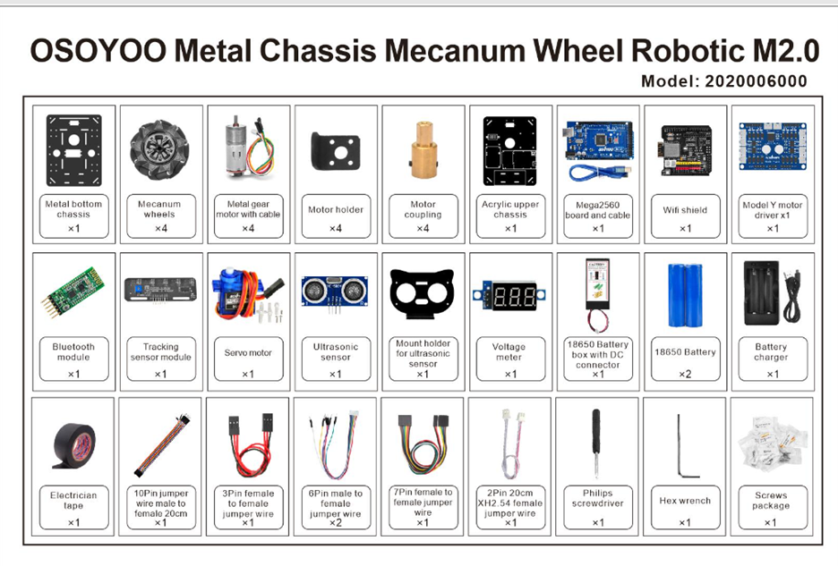

There is a little manual with the car. However, it really only serves the purpose of telling you to go online and look at the manual(s) there:
[Osoyoo manual](https://osoyoo.com/?p=49235)

Hmm.... what version is my robotic car kit? The manual says there are three versions 1.1, 1.2, 1.3 which are distinguished as follows:

*If you received a black acrylic board and 3-point tracking module, please download the V1.1 manual.*
https://osoyoo.com/manual/V1.1metal-mecanum.pdf

*If you received a transparent acrylic board, please download the V1.2 manual.*
https://osoyoo.com/manual/V1.2metal-mecanum.pdf

*If you received a black acrylic board and 5-point tracking module, please download the V1.3 manual.*
https://osoyoo.com/manual/V1.3metal-mecanum.pdf_*

Well... the picture of the robot on the front of all three manuals is identical, showing a 3-point tracking module.

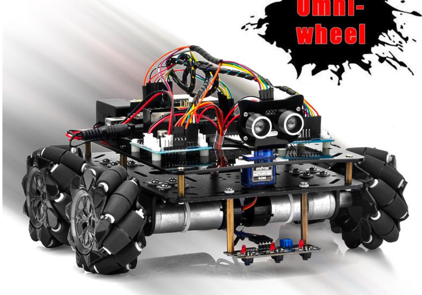

However, the robot I received has a black acrylic board and 5-point tracking module. As well, the cardboard parts list I received says "M2" which I assume is a Model 2 version.

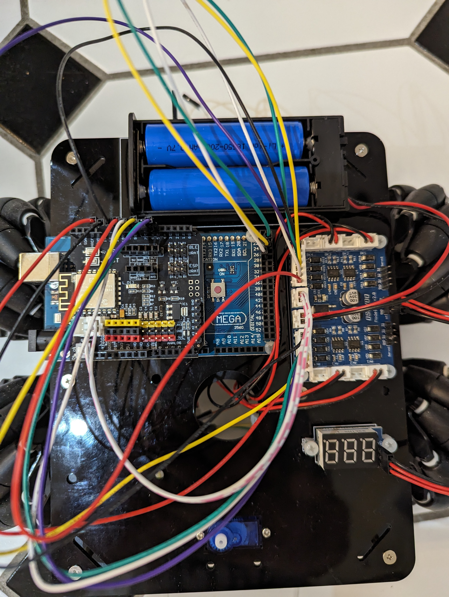

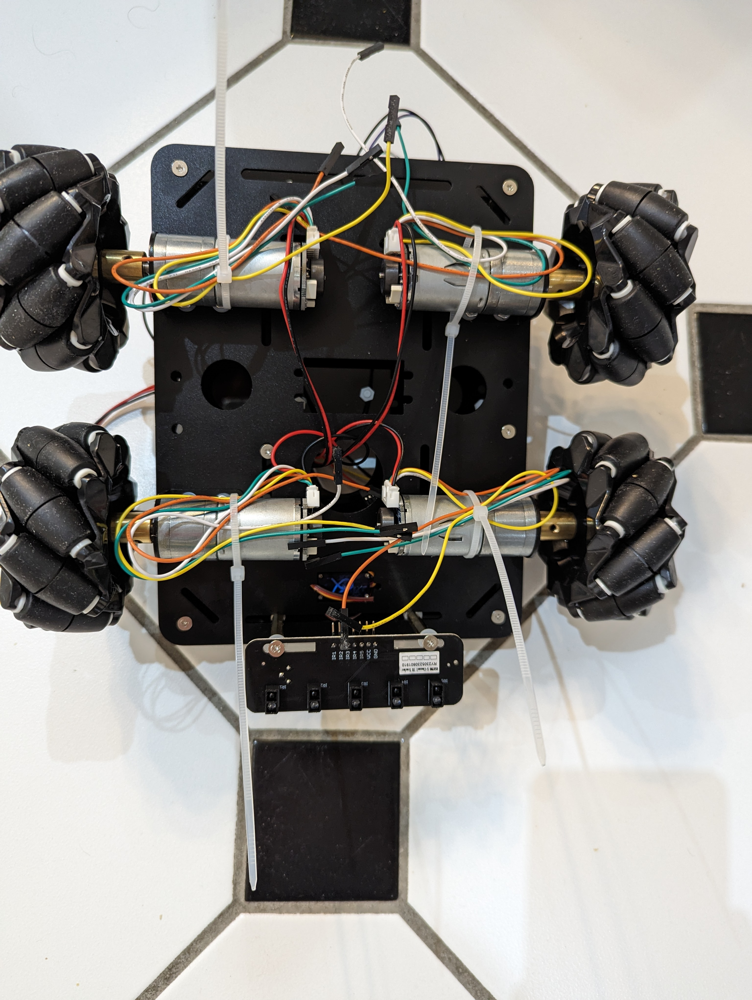

Ok... let's work backwards from the online manual to the Osoyoo hosting site and let's see if there are other models listed.... yes indeed, there is a Model 2. Thus, I will assume that I have model 2 and thus I will download the M2 manual. Therefore, this overview of the robot car will be from the perspective of the M2 model.

I think this is reasonable as I purchased my kit from Amazon November 2023, and I assume it is already 2024 or later when you the reader are reading this, and most likely you will have a later model as well. Also, it seems that the models and versions are somewhat similar, so my overview should be useful to you regardless of the model that you have. (Look at the version number on your parts list. Also match your robot to the descriptions above. If you have a version 1, i.e., 1.1, 1.2, or 1.3 version robot kit, then download one of the manuals listed above.)  

For myself and those of you with a Model 2 robot kit (which should be most users in the future, if not a more advanced model) we should download this PDF manual:
 [model 2 PDF manual](https://osoyoo.com/manual/202000600-m2.pdf)

Great -- the robot shown on the cover the manual matches the car I received:
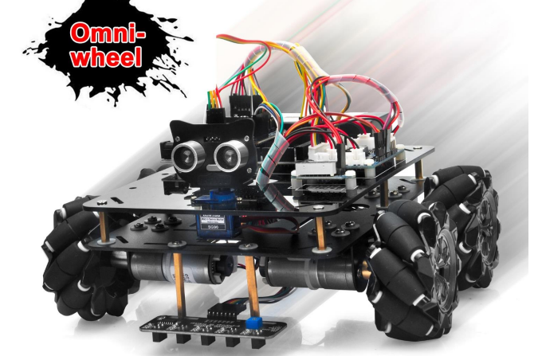

The online version of this manual has a useful parts list which links to the Osoyoo website to buy replacement parts:
[online Model 2.0 manual](https://osoyoo.com/2022/07/05/v2-metal-chassis-mecanum-wheel-robotic-for-arduino-mega2560-introduction-model-2021006600/#4)

-
-
-
-

<h1 style="font-size: 24px;">Step #5 -- Overview of the Parts and of the Documentation</h1>

Ok... at this point you've downloaded the correct PDF manual for your robot car kit.
Again, as noted above --I am using the Model 2 manual in my overview of the robot car:  [model 2 PDF manual](https://osoyoo.com/manual/202000600-m2.pdf)

Before we start constructing the robot car, let's take a look at some of the parts and then quickly do an overview of the documentation. 

There is a metal bottom chassis where the drive motors will be attached.  (Note that the straps are still loose until the assembly is completed and wires are tucked away.) When assembled it will look like this:

Note that there is a separate drive motor for each of the four wheels. Note also there there is no steering apparatus. This is because these are Ilon Mecanum wheels  (or "omni wheels") that can go forwards and backwards, but also sideways. Note that the wheels are constructed of rollers at an angle of 45 degrees to the axis of rotation.

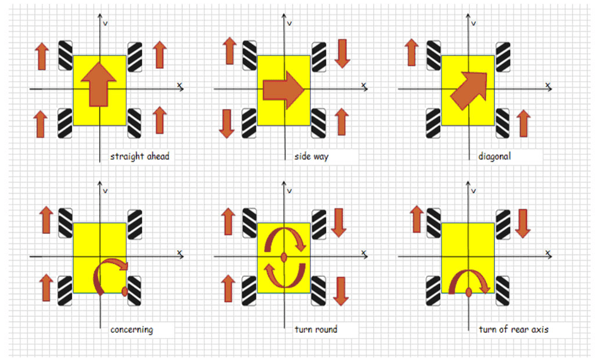

On top of this metal bottom plate there will be a top acrylic plate. The electronics will all be mounted on this top acrylic plate.

With regard to the electronics, note that there are three main electronics boards included. One of them is the motor driver board -- this board will control the motors attached to each wheel. Then there is the Mega2560 Arduino board. If you have not worked with Arduino before I will show you all the steps involved -- very easy. The Arduino board is the computer board essentially controlling the robotic car. Into the Arduino board there is a Wi-Fi shield (Esp8266) which will give the system Wi-Fi access. There is a USB cable which plugs into the Arduino board and forms an easy to use interface with your laptop enabling you later to send your software to the Arduino board. (I will show you how to use the Arduino board and the Arduino IDE below -- it's very easy, whether you have much experience or not in the area.)

There are some smaller electronics boards also, e.g., Bluetooth module, tracking sensor module, etc. We will discuss them as we use them.

When assembled the acrylic board on the top of the robot car will look like this:

Note the blue lithium batteries. In the kit parts there should be a battery charger along with its USB cable which can charge these batteries. 

****
WARNING: Osoyoo gives warnings about reversing the polarity or short-circuiting the batteries. Please follow these warnings. Reversing polarity (pay attention when you insert the batteries) or short-circuiting these lithium batteries, despite their low voltage, can result in high currents that will damage electronic parts and pose a fire hazard. Always exert caution when dealing with lithium batteries.
****

(These batteries are "18650" batteries, a standard lithium battery, indicating an 18mm diameter by a 65mm length. I am not sure why the industry standard add the '0' to
get the full number of '18650'. Osoyoo does not specify the battery chemistry but this product number is a Lithium-ion 3.7volt standard part developed by Panasonic in the
1990s (used in laptops often), and generally were graphite anodes and lithium-metal oxide cathodes. Each 18650 had a capacity of about 2500mA-h (Osoyoo notes they are 2000mAh).
Of interest, 2.5A*3.7volts*1 hour = 9.25 watt-hour x 2 batteries ~= 20 watt-hrs = 0.02 kWh. In comparison the cheapest Tesla EV Model 3 (cheaper than an average internal
combustion engine vehicle at the time of this writing) has a battery with 54kWh -- equivalent to having about 6000 of the 18650 batteries. Alas, not as many as required to
generate the thousand kWh in the Tesla Semi which would be about 100,000 of the Osoyoo 18650 batteries -- yes, one would have to purchase many, many Osoyoo robotic car kits to
build an electric car or electric semi truck :)

After you construct the robot car and it is being used (especially by others) make sure the battery compartment is closed as seen in the picture below:

Before we start building the robot car, let's have a quick look at the documentation (always a good idea no matter what project you are working on).

The PDF Model M2.0 documentation is divided into five "lessons." 

Lesson 1 -- Assembly of the mechanical parts and the electronic parts and installing the Arduino IDE -- at this point you will have a functioning robot car that you can try out with the self test Arduino code that comes with the robot car.
When the car is turned on it will go forward, backward, make a left turn, a right turn, .... and finally make a down diagonal and stop.

(Below I will give you a very brief hands-on tutorial on setting up an Arduino development environment ("IDE" means "integrated development environment", which just means a software application that lets you program in some sort of language or environment -- in this case code for the Arduino board and transferring these programs to your robot car). Do not worry if you don't have much experience with Arduino or coding -- I will show you how to get software onto the Arduino board of your robot car. However, of course, if you want to use your robotic car for robotics projects, knowing how to code in Python will be necessary later on.
What is an "Arduino" board? It's a microcontroller board adopted by the hobbyist community over a decade ago. A "microcontroller board" is a board with a computer chip, RAM, meory for programs and input/output circuits so that you can use the board to control electronmechanical devices, such as a robotic car in this case. The Arduino board is open source, inexpensive and can be found at electronic parts distributors all over the world. However, it comes with the robotic car kit so you don't need to go out and buy it separately, unless you want to have a second board for experimentation.)

The car will look like this at this point:

Lesson 2 -- Use of the ultrasonic and servomechanism modules to avoid objects -- you can see the sensors mounted on the servo in the cover image. (I have not yet mounted these sensors.)
(I will give you a very brief tutorial on ultrasonic detectors and servomechanisms below.)

The car will look like this at this point (the ultrasonic module looks like two eyes, and it is mounted on the blue servo motor):

Lesson 3 -- Use of the 5-point tracking sensor to follow a black track line -- you can see these sensors in the cover image just above, as well as in the underside photo of my assembled robot car.

Lesson 4 -- Bluetooth interface to the robot car -- this board has not been installed in the Wi-Fi shield yet but will allow Bluetooth interfacing.

(Bluetooth and Wi-Fi are both wireless mechanisms that allow computer devices to talk to each other and the Internet without using wires (i.e., that is why they are "wireless"). 

-Almost everyone in the modern world is familiar with Wi-Fi which is mainly used to wirelessly connect computer devices to the Internet -- a computerized device communicates to a local area netwowrk (LAN) router which then communicates to the Internet via an Internet Service Provider (in Canada generally one of the telephone/cellphone/cable TV companies) to the Internet backbone.

-All of us have probably used Bluetooth at some time, especially if we have "Bluetooth" earbuds that wireless connect to our cellphones -- that is the purpose of Bluetooth, i.e., used to wirelessly connect computer devices between each other and over short distance. Bluetooth has been commercially available since 1999 but never worked well (trouble pairing two devices to each other was a common consumer complaint) until the large cellphone manufacturers started engineering better Bluetooth pairs in the cellphone and the earbuds. Depending on the engineering effort, modern Bluetooth devices can work great or can be terrible. Bluetooth operates at typically 2.4GHz (with enough of a one megaHertz bandwidth for a clear audio transmission to your earbuds:) and is a spread spectrum technology with typically Gaussian frequency-shift keying modulation (essentially a common FM technique, used in many devices, e.g., perhaps your garage door opener if you have one for a house or apartment building; the Gaussian filtering makes the transitions smoother and reduces the sideband (generation will end up being interference to an adjacent frequency channel; lots of tricks going back decades for single-sideband, etc)). Note that the frequency modulation has nothing to do with the frequency hopping. The frequency-shift keying FM is within a frequency channel. However, Bluetooth frequently hops between different channel (i.e., frequency main channels). This Frequency-Hopping Spread Spectrum technique reduces interference with other signals, perhaps another Bluetooth device, and has the effect of producing a secure signal (since the signal is jumping around all the time so hard to intercept) that is robust in noisy environments. However, both Bluetooth devices must change frequencies in synch via a pseudorandom sequence used in the protocol. Lots of requirements -- if the engineering of the products is poor, Bluetooth is much more troublesome than modern Wi-Fi. Bluetooth 4.0 in 2010 addressed many of the limitations of using Bluetooth between real-world devices and finally Bluetooth 5.0 in 2016 smoothed out the consumer experience with a myriad of engineering improvements over the original Bluetooth from the 1990s. While the technology underlying Wi-Fi is actually more complex than Bluetooth (e.g., Wi-Fi uses a myriad of modulation techniques and spread spectrum techniques), Wi-Fi has been better engineered over the years, the underlying chipsets and algorithms which implement these techniques have been well refined, so that for most users, Wi-Fi actually works quite well and actually quite robustly.)

The Bluetooth module will be inserted into the Wi-Fi Board:
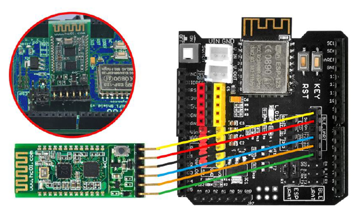

Lesson 5 -- Wi-Fi interface to the robot car -- the Wi-Fi shield has already been installed in photo showing the electronics of my assembled robot car.

As noted above, Bluetooth and Wi-Fi are both wireless mechanisms that allow computer devices to talk to each other and the Internet without using wires.

The Wi-Fi board will now actively interface to the Arduino board:
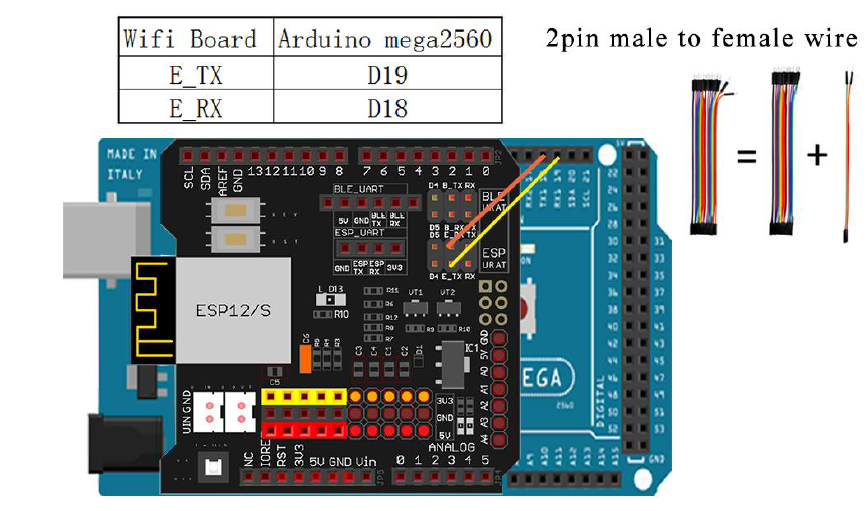

-
-
-
-

<h1 style="font-size: 24px;">Step #6 -- Assembly of the Parts on the Underside of the Chassis</h1>

-Follow the instruction manual to bolt into place the motor holders. Then install the jackscrews and couplings on the motors, and install the motors as shown in the manual. There are nylon tie wraps to hold the extra wires. Note that these motors (one for each wheel) have Hall sensors (the white, yellow, orange, green lines) but they are apparently not being used and are just tucked away. Only the ground black and power red wires will go to the electronics through the center hole in the chassis.

-Pay attention when you are installing the Mecanum wheels -- follow the orientation shown in the manual.

-Then install the tracking sensor (which should be a 5-point one in the Model 2) to the chassis as shown.

Assembled chassis (Note that the straps are still loose until the assembly is completed and wires are tucked away.) When assembled it will look like this:

-
-
-
-

<h1 style="font-size: 24px;">Step #7 -- Assembly of Electronic Parts on the Acrylic Board above the Chassis</h1>

-Follow the instruction manual to prepare the acrylic board and then install the electronic modules as shown.

-To avoid static damage to the electronic components I would strongly advise doing these steps near a sink. Hold onto one of the water pipes to ground yourself and then you can do an operation. Then ground yourself again with each operation. It's ok to let go of the water pipe when you insert the electronics -- if you're not walking around it's unlikely you'll build up much static in a few seconds.

-Follow the manual very carefully to orientate the electronic modules as shown.

-Then follow the manual and insert the wires connecting the motors to the motor control board.
-Tip: Careful about not wasting wire in threading through the center hole and to the motor control board -- there will not be much excess wire on one side.
(Also, note that only the red power and black ground wire from the motors are controlled by the motor board. The other colored wires are from the motor's Hall sensor and are not used at this point in the project. Hall sensors can measure the magnitude and orientation of a magnetic field, so, usually a pair or equivalent of magnets rotate without any physical contact and the Hall sensor detects their location, i.e., effectively the location of the rotor of the motor, which can be very useful in precision robotic applications.)

(The Osoyoo "Model Y 2.0 Motor Driver Board for Arduino Robotic Car Kit" is a 4-channel H-bridge motor driver. H-bridge circuits allow voltage to be applied across a load in either direction, which is very useful for controlling the rotation direction of a DC motor such as used in the robotic car. A simple, silicon transistor H-bridge circuit is shown below -- as can be seen it looks like an 'H' thus the name. The Osoyoo board uses the PT5126 chip as a DC motor driver, which can supply up to 2.8Amps at a voltage of 2 - 24 volts, useful for bidirectional control of electric motors. It is a single-channel chip.  They specify using two such chips in their product specifications, although just by looking at the layout of the PCB it looks like there are 4 such chips which makes more sense given it is a single channel. The lettering on the chip packages are faded so I cannot read the parts numbers. However, the chip part number comes up on the Alibaba website at the time of writing at 13 cents per chip and shows a picture resembling the 8-lead slim packages soldered to the PCB. From another site I was able to find the specs for this chip:  controls 2V- 24V at 2.8 amps, as noted above; accepts logic signals of 1.6V to VCC; VCC can be 2.7V to 5.5V (which means can work with other Arduino boards that operate at 3.3 volts); good PWM specs with up to 200KHz signals allowed; and very importantly seems to have protection for back-EMF from the motor although terms used don't say this exactly; also thermal shut-down protection; draws less than 50 nanoamps (not milliamps or microamps but nanoamps, i.e., .05 microamps) when bridge is turned off -- seems like an impressive integrated circuit for 13 cents !! )

(The INI inputs on the Model Y 2.0 Motor Driver Board control the H-bridge motor driver circuits. For example, if M_A IN1 input from Arduino is high and M_A IN2 input from Arduino is low, then the Motor A (which wheel depends on if these inputs control AK1, AK3, BK1, BK3 -- I will trace out in the future or perhaps take the lazy approach write some diagnostic software to see the effect) by convention turns clockwise (again I need to actually experiment and measure), while if M_A IN1 is low and M_A IN2 is high, then the wheel A will turn counter-clockwise. If both M_A IN1 and IN2 are both high or both low, then the H-bridge is turned off and no activation of the motor. Note that the inputs from the Arduino board can be PWM inputs, although I am unsure how much the pre-packaged Osoyoo software takes advantage of this. By varying the duty cycle of the pulses, the speed of each motor can finely be controlled. Also, each of the motors on the robot kit have feedback sensors which are actually not connected in this robot kit, as noted above, but are there for possible future used.) (Previous tracings indicated that Osoyoo EMB IN4, IN3  correspond to inputs M_A IN1, M_A IN2 on the Driver Board which get PWM inputs from Ardinuo pins 5, 6, and which typically should control the rear-right motor, although note that which motor depends on where cables are plugged and I did not record which output (i.e, AK1, AK3, BK1 or BK3) nor which logic signals corresponded to clockwise versus counterclockwise -- to do in future documentation.)

(Note that the Osoyoo "Model Y 2.0 Motor Driver Board for Arduino Robotic Car Kit" also provides the motor output to two servomechanisms. In the robot car kit described here, only the outputs from "Servo1" are used. The Motor Driver Board does not actually control the servo motor. It supplies power to the servo motor, i.e., the pins 5V and ground. There are pins (for servo #1 being used in the robot car) of S1 and S1. One of the pins S1 receives a PWM signal from pin 13 of the Arduino board. The other pin S1 simply passes this signal to the servo motor, i.e., the servo motors are actually being driven and controlled directly by the Arduino board, not the Model Y 2.0 Motor Driver Board.)

(At this time note that pin 13 of the Arduino board is driving the servo motor. This might be changed in the future since pin 13 of the Arduino board also goes the LED on the Arduino board. Thus, if you write a program in the future that blinks this LED, you will also be pulsing the servo motor moving the ultrasound sensors of your robot car, and possibly burn out the servo motor. Pin 13 is the default wiring that Osoyoo used in its manual and in the pre-packaged Arduino software that comes with the robot car kit.)

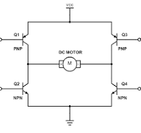

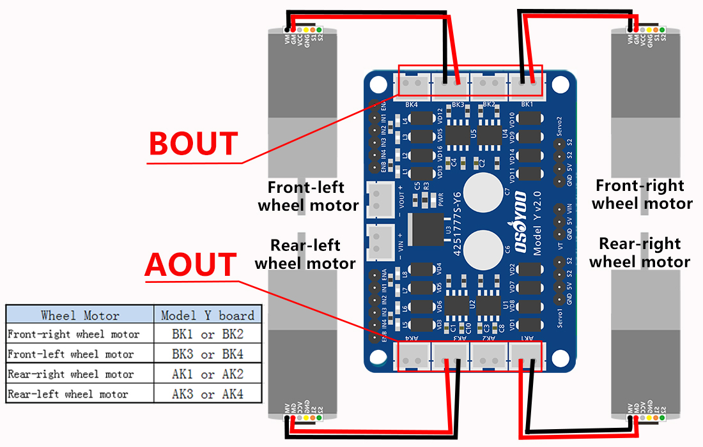

-Now connect the motor controller board to the Arduino board and the Wi-Fi shield pass through connectors as shown in the diagram in the manual:
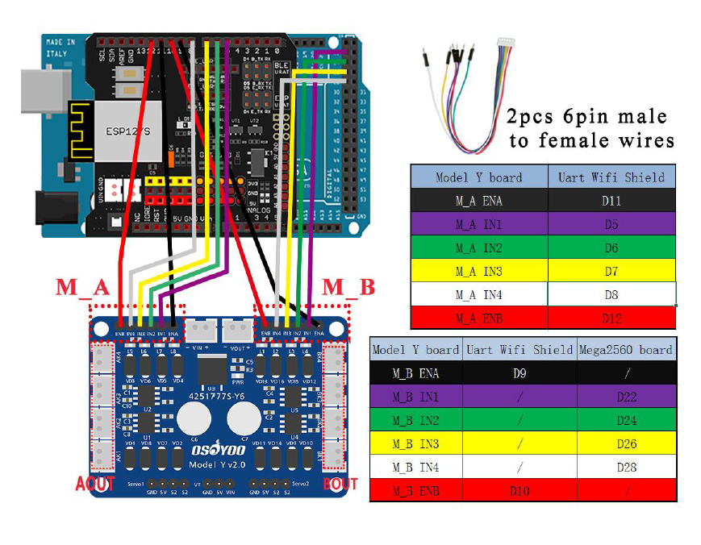

-
-
------------

Note:
The wiring shown in the Osoyoo Manual causes the robot car to run in reverse when the software of Lesson 2 (ultrasound object avoidance) and Lesson 5b (cellphone Wi-Fi app to make the car go in different directions) is run. (However, if the software from Lesson 3 (photocell line tracking) is run, the direction is correct.)

The original Osoyoo wiring instructions for wheel motors to pin locations on the Motor Control Board Y:

Front-right  BK1

Front-left BK3

Rear-right AK1

Rear-left AK3

For the Osoyoo software that comes with Lesson 5b you need the wiring reversed from original wiring:

Front-right  BK1 --> AK3

Front-left BK3 --> AK1

Rear-right AK1 --> BK3

Rear-left AK3 -->  BK1

These reversals can be done in software. However, this would require modifying the Osoyoo packaged software. Thus, for the moment we are not modifying the software so that you can download the software which Osoyoo provides without modifications. However, later on, we will reverse the wheel wiring virtually rather than unplug and replug cables.

------------
-
-

-I then connected the voltage meter and the battery box, although in the manual they also show connection of the servo motor and the 5-point tracking module, which can be done now or later.

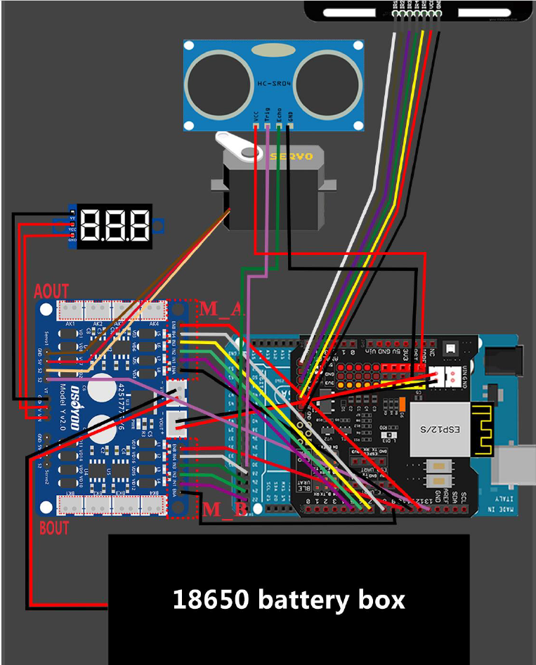
-
-
-
-

<h1 style="font-size: 24px;">Step #8 -- Installation of the Arduino IDE and Self-Test Program</h1>

-Even if you have no experience with Arduino, this step is quite easy.

-As noted above:
- Arduino development environment: "IDE" means "integrated development environment", which just means a software application that lets you program in some sort of language or environment which in this case is code for the Arduino board and transferring these programs to your robot car
- What is an "Arduino" board? It's a microcontroller board adopted by the hobbyist community over a decade ago. A "microcontroller board" is a board with a computer chip, RAM, meory for programs and input/output circuits so that you can use the board to control electronmechanical devices, such as a robotic car in this case. The Arduino board is open source, inexpensive and can be found at electronic parts distributors all over the world. However, it comes with the robotic car kit so you don't need to go out and buy it separately, unless you want to have a second board for experimentation.

-Warning: As mentioned elsewhere, you must use the Arduino board that comes with the Osoyoo car kit. If you use your own Arduino board and its configuration is different, it may not work properly unless you are willing to make code modifications.

-Anti-Warning: Arduino boards are inexpensive!! Consider buying a cheap one (available at Amazon as well as many electronics part suppliers around the world) and experimenting with it on its own.

- (There is a large and active hobbyist community using Arduino and similar microcontroller boards to build projects. Go to your school or community library (or newsstand) and take a look at the January 2024 issue of Make magazine. (Or look at just about any other issue -- there are always Arduino and similar projects in Make magazine.) (You can purchase online PDF's of Make magazine issues at https://makezine.com/ but given that the Make community is about hands-on (as opposed to virtual) construction projects, it's nice to have the physical magazine in your hands. Nonetheless, an online guide to microcontroller boards is frequently posted on Make's website. At the time of this writing it is: https://makezine.com/comparison/boards/ )
- The January 2024 vol 87 Make magazine compares 81 different microcontroller boards available. There are various different Arduino boards available with different amounts of memory and different physical sizes, as well as voltage requirements. The Arduino Uno is probably the best-known hobbyist microcontroller board, with all sorts of options available. The Arduino Nano is less than 2cm in width. While the Raspberry Pi is also listed along with the other microcontroller boards due to its small size and low cost, the Raspberry Pi is really a microprocessor computer system board intended to function as a low cost fully functional computer running Linux, which was an amazing achievement when it was released over a decade ago. It has a large development community, and can be used to control projects, as Make magazine frequently shows. It too is available in various configurations. For example, the Raspberry Pi Pico board (more of a microcontroller board) is also about 2cm in width and was released in 2021 at the amazing price of US$4 which is even more amazing that this board can be programmed in C, C++, MicroPython, CircuitPython and can even run deep learning code such as TensorFlow Lite. The Jan 2024 Make magazine has an article on how to build a US$25 real oscilliscope by using the Raspberry Pico.
- Pythonistas are probably familiar with MicroPython boards that now can directly run Python 3 code. Adafruit boards are frequently used by MicroPython/CircuitPython coders although they have never achieved the popularity of, for example, Arduino boards. As well, MicroPython/CircuitPython is not fully compatible with many of the library and PyPI modules used in Python programs. (CircuitPython is a fork based on MicroPython. It is easier to use, especially with the AdaFruit boards it was intended for.)  However, there is an active AdaFruit development community, and they too are available in various configurations and sizes. For example, the Jan 2024 Make magazine gives a project using an AdaFruit board to make wearable intelligent fabric. A variety of other boards are listed in the Jan 2024 Make magazine comparison. Of interest, many boards can use the Arduino IDE and/or MicroPython/CircuitPython and/or C/C++. In 2022, in fact, Arduino started officially supporting MicroPython on a number of its boards, and a MicroPython IDE can be downloaded from Arduino. Given that the Raspberry Pi can function as a full Linux computer system, any Python code along with whatever libraries are required, can be run on it.)
  
-The manual gives you a link to download the Arduino IDE. I did not use it but instead went to https://www.arduino.cc and clicked 'software' which I know is a secure website for Arduino and installed the IDE for Windows from that page. (They also have the IDE for Linux and macOS.)
This website, i.e., https://www.arduino.cc also has comprehensive documentation on the Arduino hardware and software, including a language reference, examples and tutorials. There actually is a tutorial on "Downloading and installing the Arduino IDE 2" https://docs.arduino.cc/software/ide-v2/tutorials/getting-started/ide-v2-downloading-and-installing
However, you can simply go to https://www.arduino.cc/en/software, click the download option you want (i.e., choose Windows), and the installation is quite straightforward

-Then as the manual recommends you should go to https://osoyoo.com/driver/mecanum_metal_chassis_m2/m2-lesson1.zip and download the Osoyoo self-test code. Always virus scan files you download and virus scan them again after unzipping. You will find a file "m2-lesson1.ino" which was a clean file when I downloaded it.

-Opening the Arduino app on my computer:
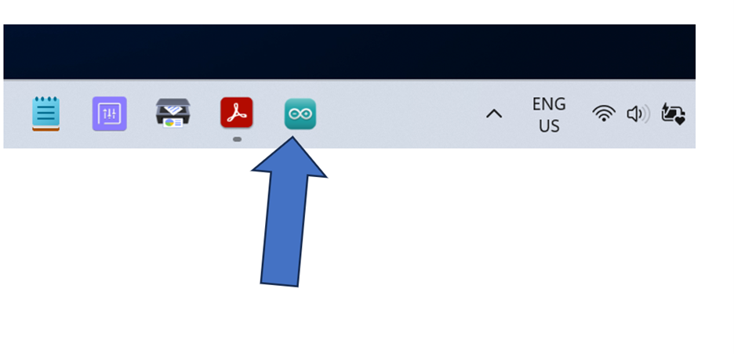

-Plugging the Arduino USB cable from the Arduino board to my PC's USB port

-Go to the Arduino IDE which should be open on your desktop, and click File, Open, and choose the file "m2-lesson1.ino"
The Arduino IDE will compile the C++ variant code (called a 'sketch' in the Arduino environment) into code that the Arduino board can execute.
On my PC it looks like this now:
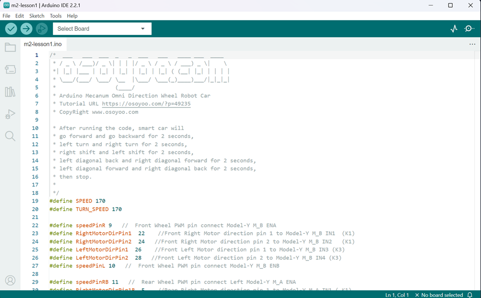

-Then click 'Tools' in the IDE and make sure the 'Board' is selected as the Mega 2560 (so the IDE knows what type of Arduino board you are using).
On my PC note that the IDE will not process the file unless the correct board is selected, which the IDE does automatically for me -- Mega2560 on COM3 -- I will select, this of course.

(The Arduino Mega 2560 board is a microcontroller board based on the ATmega2560 chip. The ATmega2560 is a chip made by Microchip and is an 8-bit, low-power RISC-based microcontroller with 256KB of flash memory, 8KB of SRAM and 4KB of EEPROM. It has 86 I/O lines, includng serial interfaces, 16-channel A/D converter. It runs at 5 volts at 16MHz and can produce 16MIPS at these parameters, albeit at one instruction per clock cycle (versus several clock cycles for the complex Intel microprocessor instructions in the laptop computer, that perhaps you are using to read this right now). Great architecture for a microcontroller!! Microchip licenses C compilers for this chip, i.e., optimizations already included, you can go ahead and just start developing for their chip. Thus for a company making Arduino boards or other products, development is greatly simplified (i.e., Microchip has taken care of the low-level functions for you). In comparison the Arduino UNO board uses the ATmega328P which has less flash memory, less RAM and less EEPROM, but then again the board is more economical. Both these chips do share the same architecture, so really both boards in theory will work with the Osoyoo robotic car kit. They are considered the "AVR" family of microcontrollers from Microchip company. Of interest to those who have read about the history of computers, these microcontroller chips use a Harvard architecture whereby the data and program buses are separated, i.e., we don't mix the two, and thus you can simultaneously access both data and program bytes (this is in contrast to the architecture in most computers, the von Neumann architecture with instructions and data stored in the same memory). Note that these chips are used in other products besides Arduino boards. For example, the popular Viper-brand auto alarm systems use 2560 chips. Of anecdotal interest, I was once walking in Cambridge, Massachusetts and needed to use the washrooms and went into a building at Harvard University, and beside the washroom was an actual Harvard Mark I (i.e., where the Harvard architecture is from) just sitting there. Wow!! Since then apparently it has been moved to a new building and shiny glass and polish applied to it:)

(The Arduino Mega2560 board has specifications which follow from the above Mega2560 chip, of course. The board has 54 digital I/O pins of which 15 can be used for PWM (pulse width modulation -- variable width pulses that can control motor speed as well as other representations of amplitude), 16 analog inputs, 4 serial UART ports, 16MHz crystal oscillator, a USB connector (which can power the board, or it can receive power from the batteries) and a reset button (which by inpsection seems to be attached to the Reset pin of the ATmega2560 chip). The board is compatible with most shields that are used with the more common Arduino Uno board. A "shield" is simply an expansion board which plugs directly on top of an Arduino board (I guess looking like a 'shield', but I don't really know where the name comes from), and given that the shields have sockets on them, you can actually plug in a stack of shields.)

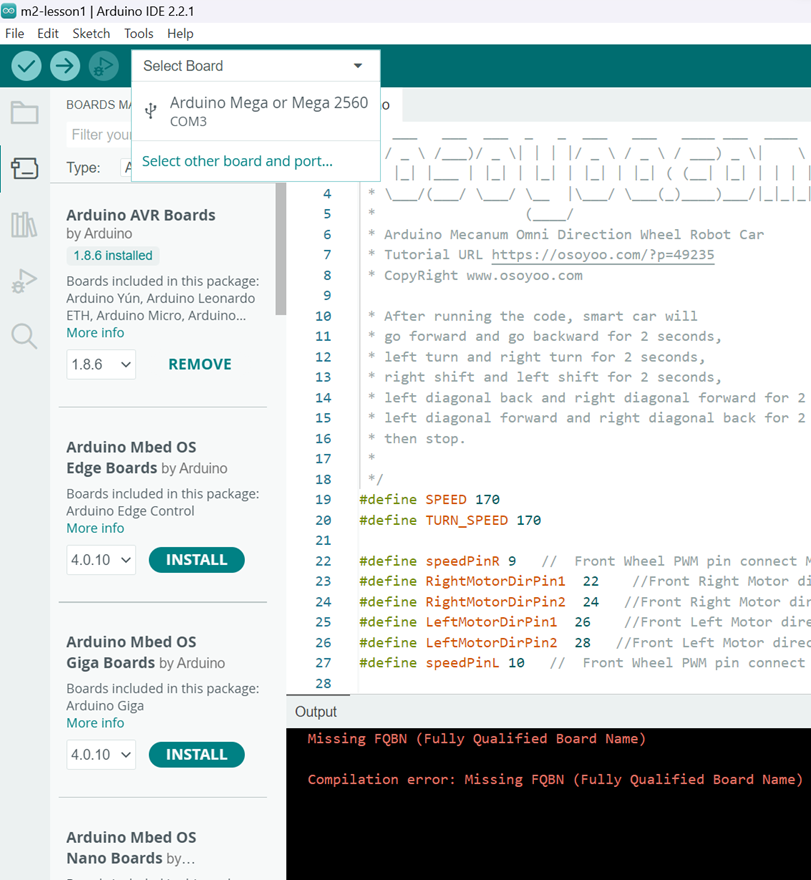

-Then click the right arrow to tell the Arduino IDE to compile the Osoyoo self-test code and to upload this code to the Arduino board on the robot.
You will see message that the code ("sketch") is compiling and then that the code is "uploading"
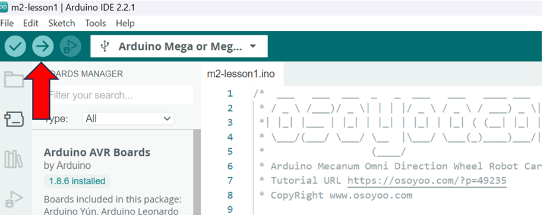

-Now unplug the Arduino cable.

-You should have previously charged the blue lithium batteries in the charger that comes with the robot car kit. (If not do this and come back in an hour.)

-Insert the batteries into the battery box and turn on the robot car

-If everything was assembled correctly and the Arduino code was successfully uploaded, then when the car is turned on, it will go through a small self-test routine for going forward, backward, left, right, diagonal, etc and then stop.

-Tip: The coefficient of friction of the rollers on the wheels used in the car is low -- it may not overcome the car's inertia and slip often on a smooth floor. To avoid this, put on a surface with a higher coefficient of friction.

Congratulations!! You have successfully assembled the basic mechanics of the car, you have successfully wired the basic electronics of the car, and you have successfully run the basic software functions of the car.

(A small divergence, but a truly important concept, is that of a modular approach to design, to systems, and so on. In Herbert Simon's "The Sciences of the Artifical" (PDF's are available from many places) he gives the story of Hora and Tempus as skilled watchmakers, but Tempus assembles full watches (faster) while Hora designs and assembles watches via combining independent modules (slower). However, Hora is actually much more efficient since he doesn't have to start over from zero if there is an interruption, but just redo the module, unlike Tempus who has to restart from zero if there is any interruption. The message is that you the reader, should also take this approach to working with complex robotic systems.)

My assembled Osoyoo robot car doing a self test (and slipping a bit) on a tile floor:

A video of two robot cars constructed and programmed by Olivier Georgeon running on a higher friction surface:
https://www.youtube.com/watch?v=SWa4VOoAa1U

-
-
-
-

<h1 style="font-size: 24px;">Step #9 -- Troubleshooting</h1>
-
-

Sometimes we feel like we are losing control of project when things don't work or make sense. You must have a disciplined approach to troubleshooting when this happens. (Image generated by GPT4.)

-
-

**Generative AI Approach to Troubleshooting**
You went through the above steps. You then put the lithium batteries into the holders, turned the battery switch on (yes, there's a small black switch on the battery box!!), but nothing happened. Your robot car does not work.

What to do?

Well.... in the modern world we live in, you can ask ChatGPT/GPT4:

----
**User**

I just built the Osoyoo Robot Car kit, but it doesn't work. What should I do?

**ChatGPT**

Troubleshooting a newly built Osoyoo Robot Car kit that isn't working can be approached systematically. Here are some steps you can follow:
Check Connections: Ensure all wires and connections are properly and securely connected. This includes checking the motor connections, sensor connections, and power supply.
Battery Check: Verify that the batteries are correctly installed and fully charged. Weak or improperly installed batteries can cause issues.
Review Assembly: Go through the assembly instructions again to make sure everything was put together correctly. Sometimes a small mistake in assembly can cause problems.
Inspect Components: Look for any visible damage to the components like the motors, sensors, or the main control board.
Test Individual Components: If possible, test each component separately. For example, test the motors independently to see if they are functioning.
Software and Firmware: Make sure you've uploaded the correct code to the controller. Also, check if the firmware of the controller is up to date.
Debugging Code: If you have written or modified the code, ensure there are no errors. Sometimes, logical errors in the code can prevent the robot from functioning as expected.
Online Resources and Forums: Check the Osoyoo website or forums for troubleshooting tips. Often, others may have encountered and solved similar issues.
Technical Support: If you've tried all the above and still face issues, consider reaching out to Osoyoo's customer support for help.
Remember, building and troubleshooting a robot kit can be a learning experience, so take your time and be methodical in your approach.

----

Hmmm...actually not bad given the vague question asked. Please note that I am using a December 2023 build of the GPT4 version of ChatGPT. Let's make the prompt more precise:

----
**User**

I just built the Osoyoo Metal Chassis Mecanum Wheel Robotic M2.0  Model: 2020006000. It is also called the "OSOYOO Omni-directinal Mecanum Wheels Robotic Car Kit for Arduino Mega2560 Metal Chassis DC Motor". It also called the "V2.0 Mecanum Wheel Robotic Car Kit for Arduino Mega2560".  The assembly/technical manual for this product can be found at https://osoyoo.com/manual/202000600-m2.pdf .
The robotic car does not work. I turn on the on/off switch and nothing happens. How can I make the robotic car work?

**ChatGPT**

Error analyzing
It seems there was an issue with the initial attempt to download the manual. Let me try a different approach to access the manual for the Osoyoo Metal Chassis Mecanum Wheel Robotic M2.0, Model: 2020006000. I will browse the manual to provide specific guidance for troubleshooting your robotic car. Please hold on for a moment. ​​

Error analyzing
It appears that I am unable to directly download and access the manual from the provided link due to current limitations in my environment. However, I can guide you through some general troubleshooting steps for the Osoyoo Metal Chassis Mecanum Wheel Robotic M2.0, Model: 2020006000. These steps are often helpful in diagnosing common issues with robotic kits:

Power Supply Check: Ensure that the battery or power source is properly connected and charged. If you are using a battery, make sure it's inserted correctly and has sufficient charge.
Connection Verification: Double-check all the connections according to the assembly manual. Ensure that all wires are securely connected to the correct terminals, and there are no loose connections.
Board and Component Inspection: Inspect the Arduino board and other components for any visible signs of damage or improper installation.
Software and Code: If your robotic car requires programming, make sure that the code is correctly uploaded to the Arduino board. Verify that there are no errors in the code and it's compatible with your model.
Motor Testing: Test the motors independently to ensure they are functioning. You can do this by applying power directly to the motors, bypassing the control system.
Sensor Check: If your model includes sensors, verify that they are correctly connected and functioning as expected.
Switch and Indicator Lights: Check the on/off switch to ensure it's working and observe any indicator lights on the board for signs of power or error signals.
Online Support and Forums: Visit the Osoyoo website or online forums for specific troubleshooting tips related to your model. Often, these platforms have discussions on common issues and solutions.
Consult the Manual: Since you have access to the manual, refer to any troubleshooting section it may have. Manuals often include common issues and how to resolve them.
If after these steps your robotic car still does not function, consider reaching out to Osoyoo customer support for further assistance. They can provide model-specific guidance and support. ​

----

Again this is quite a reasonable approach given the limited information ChatGPT had to work with.

Let's upload the  Model 2 Assembly PDF Manual to ChatGPT so it has more information to work with:

----
**User**

assemblymanual.pdf

I just uploaded the assembly manual for the robotic car. Can you give me more precise tips now how to make my broken robotic car work?

**ChatGPT**

To troubleshoot your Osoyoo Mecanum Wheel Robotic Car M2.0, consider these steps:
Battery and Power: Ensure the batteries are correctly installed and charged. Check the power connections, especially the switch and battery box.
Motor Connections: Verify that all motors are properly connected to the Model Y motor driver board. The manual details the specific connections for each motor.
Board Installation: Confirm the Arduino Mega2560 board and the OSOYOO Wi-Fi Shield are properly installed and connected.
Software and Code: Ensure you have correctly installed the Arduino IDE and uploaded the appropriate sketch for your project (e.g., lesson1.ino for basic car assembling). Follow the specific instructions in the manual for code uploading.
Sensor and Module Checks: If your model includes sensors or additional modules, make sure they are correctly connected and configured.
Hardware Assembly: Double-check the assembly of the wheels, chassis, and all components as per the instructions in the manual to ensure everything is correctly aligned and installed.
Debugging: Look for any error messages or indicators when you power on the car or try to execute commands.
For specific instructions and detailed steps, refer to the assembly manual you uploaded. It contains comprehensive guidance for assembling, connecting, and programming your robotic car.

----

Well.... not bad.... but still not a replacement for human troubleshooting.

**The Herbert Simon and Cleveland Institute of Electronics Approach to Troubleshooting**

Herbert A. Simon won the Nobel Prize in Economics in 1978, largely for his work on cognitive science and the beginnings of AI. In 1968 he gave the Karl Taylor Compton Lectures at MIT and these lectures were turned into the book "The Sciences of the Artificial." A link to a review of the book is, for example: https://www.science.org/doi/10.1126/science.165.3896.886.b  You can find many links actually giving PDF copies of the book elsewhere.
Above I wrote about a section of this book:
 In Herbert Simon's "The Sciences of the Artifical" (PDF's are available from many places) he gives the story of Hora and Tempus as skilled watchmakers, but Tempus assembles full watches (faster) while Hora designs and assembles watches via combining independent modules (slower). However, Hora is actually much more efficient since he doesn't have to start over from zero if there is an interruption, but just redo the module, unlike Tempus who has to restart from zero if there is any interruption. The message is that you the reader, should also take this approach to working with complex robotic systems.

The Cleveland Institute of Electronics was a technical college that trained over 40,000 students since 1934 before shutting down in 2022 how to service and maintain the growing field of electronics occurring in the United States and then in the rest of the world. They provided courses of study which are essentially equivalent to "engineering technology" degrees offered by many universities in North America now (i.e., engineering without the hard analytical courses; controversy over whether graduates should be considered professional engineers, however). Cleveland Institute of Electronics was famous for its "Auto-Programmed" learning methods and its troubleshooting techniques -- its graduates were amazing at maintaining radio stations, television stations, airport avionics, governmental/defense electronics and industrial electronics. (The industrial base has changed in North America greatly since the 1930s and there are a myriad of universities providing "easy" engineering technology degrees, and it seems there was no more need for Cleveland Institute of Electronics' rigor in producing its excellent service technologists.) (As well, I guess by 2022 the famous Cleveland Institute of Electronics electronics slide rule was a bit dated :)

The methodology of Herbert A. Simon, Nobel Prize winner, and the Cleveland Institute of Electronics, electronics repair educators, were essentially the same -- break things down into manageable modules. Know what works, and what possibly does not work.

-->Taking this approach you will have the best chance of troubleshooting your malfunctioning robotic car kit.
(For those of you who already have much experience troubleshooting, I apologize for wasting your time reading this. However, for those of you newer to actually building and troubleshooting stuff with your own hands, this can be an excellent learning opportunity, applicable to many things in life.)

-
-

**Electronic Component/Digital Oscilliscope Appraoch to Troubleshooting your Robot Car**

Even if you have a full suite of electronics test equipment, particularly a multi-channel digital oscilliscope that can capture pulse trains at the clock speed of the Arduino board, it is not practical to troubleshoot the robot car as such. The reality is that in 2023 at the time of writing, given surface mounted components and given application-specific integrated circuits, unless you are the designer/authorized repair hub of the computer board, it is not possible/feasible/realistic to do component level repairs. 

Thus, we will simply use simple logic to troubleshoot. Even a simple VOM/multimeter to measure voltages, etc is not required.

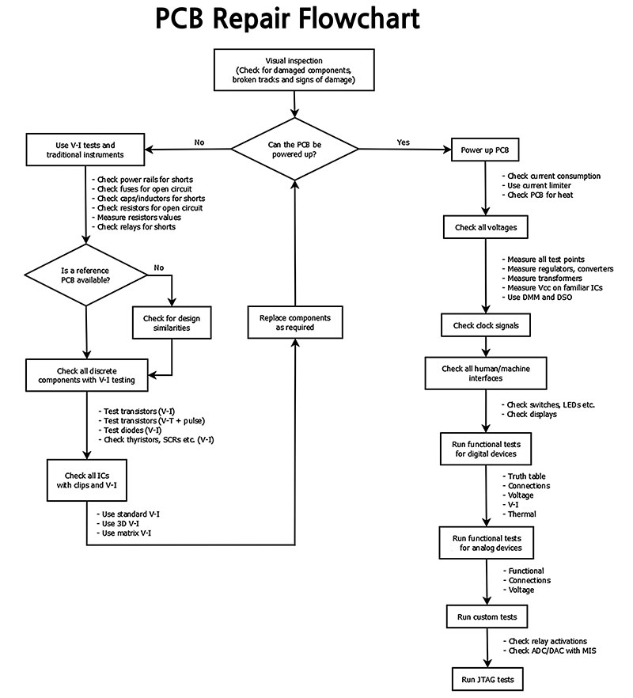

(That said, if you have electronics test equipment, it does speed up things to see what voltages, currents, pulse trains are doing -- you can isolate issues much faster with the equipment, even if you are only swapping out at the board level.)

For the remainder of this section we will consider a modular approach to getting the robotic car to work.

Remember, especially if you live in a winter-climate environment where there is lots of static charge in the low-humidity winter: static electricity will destroy the sensitivie chips on the little electronics boards. Ground yourself (e.g., touch a water pipe) before touching the electronics in these environments.

 **Mechanical Issues**
 This section is for troubleshooting mechanical issues and can be added to with experience, i.e., "under construction" at present.
 
PLEASE CONTRIBUTE TO THIS SECTION AS YOU ENCOUNTER AND TROUBLESHOOT PROBLEMS

 Some tips at present:
 
 -follow the assembly manual carefully
 
 -if you reverse the assembly of parts then take the time to disassemble and try again (it's easy to get confused with the orientation of both the metal chassis and the acrylic board)
 -make sure the Mecanum wheels are orientated exactly as shown in the manual

 -make sure the wheels can rotate freely -- careful with the attachments

 **Electronics Issues**
This section is for troubleshooting electronics issues and can be added to with experience, i.e., "under construction" at present.

- -->The robotic car appears to want to drive in reverse all the time when I run the Ultrasonic Obstacle avoidance lesson.
- Put your hand in front of the Ultrasonic Transducer. Does the car then try to 'escape' the obstruction by going forward? Most likely you have reversed the wiring of the electric drive motors. Reverse the pin plug-in's to what they should be, and the car will work properly -- the car will go forward until it senses an obstruction, and then reverse to escape the obstruction.
-
- 
PLEASE CONTRIBUTE TO THIS SECTION AS YOU ENCOUNTER AND TROUBLESHOOT PROBLEMS

 Some tips at present:
 
 - ground yourself before touching electronics boards

 - follow the assembly manual carefully -- double check the orientation of the electronics boards before mounting them, and double check the colors and insertion points of every wire

 - before putting the batteries in (or the batter switch is in the OFF position) the following lights should be on when the USB cable attaches to your computer:
 - 
   

   -when you put the batteries into the battery holder and turn the battery switch ON, then you should see a voltage number on the voltage display and the following lights on:

   

   - if you don't see a voltage level, and you have a multimeter, measure the batteries directly to make sure they are charged and have a voltage on them (or if you don't have a multimeter, trying recharging them again)
  
   - if you don't see lights on, a first step is to remove wires, double check with the manual their locations, and re-insert carefully the wires again
  
   - if the above does not work, and you have second Arduino kit, you can try swapping boards to see if you can isolate the problem to one board
  
   wiring of wheel motors direction issue:

   
-
------------

Note:
The wiring shown in the Osoyoo Manual causes the robot car to run in reverse when the software of Lesson 2 (ultrasound object avoidance) and Lesson 5b (cellphone Wi-Fi app to make the car go in different directions) is run. (However, if the software from Lesson 3 (photocell line tracking) is run, the direction is correct.)

Thus, for Lesson 2 and for Lesson 5b reverse the following wires:

AK1 <--> BK3

BK1 <--> AK3

And thus, when you then move onto Lesson 3, reverse the wires back to the original position. And then when moving onto Lesson 5b reverse again as shown above.

Osoyoo wiring instructions for wheel motors to pin locations on the Motor Control Board Y:

Front-right  BK1

Front-left BK3

Rear-right AK1

Rear-left AK3

Thus when we reverse the wiring we get:

Front-right  BK1 --> AK3

Front-left BK3 --> AK1

Rear-right AK1 --> BK3

Rear-left AK3 -->  BK1

And we reverse again the wiring we get:

Front-right  BK1 --> AK3 --> BK1

Front-left BK3 --> AK1 --> BK3

Rear-right AK1 --> BK3 --> AK1

Rear-left AK3 -->  BK1 --> AK3

These reversals can be done in software. However, this would require modifying the Osoyoo packaged software. Thus, for the moment we are not modifying the software so that you can download the software which Osoyoo provides without modifications. However, later on, we will reverse the wheel wiring virtually rather than unplug and replug cables.

------------
-
-

 **Arduino/Computer Issues**
 This section is for troubleshooting Arduino/computer issues and can be added to with experience, i.e., "under construction" at present.
 
PLEASE CONTRIBUTE TO THIS SECTION AS YOU ENCOUNTER AND TROUBLESHOOT PROBLEMS

 Some tips at present:
 
 - follow the assembly manual carefully

 - double check the orientation of the electronics boards before mounting them, and double check the colors and insertion points of every wire

 - use the supplied Oyosoo self-test code for the Arduino -- it should work

 - follow the screenshots shown above in attaching to the Arduino board and uploading code

 - if you have second Arduino kit, you can try swapping boards to see if you can isolate the problem to one board

 - you may want to consider purchasing a cheap Arduino board from a local electronics shop or online electronics retailer (e.g., Amazon sells an Arduino Uno board for US$27 at the time of writing), and setting up the Arduino IDE on your computer and making sure you can upload compiled code to the Arduino board

 - TAKE A MODULAR APPROACH TO STUBBORN ISSUES. For example, make sure the wires coming from the battery compartment have a voltage on them (with a simple voltage tester or multimeter) and then just install the motor controller board with only the power wires and the voltage meter wires. Does the board light come on? Is there now a voltage displayed?  If so, then hook up the four motors. Is there still a voltage displayed? Then perhaps hook up to the Arduino board without the Wi-Fi shield (pay attention to where you are inserting wires if you do this). Lights come on? Then plug your PC into the Arduino board -- is it detected?  And so on.
   (It is unfortunate that the motor controller board does not have a fuller modular built-in self-test feature which could be used to make sure that part of the system is working before we need to consider the functioning of the Arduino board.)

 
BEFORE PROCEEDING FURTHER, MAKE SURE THE BASIC SELF-TEST PROGRAM OF YOUR OSOYOO ROBOTIC CAR WORKS. YOU NEED TO KNOW THAT THIS WORKS BEFORE ADDING MORE COMPLEXITY TO YOUR PROJECT.

-
-
-
-

<h1 style="font-size: 24px;">Step #10 -- Adding the Ultrasonic and Servomechanism Components</h1>

 -An "ultrasonic distance sensor" is effectively an ultrasonic transducer (generates ultrasonic waves) and an ultrasonic sensor (detects ultrasonic energy). (A "transceiver" is a device that both transmits and receives a signal.) An ultrasonic transceiver can measure distances by seeing how long it takes for an ultrasonic sound wave to hit a target and reflect back to the sensor. From the the time delay and the speed of sound the distance can be computed.

 -The Osoyoo ultrasonic distance measuring transducer/sensor sends out 40KHz ultrasonic sound pulses and waits for their echos to return, with the time (and thus distance) as the width of the produced TTL pulse.

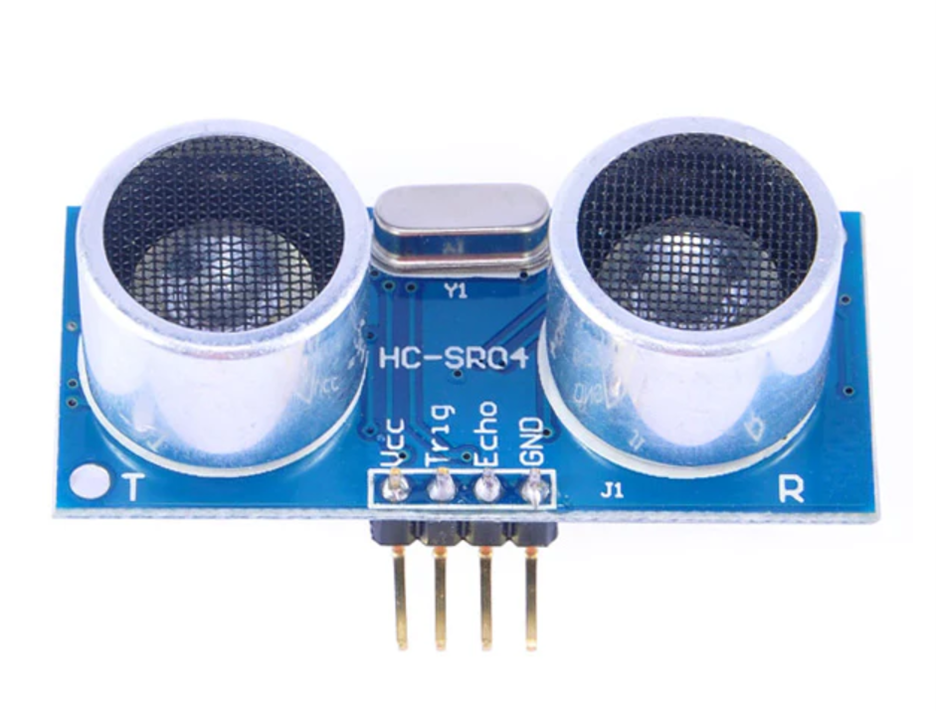

 The Osoyoo motor is called a "micro servo motor." We tend to interchange the words "servomotor", "servo", "servomechanism", etc in Lesson #2 (i.e., adding the ultrasonic and servomechanism components) in referring to this motor. However, be aware of the actual meaning of these different terms:
 
 -A "servomotor"  (or sometimes just called a "servo") is generally a rotary motor (but it can be a linear actuator) that produces precise angular position, velocity and acceleration. This is in contrast to a normal motor which will just spin continuously.
 
 -A "servomechanism" (or sometimes just called a "servo system" or "servo") is a system that controls position, velocity and acceleration of a mechanical system using some sort of feedback to reduce error generally. Thus, a servomotor combined with some sort of feedback device (e.g., a rotary Hall detector, a potentiometer, etc) forms a servomechanism.

 -The Osoyoo SG90 Micro Servo Motor can rotate +90 or -90 degrees, and will hold the position, even when no signal is sent. It provides 1.5kg/cm torque and has a speed of 60 degrees in a third of a second. It makes use of the Servo Arduino library.

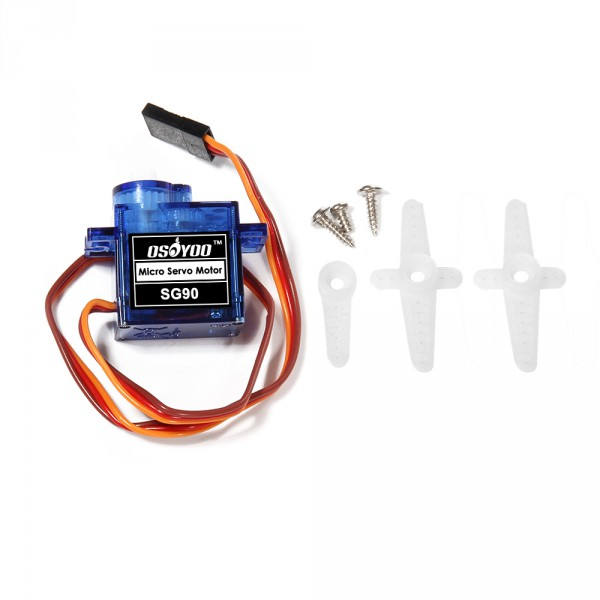

 
 At this point please make sure your robot car performed the self-test correctly as described above in Step #8 (with Step #9 for troubleshooting). Do not start this new step #10 unless your car has been built, the electronics wired up, the Arduino software downloaded and the self-test peformed as above (i.e., turn the car on and it will perform a number of self-test maneuvers spinning different combinations of wheels).

 In the Osoyoo Manual now turn to Lesson 2 "Obstacle Avoidance Robot Car."

 Complete the hardware installation of the Ultrasonic Module as shown in the manual. 

 Note: The manual says to use M1.4*8 screws to mount the holder for the Ultrasonic Module. However, my kit came with M1.5-8 screws and nuts, which worked fine.
 -Tip: If you don't have small needle-nose pliers to hold the small nuts in place, take a piece of transparent adhesive tape (e.g., Scotch-brand tape) and hold the nut in place with it until the screw starts threading.
 -Tip: It says not to install the M2-4 self-tapping screw to hold the module to the servo motor until the alignment process is complete -- follow this advice. When the robot car boots up later, you will need to make sure the ultrasonic sensor is facing forward before screwing it in place.

 Complete the circuit wiring as shown in the manual.
 -Tip: If it is hard to see the pin numbers exactly, count slots from the end of the board. Thus the slot 13 ("D13") is the fifth emtpy socket from the end of that connector, for example.
 -Tip: The brown wire is the ground wire from the Servo motor -- make sure that is the one that goes to the "GND" socket on the Model-Y board, and so on for the other wires.

 Below is a photo of the robot car wired up as specified. (Please use the diagrams in the manual -- they are more clear. Below is simply to show what the final wired up configuration looks like.)

 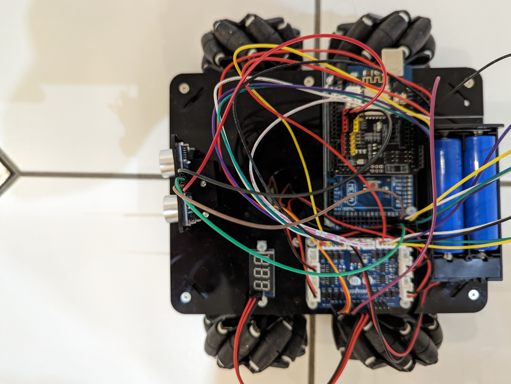

Then download the demonstration software for the ultrasound detector.

-The link shown in the manual works fine -- you will have folder containing m2-lesson2.ino which will work with the Arduino development environment (IDE).

-Always virus scan files when you download them. I virus scanned this file -- it is fine according to NAV Feb 6, 2024 (of course, as would be expected).

-Then open the Arduino IDE exactly as described above. As well, the manual shows several screens of the Arduino IDE. Make sure your Arduino IDE is configured exactly like before (i.e., correct Arduino board is specified).

-Click 'Open' and load in m2-lesson2.ino

-Then attach the USB cable to the Arduino board connector on the robot car, exactly like you did above when we uploaded software to the car's Arduino board. The power on your robot car should be turned off -- the cable will supply power to the Arduino board.

-(Note: In theory, Arduino boards can remain powered while you connect your also powered USB cable from your desktop/laptop to the Arduino board. Most modern USB interfaces are designed for 'hot swapping.' However, if there are momentary shorts or static discharges as the pins go into the connector or other parts get disturbed, it is generally better if the board is unpowered.)

-Now click the upload arrow (green arrow inside a circle at the top left corner).

The software in m2-lesson2.ino will now be uploaded to the Arduino board in your robotic car.
It happens quickly -- this is my screen less than a second after clicking the arrow:

 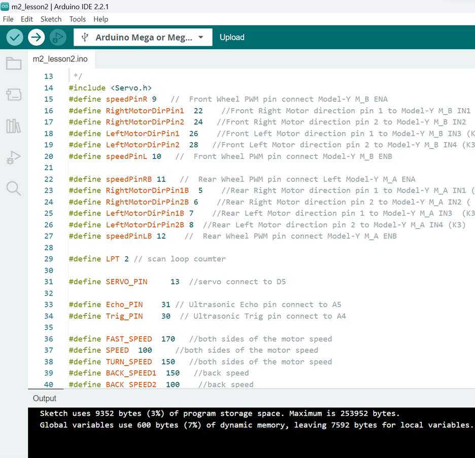

 Now you have to align the ultrasonic sensor. The manual makes it sound complicated, but it is not.
 Turn on the robotic car power switch.
 If everything was installed correctly (especially the wires) and the software upload was done, then most likely you will see the ultrasonic sensor move from side to side .
 Then the ultrasonic sensor will stop in a position for about 5 seconds. This position should be facing forward. If it is not, then pull off the sensor and put it back on the servo motor but in a forward facing direction. Once this is done you can screw the sensor in place.

 Now you can try out the ultrasound sensor in your robotic car.

 Turn on the power switch. The robotic car will go forward until it gets close to a wall and then stops before hitting the wall:

 

 For comparison, a typical robotic vacuum cleaner, at the time of this writing, will actually bang into the wall before changing direction.

  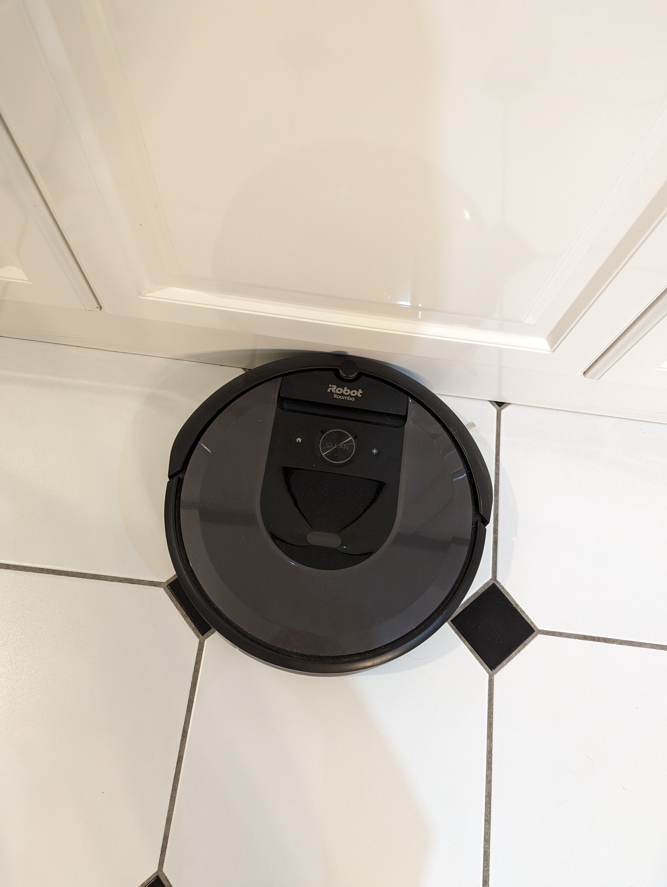

  The robotic car will now scan directions for a new path without obstacles.
  
 

 The robotic car will then turn away from the wall and continue in a new direction.

 
 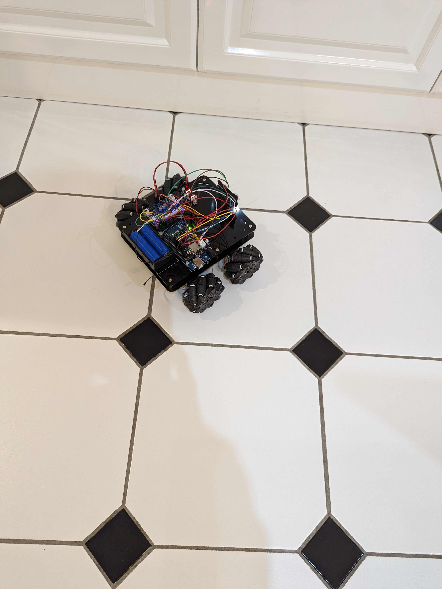

 You are probably thinking to yourself now, "Well.... I have constructed a cute little toy."  Well.... maybe. But as the keen scientist you are, you realize two important things right now:

 -1. Ahhh.... I have working robotic car that I can later hook up to my thousands of lines of Python code. I will be able to interface the real world to my theoretical ideas :)

 -2. Hmmm..... I actually have the secret of the intelligent life on our planet in front of me now.

 -There is evidence in Torridon Group in Scotland of multicellular life over a billion years ago. There is evidence of obvious bilaterian animals (i.e., left and right side like us and like our robot car, and go forward, left, right and backwards) from the Cambrian Explosion about 550 million years ago. Thus, we can be bold and assume the first bilaterians emerged 700 million years ago, i.e., lots and lots of time for the brain to evolve to better and better functionality for the environments the animal was in.

 -A lot of evidence that the bilaterian brain only evolved once, e.g., Holland, L. Z., Carvalho, J. E., Escriva, H., Laudet, V., Schubert, M., Shimeld, S. M., & Yu, J. K. (2013). Evolution of bilaterian central nervous systems: a single origin?. EvoDevo, 4, 1-20.

 -This bilaterian primitive brain gave rise to the brains of just about all the animals we see around us -- insects, worms, fish, mice and you the reader :)
 e.g., Peterson, K. J., & Davidson, E. H. (2000). Regulatory evolution and the origin of the bilaterians. Proceedings of the National Academy of Sciences, 97(9), 4430-4433.

 

 -Most of the animal world's brains (i.e., insects, worms and all the vertebrates) evolved from these first primitive bilaterians. Intelligence on Earth stems from a creature with a left and  right and that could go forward to food and that tried to go backwards/turn away from danger (evolutionarily-wise this is what will propagate creatures into the future). This is what our Osoyoo robotic car can now do!!  It can go forward (well... maybe in the next step it can go forward to positive food-like items or we can program it to do so) and it can escape from dangers such as hitting a 'predator' such as the wall above.

 -This is not a toy.  This is the basis for intelligent life on our planet :)
 
-
-
-
-

<h1 style="font-size: 24px;">Step #11 -- Avoiding Obstacles with the IR Obstacle Avoidance Module</h1>

One of the versions of the Osoyoo Robot Car kit comes with an additional lesson explaining using the Osoyoo IR Obstacle Avoidance module. My kit did not come with this lesson, and thus its use is not described here.

The Osoyoo IR Obstacle Avoidance module is exactly what is sounds like -- there is an infrared LED projecting infrared light outwards and and infrared detector, attempting to detect the reflection of this IR light, which it can do from 2 to 30 cm away, at an angle up to about 35 degrees. 

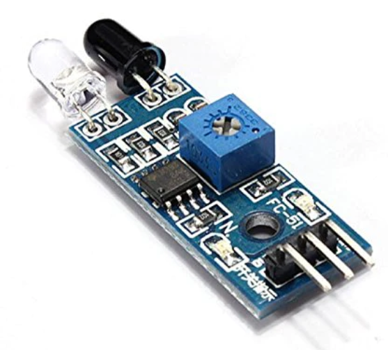
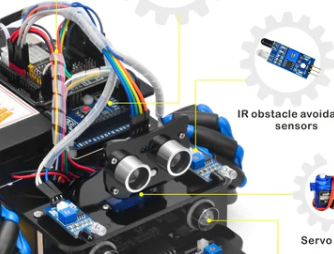

-
-
-
-

**Step #12 -- Adding and Using the 5-Point Tracking Sensor**
<h1 style="font-size: 24px;">Step #12 -- Adding and Using the 5-Point Tracking Sensor</h1> 

 -The Osoyoo 5-channel IR Tracker Sensor is an array of five infrared sensors that the Ardinuo can read as digital bits inputs. There is an on-board potentiometer to adjust the sensitivity of the sensors, i.e., at what point do they trigger. The advantage of an array of five sensors is that the car can detect the center of line and the edges outside the line at the same time -- very useful for following lines and borders. 

-The IR Tracker Sensor was already physcially installed on the car when we first built the car above.

 The sensor array can detect when the car is following a line:
 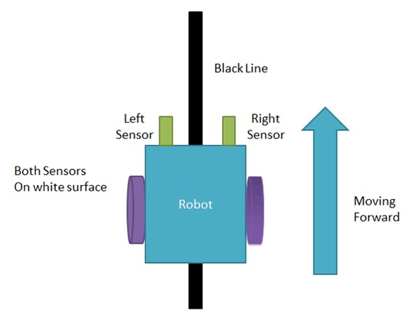

 The sensor array can detect when the car is off-center:
 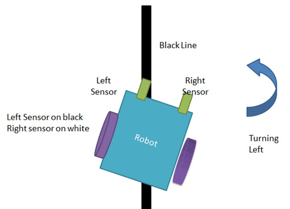

 -The IR sensors are Everlight ITR9909 Opto Interrupter sensors. Each device consists of an infrared LED (typically gallium-aluminum-arsenide structure) and an NPN (therefore typically silicon structure) phototransistor, along the same optical axis. Spec sheet gives 50mA current and 75mW power dissipation but these are maximums -- probably running at much lower currents (hmmm.... P=E*I, thus 5 volts * 50mA = 250mW actually  -- perhaps 75mW maximum is what the LED itself and not associated resistors and phototransistor, etc,can dissipate) with an output at about 940nm (infrared is radiation with a wavelength between 780nm to 1mm (which is 1,000,000nm). (IRA 780--1400nm -- penetrates skin and eye -- high power/long exposure can damage the retina -- there are actually guidelines on exposures of humans to laser radiation between 180nm and 1000um; IRB 1.4um - 3um; IRC 'far IR' 3um-1000um -- superficial absorption by skin).
 -Why use IR sensors? Because there is visible light all around us that will interfere with the sensor detection. (Yes, of course there is is IR light from the sun, so the robotic car will obviously work better indoors than outside in the sun when it is using this sensor array.) (Of interest, Tesla is using only visible light from cameras, as opposed to radar and LIDAR signals that other car manufacturers are using, for autonomous driving, on the basis that humans deal with visible light, so the car autonomous driving system should deal with visible light as well.)
 
-(I know.... more than anyone wants to know about a cheap, relatively simple IR sensor :)  

-(Essentially the collector current of the NPN phototransistor peaks when the device is sensing the reflection of the IR signal at about 3mm -- by 7mm distance it drops to 50% and by 15mm distance (or if the reflection is obscured by the terrain, for example) it drops to 20% of the peak collector current -- this is what the output of the device is and how it senses the environment, i.e., if anything obstructs the reflection of the IR light.)

 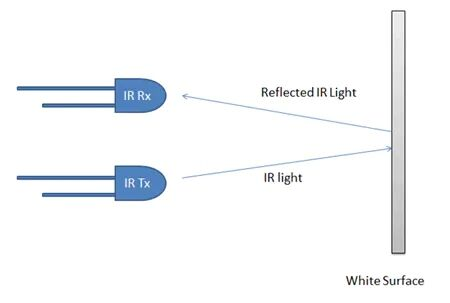
 
-The output of the Opto Interrupter sensor is fed into a a hex inverter with Schmitt-triggers. The Schmitt-trigger will take the photosensor inputs and at some threshold give a TTL output pulse which then can be fed to the Ardinuo board.

Feedback loop of a Schmitt trigger.

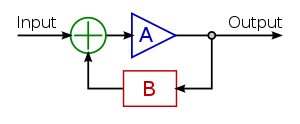

Actual hex inverter Schmitt trigger integrated circuit.

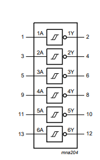

-
-
OK.... as mentioned above, the IR Tracker Sensor was already physcially installed on the car when we first built the car above. However, we now have to wire it up to the Ardinuo board.

-Go to Lesson 3 in the Osoyoo Manual.

-You will have a 7pin female to female wire harness that came with the robotic car kit. Install as shown in the Manual's Lesson 3 illustration. It attaches from the IR Tracker Sensor to the Wi-Fi board that is seated on top of the Ardinuo board.

-Tip: Make sure the black wire is the one going to "GND" (i.e., ground) when you plug the connector into the IR array. Then the cable splits into the black/red and 5 other wires. Make sure the black wire goes into "GND" pin on the Wi-Fi/Ardinuo board and the red wire goe to the "5V" pin. Then the wire beside the red wire should be the yellow wire coming from the sensor #0, and the white wire coming from sensor #4. The pins are labeled on the Wi-Fi/Ardinuo board.

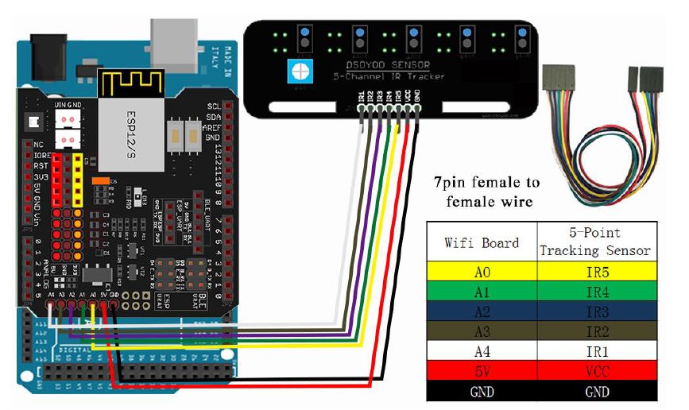

Your robotic car still has the code from Lesson 2 on it. However, when you turn on the power you will see the LED's light up on the IR Array Sensor board as shown below. Also, use this photo for an idea how the wires look when wired up.

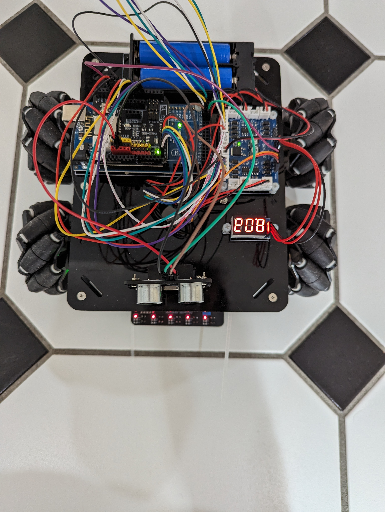

OK.... now we have to install new code to make use of the IR Sensor array.

------------------------------
NOTE ABOUT WHEEL DIRECTION: The original Osoyoo wiring of the motors will give the correct forward and backward direction of the wheels. Thus, if you reversed the motor wiring for Lesson 2 above, you should re-reverse it back to the original wiring, i.e.,

Front-right  BK1 --> AK3 --> BK1

Front-left BK3 --> AK1 --> BK3

Rear-right AK1 --> BK3 --> AK1

Rear-left AK3 -->  BK1 --> AK3

As noted above, these reversals can be done in software. However, this would require modifying the Osoyoo packaged software. Thus, for the moment we are not modifying the software so that you can download the software which Osoyoo provides without modifications. However, later on, we will reverse the wheel wiring virtually rather than unplug and replug cables.

------------------------------

-Open the Arduino IDE exactly as described above. As well, the manual shows several screens of the Arduino IDE. Make sure your Arduino IDE is configured exactly like before (i.e., correct Arduino board is specified).

-Click 'Open' and load in m2-lesson3.ino

-Then attach the USB cable to the Arduino board connector on the robot car, exactly like you did above when we uploaded software to the car's Arduino board. (The power on your robot car should be turned off -- the cable will supply power to the Arduino board. 

-Now click the upload arrow (green arrow inside a circle at the top left corner).

The software in m2-lesson3.ino will now be uploaded to the Arduino board in your robotic car.
It happens quickly -- this is my screen less than a second after clicking the arrow:

 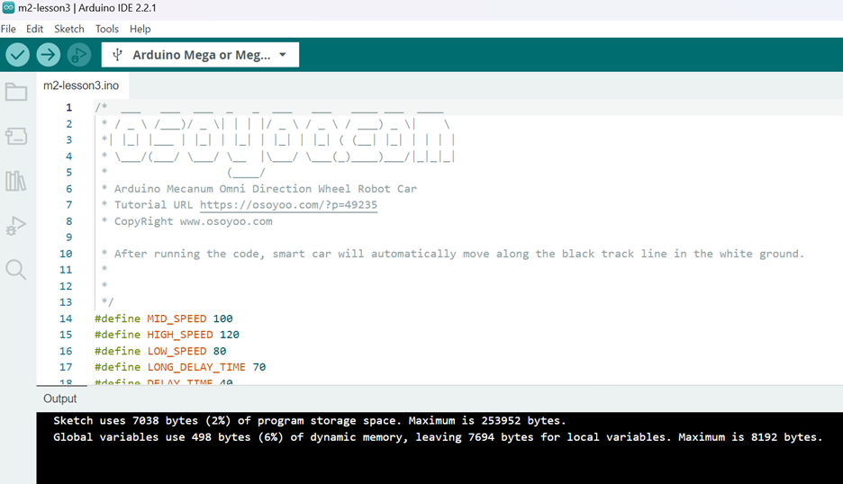

 Now you have to adjust the sensitivity of the IR sensors, i.e. you want a black surface to reduce reflection back to the sensor, which will be indicated by the LED turning on on the IR array sensor board.
-you can make your own test sheet -- take the electrical tape that came with the kit and put some strips on a piece of white paper

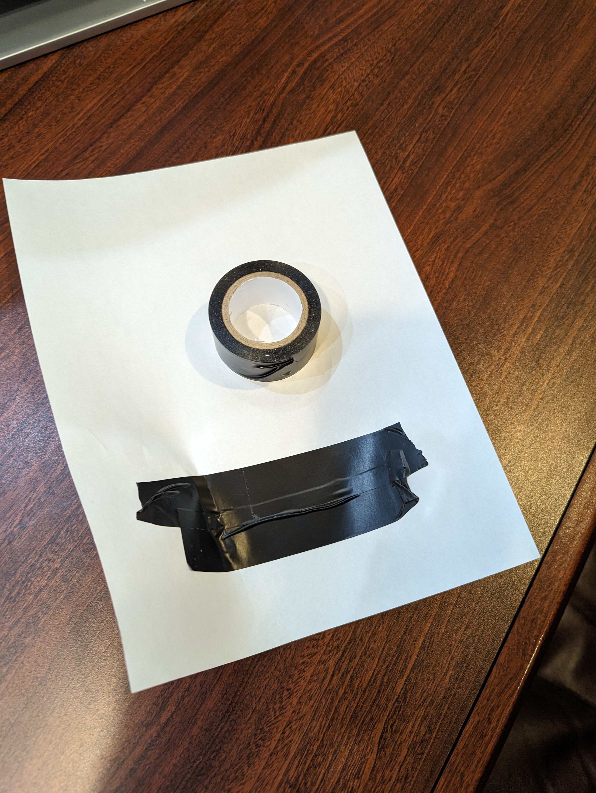

-hold up the car with one hand (since the tires will start spinning)
-turn on the Power
-with your other hand, put a small Phillips screwdriver (the small one that came with the kit works well) into the potentiometer on the IR sensor array board (arrow points to in the picture below) and adjust it so that the LED's turn on when the black electrical tape is placed underneath the detectors, and the LED's turn off when the white sheet is placed underneath

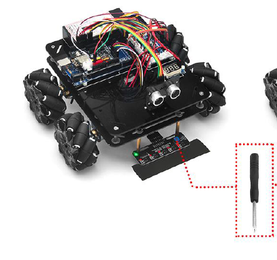

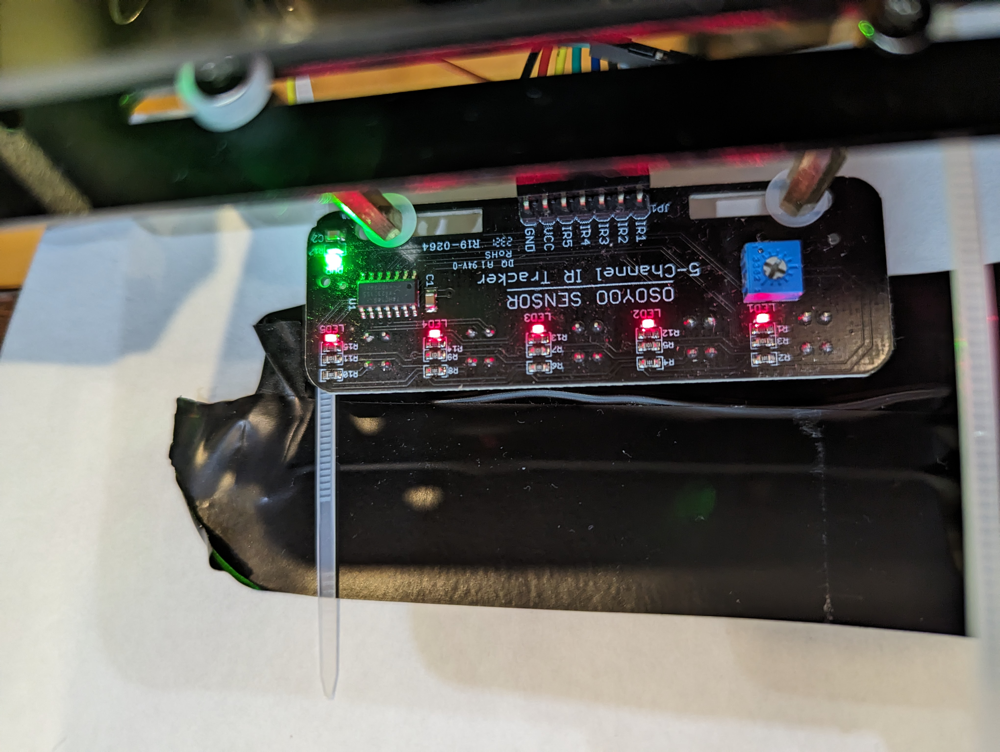

Here is a small test I did. I put a black mat in the middle of this mostly white floor (yes... the small black squares do confuse the car at times when one of the sensors detect the black square but it turns a bit and then continues). Once the car reaches the black mat it ends up trapped there because all its detectors turn on since the surface is all black (the code is expecting a thinner black line to follow).

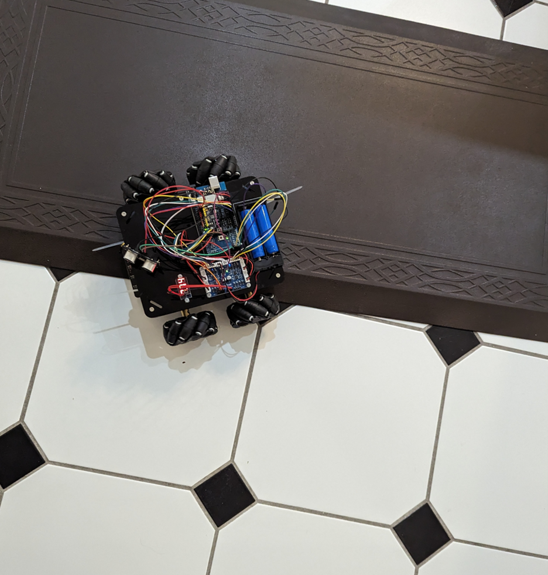

The car will now follow a black line (2 - 3 cm wide) on a white background.

-
-
-
-

<h1 style="font-size: 24px;">Step #13 -- Adding Bluetooth Control of the Robotic Car</h1>

 As noted above, Bluetooth and Wi-Fi are both wireless mechanisms that allow computer devices to talk to each other and the Internet without using wires (i.e., that is why they are "wireless"). 

-As noted above, all of us have probably used Bluetooth at some time, especially if we have "Bluetooth" earbuds that wireless connect to our cellphones -- that is the purpose of Bluetooth, i.e., used to wirelessly connect computer devices between each other and over short distance. Bluetooth has been commercially available since 1999 but never worked well (trouble pairing two devices to each other was a common consumer complaint) until the large cellphone manufacturers started engineering better Bluetooth pairs in the cellphone and the earbuds. Depending on the engineering effort, modern Bluetooth devices can work great or can be terrible. Bluetooth operates at typically 2.4GHz (with enough of a one megaHertz bandwidth for a clear audio transmission to your earbuds:) and is a spread spectrum technology with typically Gaussian frequency-shift keying modulation (essentially a common FM technique, used in many devices, e.g., perhaps your garage door opener if you have one for a house or apartment building; the Gaussian filtering makes the transitions smoother and reduces the sideband (generation will end up being interference to an adjacent frequency channel; lots of tricks going back decades for single-sideband, etc)). Note that the frequency modulation has nothing to do with the frequency hopping. The frequency-shift keying FM is within a frequency channel. However, Bluetooth frequently hops between different channel (i.e., frequency main channels). This Frequency-Hopping Spread Spectrum technique reduces interference with other signals, perhaps another Bluetooth device, and has the effect of producing a secure signal (since the signal is jumping around all the time so hard to intercept) that is robust in noisy environments. However, both Bluetooth devices must change frequencies in synch via a pseudorandom sequence used in the protocol. Lots of requirements -- if the engineering of the products is poor, Bluetooth is much more troublesome than modern Wi-Fi. Bluetooth 4.0 in 2010 addressed many of the limitations of using Bluetooth between real-world devices and finally Bluetooth 5.0 in 2016 smoothed out the consumer experience with a myriad of engineering improvements over the original Bluetooth from the 1990s. While the technology underlying Wi-Fi is actually more complex than Bluetooth (e.g., Wi-Fi uses a myriad of modulation techniques and spread spectrum techniques), Wi-Fi has been better engineered over the years, the underlying chipsets and algorithms which implement these techniques have been well refined, so that for most users, Wi-Fi actually works quite well and actually quite robustly.

Go to Lesson 4 in the Osoyoo Manual and follow the instructions to insert the Bluetooth Module (which comes with the kit) in to the Wi-Fi board shield (which is, of course, on top of the Arduino board):

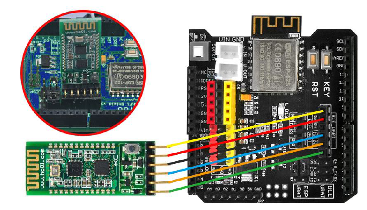

Then use two jumpers to connect B_TX and B_RX of the Wi-Fi shield to pins D19 and D18 of the Arduino board as shown in the manual and below:

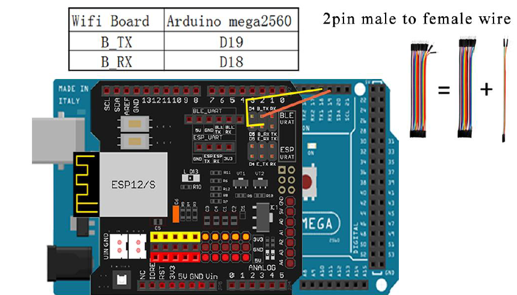

Ahhh.... problem!!

My Arduino board actually appears defective -- they did not install slots for the higher numbered D pins (there seem to be slots everywhere else).

Ok.... did I overlook this in unpacking my robotic car kit..... yup.... early photographs of unpacking show the connector missing when I unpacked (and you can see that in photographs above). Ok... that doesn't really help much.... I'm not sure if I would have returned the kit to Amazon given that everything seems to work ok on the Arduino board.... but still... sort of bad that a connector is missing from the board -- perhaps never installed in manufacture since the Board looks like it is brand new otherwise....

Ok.... in engineering there are kludges and hacks. A "kludge" tends to be a quick fix with a negative connotation as well as requiring other kludges to fix the original kludge. On the other hand, a "hack" done well can be quite elegant and an overall solution. 

We really just want to try out the Bluetooth capabilities of the robot car -- it will not be an essential feature we will be using later to interface our Python project to the robotic car (well... we didn't think so.... it could be.... there are not only Wi-Fi libraries for Python code but Bluetooth libraries too... so let's just try out the feature for now in a quick fashion, so a hack is ok). The proper solution would be to get a new Arduino Board (low cost part that is unlikely to be repaired) or purchase a slot and solder onto the board so board is properly re-furbished -- lots of delays and effort for little advantage. A simple and actually good hack would be to solder the male connectors to the other male connectors -- we have fine soldering irons capable of doing so easily (and our low-heat drop-the-solder-blob technique we've developed over the years :)  However, let's try an even more simple hack.

We still have a few extra of the female to male connectors. Ok... let's bend the metal prongs that should have been in the slot connectors at D18 and D19, and put the female part of the connectors on them. Done... easy. Ok.... we can solder together the male to male connectors coming from the B_TX and B_RX of the Wi-Fi board but even easier we can jab the two metal parts into each other's plastic enclosure and then twist the metal parts together for an electrical connection (another few seconds and the job is done :).

Picture showing the missing slots for the higher numbered D pins and the hack (female ends pressure-forced onto the bent underlying stiff wires of D18 and D19 on the Arduino board and their male ends on the other side forced into the plastic of the male ends of the wires coming from B_TX and B_RX of the Wi-Fi board with male ends of both wires twisted together giving mechanical stability and electrical continuity -- in the upper right portion of the photograph -- yellow male to tan male wire, orange male to white male wire):

Now you need to download the software for controlling the robotic car with Bluetooth.

-The link shown in the manual works fine -- you will have folder containing m2-lesson4.ino which will work with the Arduino development environment (IDE). The manual also shows you what some of the Arduino IDE screens will look like.

-Always virus scan files when you download them. I virus scanned this file -- it is fine according to NAV Feb 8, 2024 (of course, as would be expected).

-Then open the Arduino IDE exactly as described above. As well, the manual shows several screens of the Arduino IDE. Make sure your Arduino IDE is configured exactly like before (i.e., correct Arduino board is specified).

-Click 'Open' and load in m2-lesson4.ino

-Then attach the USB cable to the Arduino board connector on the robot car, exactly like you did above when we uploaded software to the car's Arduino board. (The power on your robot car should be turned off -- the cable will supply power to the Arduino board. )

-Now click the upload arrow (green arrow inside a circle at the top left corner).

-The software in m2-lesson4.ino will now be uploaded to the Arduino board in your robotic car.

Ok... software successfully loaded. Let's see if I can pair my cellphone (an Android Pixel 7) with the Bluetooth board on the robotic car. Success -- it detects a device called HC02 which is from the robotic car and successfully pairs with it.

Ok...now to download the mobile app and control the robotic car from my cellphone. Search for the "Osoyoo Imitiation Driving" app. Found on the Google Play store. Download.....
Aghhh another problem!!  Error message that this program is too old for my cellphone.

Ok.... I have an older Android phone... try again... same error message that the "Osoyoo Imitiation Driving" app is too old for the older cellphone (which may have had an Android OS update in the past). 

(Ok... not a huge surprise. It is actually a lot work to develop apps for the iPhone and the range of Android phones. You need different IDEs (e.g., Xcode and code in Swift for iPhone versus Android Studio and code in Kotlin and have to test separately plus Android is fragmented with essentially different end-user environments adding to complexity). There are cross-platform tools, e.g., Flutter released by Google that allows coding for Android, iOS, Linux, macOS and Windows, with coding in Dart (Javascript-like syntax) although I do not have knowledge how often they are actually used nor have I personally used. The bottom line is that Flutter or other 'miracle' cross-platform tools notwithstanding, considerable resources are required to release and maintain up-to-date apps for iOS and Android, so while disappointing.... I guess unless tens of thousands of people are buying robotic car kits, not unexpected. Although.... it would have been nice if Osoyoo had prepared a Python hook into the Bluetooth module, i.e., give me a Python API or module that I could quickly try out.)

Ok.... borrow an iPhone from a friend. Able to install the "Osoyoo Imitiation Driving" app but.... the iPhone refuses to pair with the robotic car Bluetooth. 
Disconnected my Pixel 7. Turned it off. Turned robotic car power off and then on again. Still unable to pair with the robotic car Bluetooth.

Aghhh.... would have liked to have tried out the app.... but can come back to this issue.

Plan at this time:

-can consider Bluetooth in the future as communication medium if essential, e.g., get an Arduino library routine for Bluetooth, perhaps try another Bluetooth board, and get a PyPI library routine for Bluetooth, and see if my Python programs can communicate with the Arduino board

-at this time, given that no Android version of the app exists and my friend's iPhone cannot pair with the Bluetooth board (iPhone's are nicely engineered products) although my Pixel can pair (although it seems the abilities of my Pixel are better than any phone I've ever used -- always robust no matter how terrible cell phone signals or Wi-Fi signals are --incredibly engineered), I'm not going to expend more effort on this issue

-perhaps try another friend's cellphone if the opportunity presents itself (the iPhone I tried was 4 years old; perhaps newer iPhones are as robust as the Pixel7 cellphone in pairing with Bluetooth devices)

-research into Bluetooth board used by Osoyoo -- it is the "HC02 Bluetooth Module" which supports Bluetooth 2.0 although it talks about Bluetooth BLE 4.0; perhaps try a different more recently released pin-compatible Bluetooth module for the Arduino board and quickly see if it can pair more easily with an iPhone (since we need an iPhone to run the app) and if it works compatibly with the Osoyoo setup and software

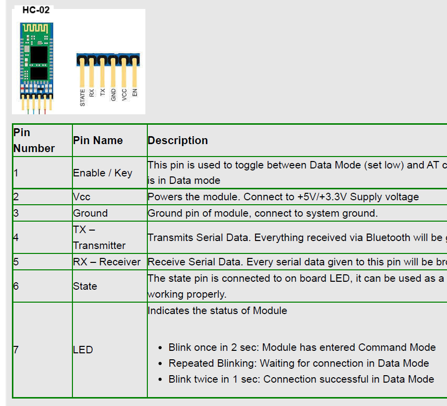

For example, here is an inexpensive ($US10 from Amazon.com) more recent HC05 Bluetooth Module with similar pin functionality:

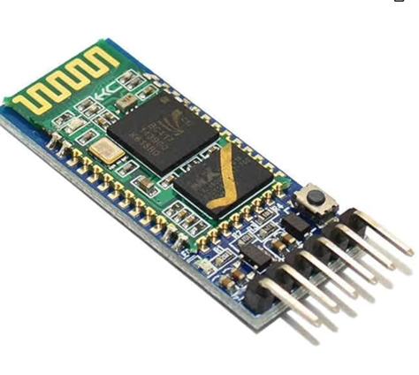

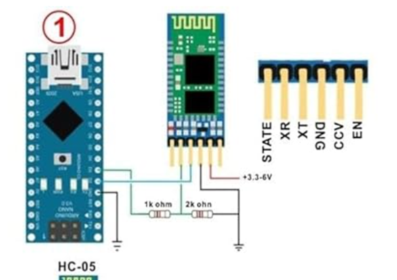

-given that Bluetooth is not required for the next lesson, time to move on.....

-
-

I just asked GPT4 to draw a logo for the PetitCat project in the style of Jackson Pollock to illustrate my feelings. Here is what it drew (first time, no regenerations):

 

-
-

Hopefully you the reader will be able to Bluetooth pair your smartphone and have more success installing and trying out the imitiation Bluetooth driving app.

-
-
-
-

<h1 style="font-size: 24px;">Step #14 -- Adding Wi-Fi Control of the Robotic Car</h1>

Ok... let's hope we have better luck with Wi-Fi compared to Bluetooth in the Step above.

Go to Lesson 5 in the Osoyoo Manual.

---Hardware Installation--

The Wi-Fi shield was installed into the Arduino board above when the robotic car was first built.

--Wiring Installation--

New wiring changes to make:

-Remove the connections from the Wi-Fi B_TX and B_RX to D18 and D19 (the ones requiring a hack above).
(In my case I just removed from the Wi-Fi board since we will still require connection to D18 and D19 for the Wi-Fi functionality.)

-Now connect D18 and D19 to E_RX and E_TX on the Wi-Fi board.

(Note. In the picture below the orange wire actually is going to E_TX and then the male-male hacked connection and then to D19, and similarly the yellow wire is going to E_RX and then to D18 via the other male-to-male hacked connection, which is a reveral of the yellow and orange in the schematic diagram, i.e., colors are reversed, but the wiring is the same.)

-
------------

Note:
The wiring shown in the Osoyoo Manual causes the robot car to run in reverse when the software of Lesson 2 (ultrasound object avoidance) and Lesson 5b (cellphone Wi-Fi app to make the car go in different directions) is run. (However, if the software from Lesson 3 (photocell line tracking) is run, the direction is correct.)

The original Osoyoo wiring instructions for wheel motors to pin locations on the Motor Control Board Y:

Front-right  BK1

Front-left BK3

Rear-right AK1

Rear-left AK3

For the Osoyoo software that comes with Lesson 5b you need the wiring reversed from original wiring:

Front-right  BK1 --> AK3

Front-left BK3 --> AK1

Rear-right AK1 --> BK3

Rear-left AK3 -->  BK1

These reversals can be done in software. However, this would require modifying the Osoyoo packaged software. Thus, for the moment we are not modifying the software so that you can download the software which Osoyoo provides without modifications. However, later on, we will reverse the wheel wiring virtually rather than unplug and replug cables.

------------

--Software Installation--

--Library Software--

In this step there is now an extra requirement to download and update an Arduino library zip file.

-download the library zip file from the link provided in the Osoyoo Manual Lesson 5 
(In the Manual version I was using the link went to:  http://osoyoo.com/driver/mecanum_metal_chassis/for_mega2560/WiFiEsp-master.zip )
A folder WiFiEsp-master.zip will download

-virus scan the file always after downloading and before clicking or using

-Open up the Arduino IDE (similar to above in earlier steps) but this time click Sketch, Library, Add ZIP Library, select WiFiEsp-master.zip

-This worked quite well on my computer:

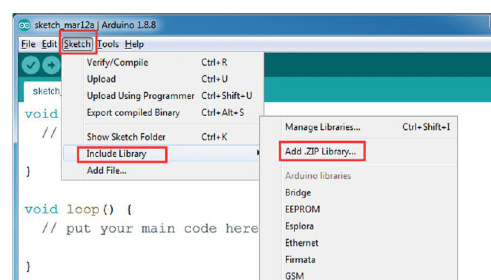

--Wi-Fi Software--

Just like the other Steps above (i.e., "Lessons" in the Osoyoo manual) there is demo software that will work with the Wi-Fi shield in your robotic car.

-The link shown in the manual works fine -- you will download a folder containing m2-lesson5.ino which will work with the Arduino development environment (IDE). The manual also shows you what some of the Arduino IDE screens will look like.

-Unlike the other lessons, in this lesson there is a lesson5a and a lesson5b software demos.  In the lesson5a demo the Wi-Fi board on the robot car becomes the Wi-Fi access point ("hotspot" is the term used by the Osoyoo manual) and your cellphone (aghhhh.... let's hope Osoyoo created a valid app for Android this time :) becomes the client. In the lesson5b demo the Wi-Fi board on the robot car becomes a node (i.e., a client) in the LAN where the robot car is operating -- we will specify the LAN's router's Wi-Fi SSID and password to the robot car, but still end up using the cellphone app to control the car (agghhh.... given what I wrote above let's hope Osoyoo created working apps for Android this time :)  

-OK.... it is usually simpler for a device to become a hotspot (i.e., simpler from the software creation point of view; many new products on Kickstarter start-up innovation site, for example, just have their Internet-enabled device become a hotspot so they don't have to worry about logging into a LAN (which always becomes more complicated than it sounds due to security layers on some LANs). Thus let's choose lesson5a software where the Wi-Fi car becomes the hotspot.

-(I would have chosen the option where I don't have to use a mobile phone app, but given that both 5a and 5b use an Osoyoo mobile phone app, let's go with lesson5a demo.)

-Ok... when you unzip folder m2-lesson5 folder, you will see the folder m2-lesson5a

-Always virus scan files when you download them and when you extract them. I virus scanned this folder -- it is fine according to NAV Feb 9, 2024 (of course, as would be expected).

-Then open the Arduino IDE exactly as described above in earlier Steps (or "lessons"). As well, the manual shows several screens of the Arduino IDE. Make sure your Arduino IDE is configured exactly like before (i.e., correct Arduino board is specified).

-Click 'Open' and load in m2-lesson5a.ino

-Then attach the USB cable to the Arduino board connector on the robot car, exactly like you did above when we uploaded software to the car's Arduino board. (The power on your robot car should be turned off -- the cable will supply power to the Arduino board. )

-Now click the upload arrow (green arrow inside a circle at the top left corner).

-The software in m2-lesson5a.ino will now be uploaded to the Arduino board in your robotic car.

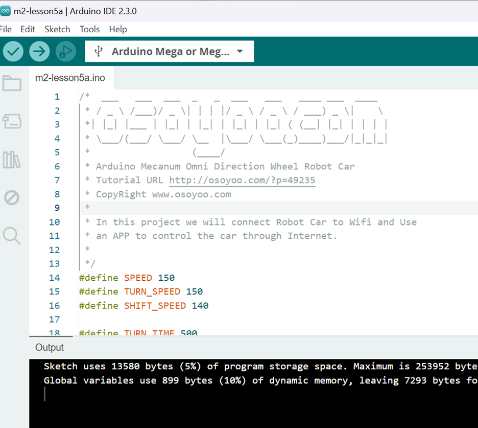

-To make sure that the Wi-Fi board (mounted on the Arduino board) in your robot car is now acting as a hotspot, you need to open your Arduino "serial monitor" -- click Tools and then click Serial Monitor

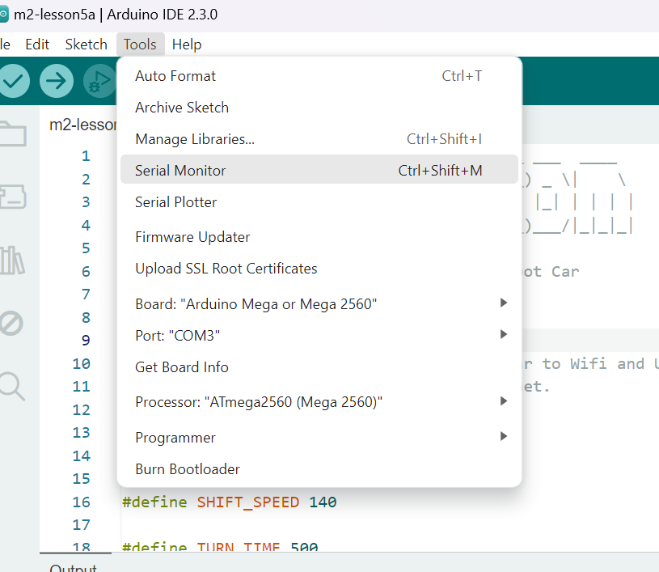

-This is the screenshot from my computer -- after a few seconds you will see that the Wi-Fi board is acting as a local access point (i.e., hotspot). The IP address shown on my computer (i.e., on the Serial Monitor) is 192.168.4.1 with a message to browse to http://192.168.4.1 for access.

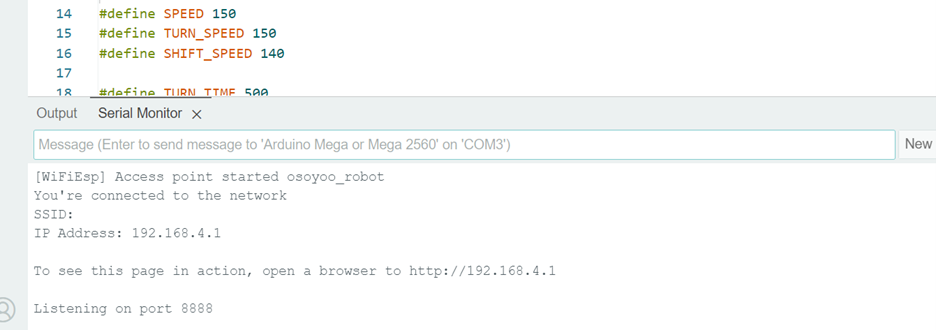

Ok.... now we need the Osoyoo mobile app to access the Wi-Fi hotspot on your robot car and use that communication link with the hotspot to control the car.

--Installing the Osoyoo Mobile App--

-If you have an Apple phone then you will go to the Apple Store

-However, since I have an Android phone (Pixel 7) I will go to the Google Play store

-The Osoyoo Manual Lesson 5 advises to search "Osoyoo Wifi UDP Robot Car Controller"

-Unfortunately when I do this search (Feb 9, 2024) the only app that appears in the Google Play store is "Osoyoo IoT UDP Robot APP" -- well, better than nothing, and maybe it will do the same thing.... so this app is installed on my Android cellphone

 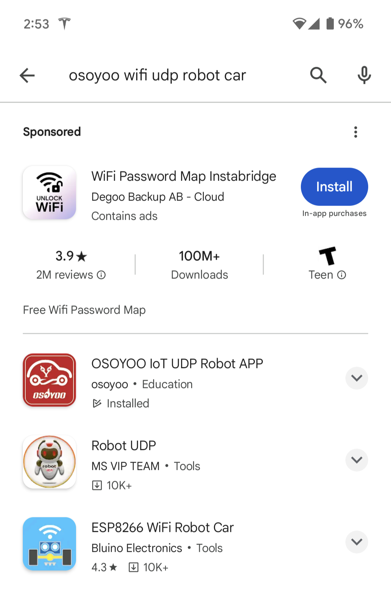

-Ok we open the Osoyoo IoT UDP Robot APP

-Then go to Settings and enter the IP address this app should access (since we want it to access the Wi-Fi board on the robot car)

 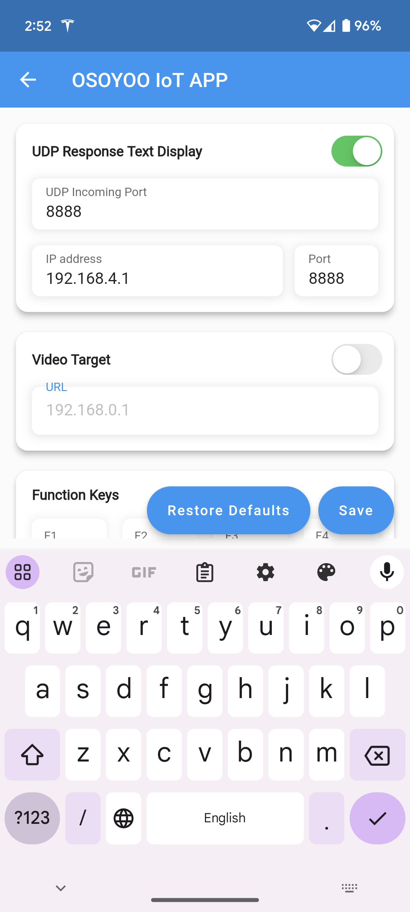

-Ok...now go to the main page of the app.

 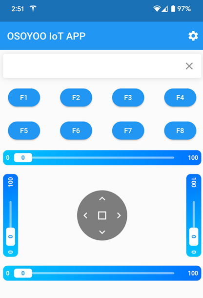

-Ok... turn on the robot car

-Remember, the car's Wi-Fi board will be the new server, i.e., Wi-Fi access spot or hotspot. Thus, turn off the cellphone Internet you may have. Disconnect from your workplace's LAN or your home's Wi-Fi LAN. In the Settings of your smartphone, look for Internet settings, and choose "osoyoo_robot". (It may say "no Internet access" -- ignore this warning since you are not accessing the Internet, you are accessing the robotic car.) Thus, at this point, when you look at the Wi-Fi connection of your cellphone, it should be to "osoyoo_robot".  (Some cellphones may try to switch back to your regular Wi-Fi settings after a minute of no Internet activity -- if your phone does this, please turn this option off. You want to stay connected to "osoyoo_robot".)

-Now, let's click a button on the app.... go forward

The car goes forward.

Click backwards, left and right.

They all work .... we can control the robot car via Wi-Fi.

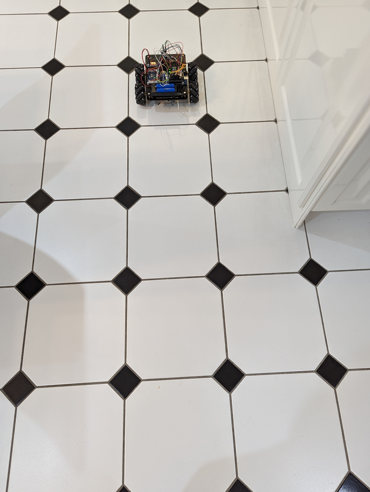

Success :)

Well, you probably notice you are at the end of the Osoyoo Manual now. Does this mean that we're at the end of the Basic Overview of the robot car?

No, not yet.

Let's take a look at some of the code we've been transferring to the Arduino board via the Arduino IDE, and try modifying some of it.

-
-
-
-

<h1 style="font-size: 24px;">Step #15 -- Software Modifications -- Basic Parameter Changes</h1>

For this Step #15, please open the Arduino IDE exactly as described above in earlier Steps (or "lessons").

Then click 'Open' and load in m2-lesson5a.ino (although it may not be necessary as this code may still be in the IDE's main window since it was the last code we processed)

We will use the Sketch (i.e., human readable program) of m2-lesson5a.ino for this Step #15. Please open it up so the discussion below makes more sense.

Above we discussed only briefly how to use the Arduino IDE (Integrated Development Environment). We simply downloaded demo code into the Arduino IDE and then transferred the processed code from your desktop/laptop computer to the Arduino board in your robot car. However, the Arduino IDE is a bona fide IDE -- it allows writing, editing, compiling, debugging, and transferring software to run on a variety of different Arduino and non-Arduino boards.

The human programmer, in this case a programmer at Osoyoo, writes a program which is called a "sketch" in the Arduino ecosystem. (However, when you see the word "sketch" just think program.) The Arduino IDE then compiles this human-readable program into binary code which can run on the microcontroller board specified (above we specified the Mega2560 board). Then the Arduino IDE uploads this compiled binary code to the Arduino board (or to a non-Arduino board if that is what you specified in compiling the code). When you turn on the Arduino board this code runs, as we saw in the many examples above.

The Arduino IDE is somewhat weak compared to other professional IDEs for software development. For example, debugging software is often an area where programmers spend much of their time, and these tools are weak in the Arduino IDE. Often software developers may use another IDE with an Arduino extension, e.g., Visual Studio Code with the Arduino extension, for serious Arduino software development.  However, nonetheless, the Arduino IDE includes a number of useful tools. Above we used, for example, the Serial Monitor tool.

The Sketch language that Arduino uses is largely standard C/C++ -- often the syntax, structures and semantics of C/C++ will work. However, the structure of the Sketch and the libraries provided are specifically designed to work with Arduino boards. (The AVR-GCC GNU compiler toolchain is used for Arduino boards. It compiles C/C++ albeit with some limitations related to the smaller amount of resources on the Arduino board.) 

The basic structure of an Arduino Sketch consists of two main parts -- 'setup()' and 'loop()' 

The 'setup()' function runs at the start of the program (after includes, various function definitions, etc) and does initial setup housekeeping such as configuring pin modes on the Arduino board. If we look at the code of m2-lesson5a.ino then we see this function at lines 188 - 218. It is initialzing serial ports, it's checking for the presence of the Wi-Fi shield, it sends out a message useful for debugging that we'ere connected to the network, and so on.

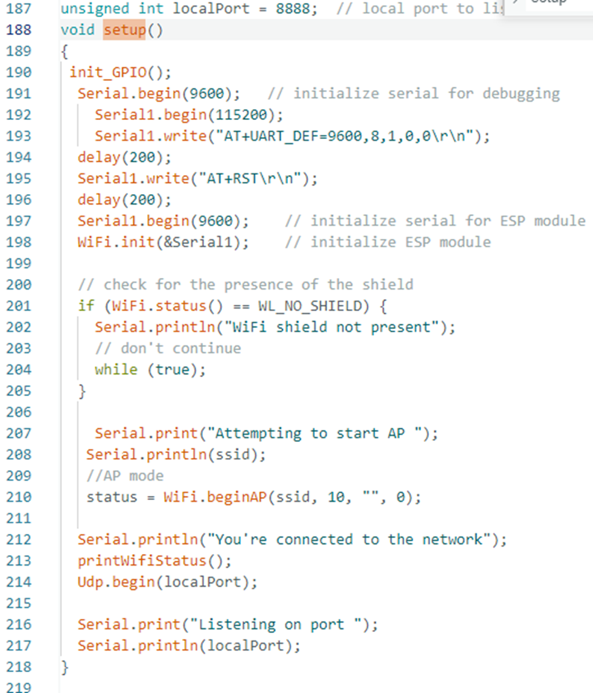

The next part of the structure is the 'loop()' function which runs repeatedly -- this is where the main logic of an Arduino Sketch program usually is.

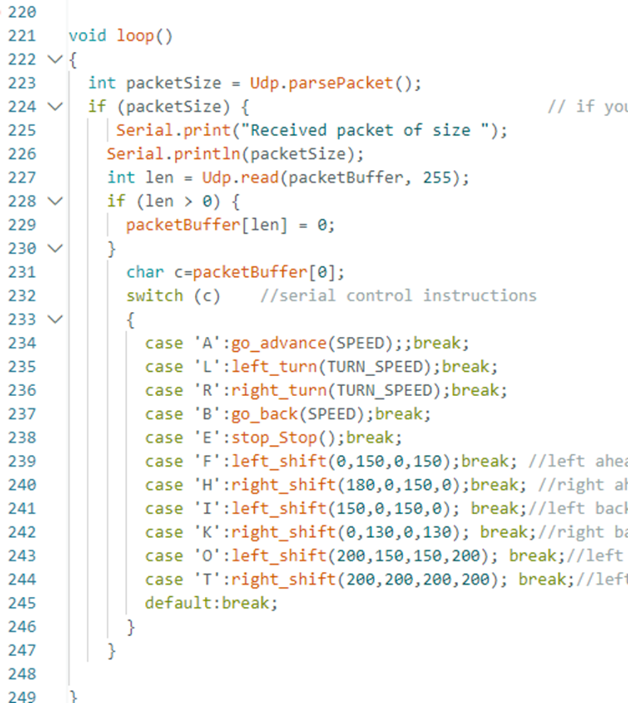

Look at the code of m2-lesson5a.in  -- we see the 'loop()' function at lines 221 - 249. It is waiting for Wi-Fi packets and then processes the character(s) received. As can be seen if there is an 'A' then this means to call the function go_advance(SPEED), i.e., for the robot car to go forward.

Let's look in the code to see where the function go_advance() is defined -- lines 50 - 55. This calls four functions (which by their names seems to relate to each of the wheels of the robot car) -- RL_fwd(), RR_fwd(), FR_fwd(), FL_fwd().   Ok... let's go see where these functions, or one of them, is defined. We see at lines 142-147 RL_fwd() is defined -- it says to digitalWrite(LeftMotorDirPin1B, HIGH).  The function digitalWrite() won't be defined here since it is a fundamental part of the Arduino programming language which writes a HIGH or LOW value (i.e., becomes voltage) to a digital pin on the Arduino board. 

Note that the function go_advance(SPEED) has a parameter 'SPEED'. Let's see where this parameter is defined. If we look at line 14 it defines SPEED as 150. This parameter SPEED ends up being passed to the function RL_fwd() (as well as the other ones for the other wheels) where in RL_fwd we see at line 146 that it is passed to the function 'analogWrite()'.  The function 'analogWrite()' is a fundamental part of the Arduino programming language which outputs a variable voltage on a digital pin which effectively simulates an analog output (via PWM pulse width modulation where the duty cycle of different sized pulses within a time period determines the average voltage output). This is how the brightness of an LED or the speed of a motor can be adjusted.

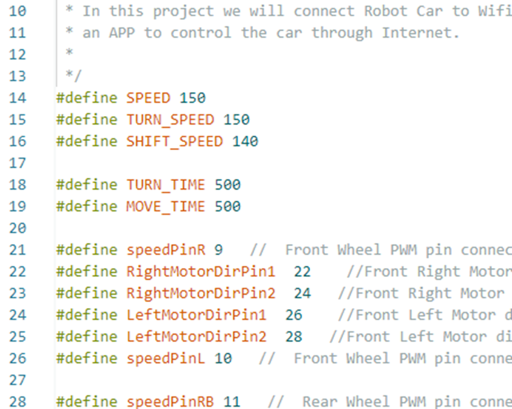

Let's try an experiment now. We will lower the value of the parameter SPEED and let's see the effect it has when the Arduino board controls the robot car.

The Arduino IDE should be opened up on your computer. Put your mouse inside the IDE's Window. You can move around and if you click at a certain line or character of text, you can easily modify it.

Go to Line 14 and change the value of the SPEED parameter to 55. Line 14 should look like this now:

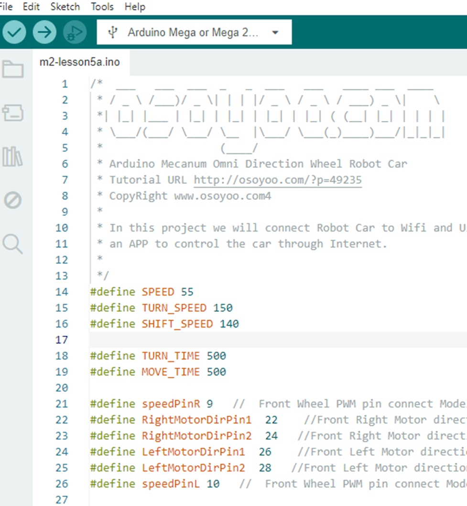

This program, i.e., Sketch, is human readable and actually essentially C-like code with a structure and specialized functions for the Arduino environment. We now have to convert this C-like code (i.e., the Sketch program you just modified) into the binary code which will run on the Mega2560 Ardinuo board in our robot car, and then actually upload the compiled binary code to the Mega2560 board.

-Just as in the demo software examples in the various steps above, attach the USB cable to the Arduino board connector on the robot car, exactly like you did above when we uploaded software to the car's Arduino board. (The power on your robot car should be turned off -- the cable will supply power to the Arduino board.) 

-Now click the upload arrow (green arrow inside a circle at the top left corner). Look at the bottom of the Arduino IDE -- you will see messages as the human readable Sketch gets compiled into binary bytes and uploaded to the Arduino board.

-The modified software (i.e., where you set SPEED parameter to a value of 55) is now in the robot car. Let's try it out.

-Unplug the cable from the car to the computer.

-Turn on the car.

-Go to your cellphone and go to Settings. Then change your Internet Wi-Fi to "osoyoo_robot"

-Ok now open the Osoyoo IoT UDP Robot APP (or, if you have, like me, the OSOYOO IoT APP, then open that one).

-(Settings should be saved from when you used the App previously, but if not, go to Settings on the App and enter the IP address this app should access (since we want it to access the Wi-Fi board on the robot car) (You can see the IP address in the Arduino IDE. In my setup it was 192.168.4.1 with UDP Incoming Port 8888))

--Ok...now go to the main page of the Osoyoo IoT UDP Robot APP/OSOYOO IoT APP, and press the forward button. The car will go forward, but much slower.

Congratulations -- you just modified your first Arduino program.

You can try changing the values for the TURN_SPEED (turning speed) and the SHIFT_SPEED (parallel shifting speed) parameters, and see the effect on the performance of the robot car.

The Arduino website provides thorough documentation of the Arduino board and the Arduino programming language and environment:  https://docs.arduino.cc/

## 
****
Initial draft Feb 9, 2024

(This is a public document that can be modified by others who have access -- if anything doesn't make sense, please ignore.)
(No use of high voltage or anything dangerous is or should be specified in this document.)

-
-

 

-
-

end of document
****
##

-
-
-
-

-

-
 

 
 
