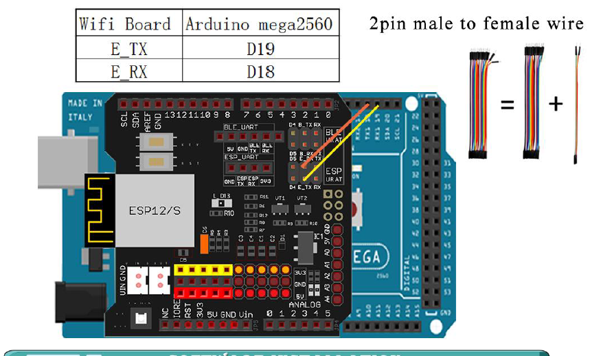
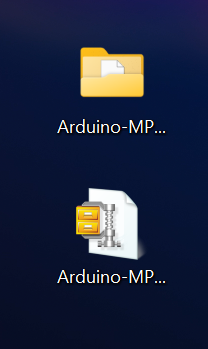
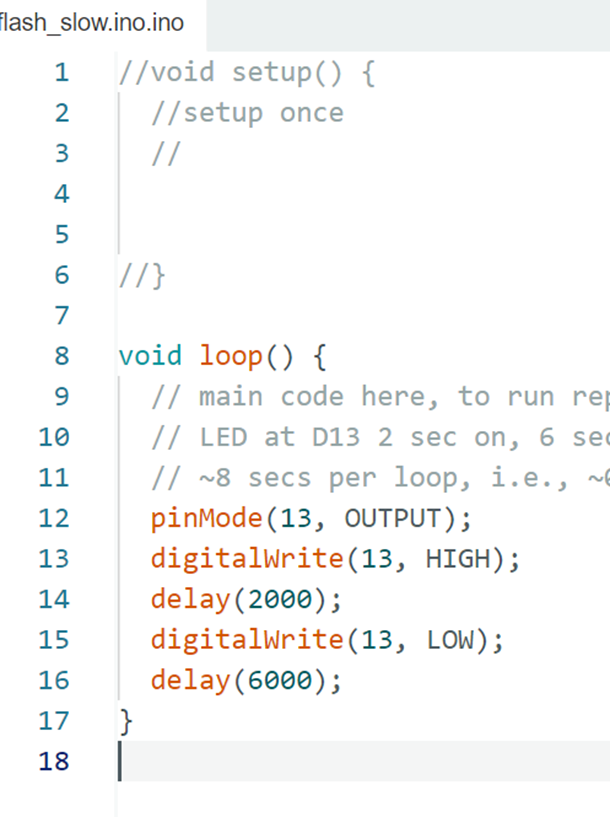
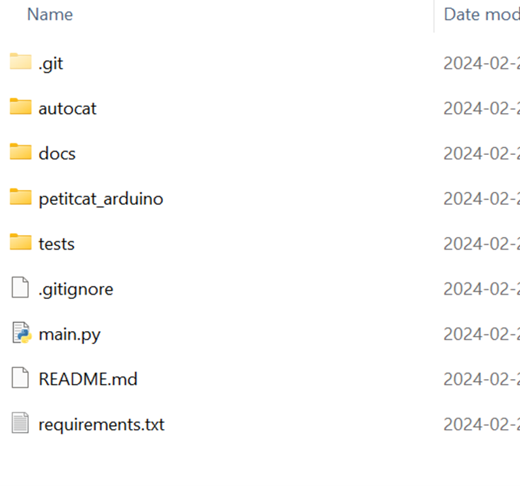

##

Initial draft Feb 15, 2024

(This is a public document that can be modified by others who have access -- if anything doesn't make sense, please ignore. A year from now, for example, I may not be aware of the full contents of this document any longer or what is still current.) (No use of high voltage or anything dangerous is or should be specified in this document.) (Any illustrations are my own, generated by OpenAI GPT4 and modified by myself, or taken from open technical sites. Reproduction is limited for "fair use" or else not allowed if prohibited by law. Software/documentation/logo belongs/(c)/tm the PetitCat project/creators but is allowed for "fair use" or else not allowed if prohibited by law. Usage is "as is" -- user should consider and treat as experimental.)

(Questions, corrections, suggestions? -- please contact me: hschneidermd@alum.mit.edu 
Howard Schneider -- Feb 15, 2024)
##

# An Easy-to-Read Overview of the Robot Car ("PetitCat") Project
# Part II

-

-

<h2 style="font-size: 24px;">The PetitCat Project </h2>

The "Easy-to-Read Overview" of the project is divided into five parts:

**Part I:** The Basics: Assembly, Software and Using

**Part II:** Modifying the Robot Car for Python Control

**Part III:** Active Inference of the Robot Car

**Part IV:** Integration of PetitCat with a Causal Cognitive Architecture

**Part V:** Integration of PetitCat with a Large Language Model

The PetitCat documentation is written so that anyone with a basic education can read it and understand it. Having a deeper breadth of knowledge in software development, AI, or cognitive science, can, of course, allow greater appreciation for certain aspects of the project.

-Part I does not require any specialized background knowledge. You should be familiar with moving files around in either your Windows, Mac or Linux desktop/laptop computer. Other than that, no specialized knoweldge is needed. Part I is perfectly fine for high school students and hobbyists.

-Part II may be fine for high school students, college students and hobbyists as well, given a willingness of some effort to learn things here and there. However, the documentation will guide you on this learning journey. The lower level software of the PetitCat project is written in C\C++ in the Arduino IDE. You don't need to know these languages or environment in order to use Python with the project. However, we provide a very basic C\C++\Arduino tutorial which may be sufficient for most readers who do want to have a bit more control over the Arduino board coding. We just touch upon the Python control of the project at the end of Part II, so you are not expected to have much Python knowledge in this part, unless you want to start modifying the Python files.

-Part III really only requires some knowledge of Python. You do not have to be an expert developer. More important, is perhaps a background in AI or cognitive science. However, there is no real background prerequisite here. Regardless of the reader's background, we provide gentle tutorials on a number of topics, and guide the learner through the concepts of active inference and implementing it in the PetitCat project.

-Part IV has similar requirements. In this part we take a functioning system, i.e., the PetitCat robot car and software, and integrate it with a cognitive architecture. The result is a true grounded system capable of autonomous operation. Again, in this part, only intermediate (or even novice) Python coding abilities are required. 

-In Part V we will add the full capabilities (depending on software releases and licensing) of a large language model (GPT4 at the time of this writing) into the PetitCat cognitive architecture robot car system. Again, in this part, only intermediate (or even novice) Python coding abilities are required. However, we will gently guide you through the project, so that you end up with a super-human intelligent grounded autonomous robot system.

-
-

# Part II: Modifying the Robot Car for Python Control

-
-

Ok... in the previous Part I we built the robot car, installed software on it, and tried out its many features.

Ok.... time to move forward now....

Saddle up!! Let's get going on the most exciting part of our journey....

 

-
-

<h1 style="font-size: 24px;">Step #1 -- The Big Picture: The PetitCat Project</h1>

Ok.... you are in the saddle, riding high on your horse. Now it's time to survey the landscape before moving on....

As noted above, in Part I you already built your Osoyoo Robot Car. You learned how to use the Arduino IDE to upload software to the robot car, and how to control the car from your cellphone via the Wi-Fi in your house or workplace. You also learned a little bit about the software running on the Arduino and how to modify some of the parameters in the Arduino code.

In this Part II you will learn how to transform your Osoyoo Robot Car into a robot car which any of your Python programs will be able to control and communicate with. We call this project the "PetitCat" project or the "Robot Car" project or the "Osoyoo Robot Car" project -- they all mean the same thing and may be used at different places in the documentation. 

(In the following Part III you will then learn how to use your Python-controlled robot car for AI/Cognitive Science experiments and demonstrations.)

In this Step #1 of Part II we will consider the big picture, i.e., what are the basic components behind this PetitCat project (i.e., Python-program connected robot car project). In the subsequent steps of this Part II, we will implement the details, and get the robot car controlled and communicating with your Python programs.

The PetitCat Project is an open-source project based on the work of Prof Olivier Georgeon and his colleagues and students at UCLY Lyon Catholic University. 

The big picture (i.e., overview) of the project is: The Python module PetitCat.py (or test_remote_control_robot.py -- see below about redundant nomenclature) running as a Python module as part of your Python program on your desktop/laptop communicates via Wi-Fi to the robot car. The Arduino program PetitCat.ino compiled to Arduino code running on the Arduino board on the robot car communicates via Wi-Fi with PetitCat.py (or "PetitCatMain.py" depending on nomenclature used). 

--NOMENCLATURE--

As this project evolves, names used to describe various parts of the project may change, although they will describe the same piece of code or the same folder of code, etc.

Let's review the nomenclature of the project, i.e., the names referring to different parts of the project.

-Overall project:

The "PetitCat" project == the "Robot Car" project == the "Osoyoo Robot Car" project 

-GibHub folder for project:   https://github.com/OlivierGeorgeon/osoyoo

-Python main file:

PetitCat.py == PetitCaMain.py == PetitCatTester.py == test_remote_control_robot.py

-GitHub folder for Python files: /osoyoo/tests/

https://github.com/OlivierGeorgeon/osoyoo/tree/master/tests

---> Go to this GitHub folder. If you click open PetitCat.py == PetitCaMain.py == PetitCatTester.py == test_remote_control_robot.py you see the standard library files PYthon will import automatically. 

-Arduino board main file:

PetitCat.ino == autocat_enacter.ino == petitcat_arduino.ino

-GitHub folder for Arduino files:

/osoyoo/petitcat_arduino/

https://github.com/OlivierGeorgeon/osoyoo/blob/master/petitcat_arduino/petitcat_arduino.ino

---> Go to this GitHub folder. You will see that in addition to the main code PetitCat.ino == autocat_enacter.ino there are a good number of header .h and code .cpp files. All these will need to be cloned and copied into the IDE later. 

-
-
-
-

<h1 style="font-size: 24px;">Step #2 -- Using your House/Workplace Wi-Fi to Communicate with the Robot Car</h1>

In Part I in one of the last Steps we created a Wi-Fi server ("hotspot") out of the Arduino board's Wi-Fi shield, and we logged our smartphone into this Wi-Fi server ("hotspot"). Then we used an app on our phone to control the robot car via a Wi-Fi linkage between the two.

In this new step we make the robot car act as an ordinary device on our home/workplace LAN (local area network). This is just a tiny bit more complicated (actually, really not.... if your Wi-Fi does not have strange security layers it should work well) than before, but more useful. Indeed, in Part II for communication of the robot car with our Python program, we will want every device (i.e, the Arduino board Wi-Fi and the desktop/laptop Wi-Fi ) to log into the same LAN (local area network).

In this Step #2 we will not be doing any programming of our own, but use the software already prepared by Osoyoo.

Before you start this step you need to find out the following information about the Wi-Fi in your house/workplace:

-SSID -- this is the name of your network, e.g., if the name of the network you log into is "Jones" then your SSID is "Jones".

-Pasword -- this is your password you use to log into your network, e.g., if the password to log into your Wi-Fi is "test1234" then your password is "test1234".

Go to Lesson 5 in the Osoyoo Manual.

---HARDWARE INSTALLATION--

The Wi-Fi shield was installed into the Arduino board above when the robotic car was first built. Thus, there should not be anything for you to do with regard to hardware installation.

--WIRING INSTALLATION--

Similarly, we already made the wiring changes in the Step in Part I when we tried out the Wi-Fi board. Thus, there should not be anything for you do now with regard to wiring.

Previously (should already be done) wiring changes to make:

-Remove the connections from the Wi-Fi B_TX and B_RX.

-Now connect D18 and D19 to E_RX and E_TX on the Wi-Fi board.

(Note. In the picture below the orange wire actually is going to E_TX and then the male-male hacked connection and then to D19, and similarly the yellow wire is going to E_RX and then to D18 via the other male-to-male hacked connection, which is a reveral of the yellow and orange in the schematic diagram, i.e., colors are reversed, but the wiring is the same.)

--SOFTWARE INSTALLATION--

--Library Software--

We already added this library software in the Step in Part I when we tried out the Wi-Fi board. Thus, there should not be anything for you do now with regard to loading library software.

In case you did not do this or the Arduino IDE was re-installed:

In this step there is now an extra requirement to download and update an Arduino library zip file.

-download the library zip file from the link provided in the Osoyoo Manual Lesson 5 
(In the Manual version I was using the link went to:  http://osoyoo.com/driver/mecanum_metal_chassis/for_mega2560/WiFiEsp-master.zip )
A folder WiFiEsp-master.zip will download

-virus scan the file always after downloading and before clicking or using

-Open up the Arduino IDE (similar to above in earlier steps) but this time click Sketch, Library, Add ZIP Library, select WiFiEsp-master.zip

Lesson5b Arduino code being compiled and uploaded to the robot car -- with this new code the robot car's Wi-Fi board will log onto your house/workplace Wi-Fi

--Wi-Fi Software--

Just like the other Steps in Part I (i.e., "Lessons" in the Osoyoo manual) there is demo software that will work with the Wi-Fi shield in your robotic car. We will use Osoyoo software for this Step. (However, later for controlling the robot car from our Python program we will be using our own created software, not Osoyoo's software.)

-The link shown in the manual works fine -- you will download a folder containing m2-lesson5.ino which will work with the Arduino development environment (IDE). The manual also shows you what some of the Arduino IDE screens will look like.

-Unlike the other lessons, in this lesson there is a lesson5a and a lesson5b software demos.  In the lesson5a demo the Wi-Fi board on the robot car becomes the Wi-Fi access point ("hotspot" is the term used by the Osoyoo manual) and your cellphone becomes the client. We already did this in one the Steps towards the end of Part I.

In the lesson5b demo the Wi-Fi board on the robot car becomes a node (i.e., a client) in the LAN where the robot car is operating -- we will specify the LAN's router's Wi-Fi SSID and password to the robot car, but still end up using the cellphone app to control the car. ---> WE WILL TRY OUT LESSON5B DEMO SOFTWARE NOW.  

-Ok... when you unzip folder m2-lesson5 folder, you will see the folder m2-lesson5b

-Always virus scan files when you download them and when you extract them.

-Then open the Arduino IDE exactly as described in Part I. As well, the manual shows several screens of the Arduino IDE. Make sure your Arduino IDE is configured exactly like before (i.e., correct Arduino board is specified).

-Click 'Open' and load in m2-lesson5b.ino

-Then attach the USB cable to the Arduino board connector on the robot car, exactly like you did in Part I Steps when we uploaded software to the car's Arduino board. (The power on your robot car should be turned off -- the cable will supply power to the Arduino board. )

--> YOU NEED TO MODIFY THIS SOFTWARE

You now need to tell the software what your Wi-Fi SSID and password are.

For example, if the name of the network you log into is "Jones" then your SSID is "Jones" and if the password to log into your Wi-Fi is "test1234" then your password is "test1234".

--> Look at lines 180 and 181 (or equivalent lines if the software has changed since the time of this writing).  Modify the lines as follows:

char ssid[] = "Jones"

char pass[] = "test1234"

-Now click the upload arrow (green arrow inside a circle at the top left corner).

-The software in m2-lesson5b.ino (modified with your Wi-Fi SSID and password) will now be uploaded to the Arduino board in your robotic car.

-Now open the Serial Monitor on the Arduino IDE. You will see something like this written:

Write down the IP address you, in this example, it would be "10.0.0.41" -- you will need this address for the App running on your smartphone -- it will tell the App where the robot car is connected.

--Phone APP software--

We already add the phone app software in the Step in Part I when we tried out the Wi-Fi board. Thus, there should not be anything for you do now with regard to installing new app's on your smartphone. However, you will have to change the settings, as shown below. IMPORTANT: You must change the settings in the smartphone App since the robot car is no longer a hotspot but is logged onto your home/workplace Wi-Fi now.

In case you did not do this or you un-installed the app from your phone:

-If you have an Apple phone then you will go to the Apple Store

-However, since I have an Android phone (Pixel 7) I will go to the Google Play store

-The Osoyoo Manual Lesson 5 advises to search "Osoyoo Wifi UDP Robot Car Controller"

-Unfortunately when I do this search (Feb 9, 2024) the only app that appears in the Google Play store is "Osoyoo IoT UDP Robot APP" -- well, better than nothing, and maybe it will do the same thing.... so this app is installed on my Android cellphone

---> Your smartphone App is installed. (Whether it is called "Osoyoo Wifi UDP Robot Car Controller" or "Osoyoo IoT UDP Robot APP").

Now we have to go to the settings section of the phone App.

-Ok we open the Osoyoo IoT UDP Robot APP

-Then go to Settings and enter the IP address we saw in the Serial Monitor. In this example, we would enter "10.0.0.41" (you will enter, of course, the IP address your Serial Monitor showed you -- this is the address the robot car is using).

-You can leave the other settings such as the default Ports unchanged

Your smartphone App should now be able to control your robot car. Let's try it out.

-Ok...now go to the main page of the app.

-Ok... turn on the robot car

-Now, let's click a button on the app.... go forward

The car goes forward.

Click backwards, left and right.

They all work .... we can control the robot car via Wi-F i -- this time with both the robot car and cellphone attached to the same house/workplace Wi-Fi router.

Success :)  

Celebrate.... because we will be moving onto more technical details in a few moments.....

For a moment, you can pretend you just created a great new robot to be used on the Star Ship Enterprise (NCC-1701-D, of course). Picard is most pleased with your genius, and invites you for a cup of tea, Earl Grey, of course. 

 

-
-
-
-

<h1 style="font-size: 24px;">Step #3 --Getting More Experience with the Arduino IDE -- The Library Manager</h1>

In this Step we will learn how to use the Arduino IDE library manager, and we will then install some of the Arduino libraries that our PetitCat project code will later need to use.

An Arduino library is essentially C++ code consisting of various C++ classes and functions that perform some related function. For example, a Wi-Fi library would provide functionality with regard to sending and receiving information via Wi-Fi. For example, a JSON library would provide functionality with regard to JSON operations. (JSON is a popular data format which simply consists of (key:value) pairs. However, the key-value pairs can be nested and structured and held in arrays. Although verbose, it is human readable.) For example, a JSON library would help with parsing JSON data, generating JSON data and processing JSON data.

--INSTALLING LIBRARIES FROM WITHIN THE ARDUINO IDE ECOSYSTEM--

Your Arduino IDE should still be on from the previous step. (If not, open up the Arduino IDE.)

If you go to Tools you can click "Manage Libraries..."  or you can just click the icon on the left column of the page where you see a bunch of library books.

The "Library Manager" will now appear in a column to the left of the code.

You can use the Library Manager to add and remove libraries from your Arduino projects.

You already installed in Part I (when we were getting the robot car to communicate via Wi-Fi and act as its own hotspot server) the library WiFiESP. You can see in the illustration above that this library is already installed in your Arduino IDE.  (If it is not, then please install it along with the other librares we will install below.)

We want to install a JSON library also. Search for JSON (or you can go through all the libraries available, although that takes a good amount of time). Choose "Arduino_JSON by Arduino" and click to install it.

Do the same for the "Adafruit TCS34725 by Adafruit" library, and click to install it. There will be a question about dependencies -- generally you should respond 'Yes' since the libary may need some of these dependencies at some point in order to function. (This library will be used later for an additional color sensor we will be attaching to the robot car.)

Thus at this point when you search for Installed libraries you should see this on the Library Manager:

--MANUALLY INSTALLING THIRD-PARTY LIBRARIES--

-------------
NOTE:  Feb 27, 2024:  The HLC5883L code is now within the GitHub repository and as such this library does not have to be installed manually any longer. (However, keep reading as the MPU-6050 library still needs to be installed manually.)

(Advantages of including code in the repository along with all the other code is that extra libraries do not have to be installed. However, the disadvantage is that libraries are often maintained by other people, and once code is put into a private program the code may no longer be maintained as effectively. )

(If you go ahead and install the HLC5883L library anyway,this should not cause any problems -- the repository HLC5883L code will be used in any case. You can see this if you inspect the code in Imu.cpp :

// #include <HMC5883L.h>

#include "src/lib/HMC5883L.h"   )

--------------

The HLC5883L compass function library must be installed manually. (The HMC5883L is a three-axis (x,y,z) digital compass/magnetometer module that is installed and used later as part of the project. It is based on orthogonally situated magnetoresistive sensors. It provides raw data related to measured magnetic fields and does not adjust the outputs for variations in the Earth's magnetic field required for more accurate navigation. By the 1800's ships housed the ship's compass in a binnacle which contained soft iron spheres or sometimes actual magnets to help counteract the ship's magnetic fields -- something you can see if you ever look at old ships or visit museums. In modern ships there is GPS correction of the compass to deal with the deviations in the field in different locations on Earth.)

Go to the GitHub repository Arduino-HMC5883L

https://github.com/jarzebski/Arduino-HMC5883L

Save the repository as a zip file.  (If you are not sure how to do this, see a few paragraphs below where I show you step-by-step how to clone the GitHub repository onto your computer, make it a zip file and then include it as a new library.)

On the Arduino IDE click 'Sketch' and then 'Include Library' then 'ADD Zip Library'. Then select the zip file for the repository. This will get stored as a new library in your IDE.

----> There is still another library you must install -- the MPU6050 inertial measurement unit (IMU) library. (We will later add an IMU hardware board to the project.) 

(The MPU-6050 uses MEMS (microelectromechanical system) integrated circuit fabrication technology to create a 3-axis (x,y,z) gyroscope and accelerometer in a single chip. The gyroscope measures the rotational velocity which allows navigation information with regard to spins and orientation. The accelerometer measures accelerations along the orthogonal axes. By mathematically integrating the accelerations they can be converted to velocity and by further integration they can be converted to change in position. Keep in mind the accelerometer will measure the acceleration due to gravity, and it is necessary to distinguish between accelerations measured due to gravity from accelerations due to movement of the robot car.)

Go to the GitHub repository Arduino-MPU6050

https://github.com/jarzebski/Arduino-MPU6050

You need to copy this repository into a zip file.

Here is a quick way.

Make sure you have Git installed on your computer. 

https://git-scm.com/downloads

(Git is a version control system, i.e., tracks changes being made to the source code as software is developed. In the early days of software development, people would have to back up this and that part of their programs, either manually or via simple batch files. It often became quite complicated to keep track what changes were backed up and where, in order to recover, for example, software to an earlier version if there were some issues with the current version. Then automated version control systems started to appear. Git is a distributed version control system (each developer actually has a complete copy of the repository and all the software changes made to the code in it, and thus a software developer can work offline without immediate access to some central computer server holding the code). Git was created by Linus Torvalds (famous as being the creator and lead developer of the Linux operating system) for developers to use while working on pieces of the Linux system, and became a standard software tool used in the industry. Git allows easy branching and merging of pieces of the software with automatic documentation of who committed what pieces of software.)

At the command line (e.g., Windows in my case) write: 

>git clone https://github.com/jarzebski/Arduino-MPU6050

You will now see on your computer (Windows PC in my case) a folder with the repository copied.

Now use WinZip or an equivalent zip tool to zip the folder. In my case I ended up with the file "Arduino-MPU6050.zip"

As mentioned above, on the Arduino IDE click 'Sketch' and then 'Include Library' then 'ADD Zip Library'. Then select the zip file for the repository which will be "Arduino-MPU6050.zip". This will get stored as a new library in your IDE.

--See What Libraries Have Been Installed--

If you click Sketch, Include Libraries, you will see at the bottom of the menu a list of "Contributed Libraries':

Adafruit BusIO

Adafruit TCS34725

Arduino JSON

Aduino-HMC5883L

Arduino-MPU6050

Wifi-Esp

At the time of this writing the project is specified to use these libraries:

-
-
-
-

<h1 style="font-size: 24px;">Step #4 --Simple C/C++ Coding and (Possibly) Preventing Dementia</h1>

No, this section title is not a typo. Keep reading, and see how with acquiring very simple C/C++ knowledge (which most readers probably already have) one could possibly prevent or delay Alzheimer's (and possibly other types of) dementia with the robot car. 

(CAUTION/DISCLAIMER: We will only do this theoretically as part of learning some new coding. We will NOT build anything therapeutic or anything to be used seriously.)

<b>--C/C++ IN THE ARDUINO ENVIRONMENT--</b>

As we discussed in Part I, the Arduino IDE uses a C++ compiler (the GNU GCC toolchain for the particular microcontroller being used) -- it compiles C and C++ code. Thus, Arduino programs are really C/C++ code.

Learning to code in C and C++ is beyond the scope of this tutorial, and in any case most readers probably already have some experience in this area. However, this and the next Step (or two.... pending editing of how much material to include) is just to make sure that readers with limited experience in C/C++  feel a bit more comfortable with the code. As well, there are a number of idiosyncracies and specialized functions in Arduino programs, so this may be of interest to even experienced coders. 

C is the original procedural C programming language. C++ is a more modern object-oriented programming language with a richer set of features (particularly in memory management) and in its standard library. We will not be distinguishing between the two in this and the next Steps since the compiler will compile both sets of code. (C# is similar to C++. It was created by Microsoft in the late 1990s and originally developed for Windows platforms and Microsoft's .NET ecosystem, although it can now run on macOS and Linux. We will not be discussing it here.)

On a technical note, the Arduino IDE looks at what type of board you are trying to run your Sketch (i.e., '.ino' file) (which is really C/C++ code) on. If an AVR microcontroller board is chosen (Arduino Uno, Mega or Nano board) then the AVR GCC compiler is used. If the microcontroller board is based on an ARM microcontroller (e.g., the Arduino Duet) then it uses the ARM version of the GCC compiler, and so on. In the case of an AVR microcontroller (such as the board which is used by the robot car of this project, at the time of this writing) the following compiler toolchain components (or within actual GCC components) are used:
- Preprocessor prepares the code for compilation (e.g., includes libraries, considers compilation directives, etc)
- Compiler AVR-GCC converts the preprocessed source code into assembly language for the target AVR microcontroller
- Assembler AVR-AS converts the assembly language code into machine code object files -- occurs for each source file in a project
- Linker AVR-LD links the object files from the different Sketch files, libariers and the Arduino core code, into a single executable file, ensuring the machine code will correctly map to the AVR microcontroller's memory spaces, producing an ELF (executable and linkable format) file
- AVR-OBJCOPY then converts the ELF file into a HEX file which is a text representation of the binary data which will be loaded into the Arduino microcontroller's flash memory
- Uploader tool AVRDUDE then transfers the HEX file to the microcontroller's flash memory by communicating with the bootloader on the Arduino AVR-microcontroller board

In the Arduino IDE, when 'Upload' is clicked in the IDE then the above sequence of compile and upload steps occur.

The Arduino CLI (available as a download from the Arduino website) allows compiling and uploading Arduino code at the command line, without the use of the IDE. Or, the usage of the above individual tools can be used at the commmand line, e.g., avr-gcc to compile and link files, avr-objcopy to convert to a HEX listing, and avrdude to upload the HEX file to the Arduino AVR-based microcontroller board. However, here we only consider the usage of the Arduino IDE to compile and upload code to the robot car's Arduino board.

For readers with no background in C/C++ consider the many excellent and free (or some at small fees) courses and tutorials available online. However, the tutorial in this and the next Step(s) will give you some exposure to C/C++ in particular for the Arduino projects.

You do not need to be able to code in C/C++. The purpose of the PetitCat project is to construct an interface that will allow your thousands of lines of Python code to communicate with the robot car, and then use this ability for various cognitive science/AI experiments and demonstrations. However, given that the robot car is powered by compiled C/C++ code, understanding a tiny bit about C/C++ can be helpful in understanding how we make the robot car communicate with the Python programs.

<b>--FLASHING LIGHTS AND POSSIBLE IMPROVED COGNITION?? --</b>

Ok... above it was written "....Keep reading, and see how with acquiring very simple C/C++ knowledge you can possibly prevent or delay Alzheimer's (and possibly other types of) dementia with the robot car."  You may be thinking, 'Was this just clickbait to keep me reading your boring paragraphs?'  Well.... no :) 

In fact, this is a very legitimate topic. 

However, given that there is a risk of seizures induced by flashing lights for a very small percentage of the population, but still some people, this Step has been re-written so we discuss how we can code the Arduino board to possibly improve cognition and prevent dementia, but do so  only at the end of the Step and we don't program the actual circuit.

<b>--ARDUINO SKETCH TO FLASH THE ONBOARD LED--</b>

In this Step we will learn how to code an Arduino program (i.e., "Sketch") in trying to flash an LED. 

Go to the Arduino IDE. Click File. Click New Sketch. A new window should pop up on your screen. (You can close the Arduino IDE screen in the background.)

The LED on the Arduino board on the robot car is wired up to digital pin output 13 already (i.e., it is already soldered directly on the board from the factory -- no discrete wires are necessary).

Ok.... even if you have much experience coding in C/C++ how do you now get the LED to start flashing?  Writing a C/C++ program for Arduino is similar but still different enough than writing C/C++ code that goes to a monitor or other computers.

If you look closely at the Wi-Fi shield there is an "LED13"  (actually it says "L.D13" in the photo below) on this shield which reflects the state of the D13 pin:

Firstly, all Arduino programs need to have a setup() function and a loop() function. (In my Arduino IDE, when I click new sketch I actually get an Arduino code template with these two functions already in place, albeit empty with no lines of code inside.)

The setup() function runs only once when the Arduino board is powered up (or reset). After the setup() function finishes its programmed tasks (i.e., whatever you tell it to do) it then automatically calls the loop() function.

The loop() function runs over and over again (hence, its name of 'loop'). In our case, we want the Arduino board to flash an LED long enough to see for a bit of time, and then wait a certain delay with the LED turned off. At that point the code gets to the end of the loop and starts again. 

You can name the Sketch (i.e., program) whatever you'd like -- just click on the right side to the tabs and rename the tab. As you can see I called my program (i.e., my Sketch) "flash_slow.ino". (You don't have to, and can use the default name the Arduino IDE choses for you.)

Even if you have coded in C/C++ before, the Arduino IDE uses specialized functions. Let's review some of them right now.

-pinMode(pin, mode) -- It tells Arduino IDE that a specific pin should be configured to behave as an input (mode=INPUT) or an output (mode=OUTPUT).

-digitalWrite(pin, value) -- It tells a particular pin on the Arduino board to go to value=LOW or value=HIGH. If value is HIGH then the pin will go to 5 volts (the voltage used in the Arduino board in the robot car) and thus if an LED is attached the LED will turn on. If the vlaue is LOW then the pin will go to ground (i.e., 0 volts).

-delay(value) -- It tells the Arduino microcontroller to stop running the program for the specified delay (in milliseconds) and then once the delay period is over to continue executing the program.
(An advanced way of doing this is using the millis() function to return the number of milliseconds that have elapsed and so the Arduino board can be checking other inputs or doing other things rather than just totally shutting down, as occurs with the delay() function.)

-Also, in C/C++ coding and in Arduino programs, a double forward slash, i.e., //, means a comment -- text you write which is for other human programmers (or you at a later time when you might have forgotten what the code is supposed to do), and which the computer ignores

-Also, in C/C++ coding and in Arduino programs, lines of code typically end with a semicolon, i.e., ;  (although if a loop or if/then is being specified then after the 'if', 'for' or 'while' keyword, there will be braces, e.g.,  for (int i =0; i<5; i++) { ...... lines of code here }

Now that you know what the structure of an Arduino program looks like and now that you know these very important functions (well, important for programming Arduino boards), try to write an Arduino program that blinks the LED on the robot car's Arduino board.

-

-
-

Click the green right facing arrow at the top of the screen (i.e., compile and upload code to the Arduino board).

The red LED on the Wi-Fi shield (reflecting the status of the D13 pin) will now gently come on for 2 seconds and then go off for 6 seconds, and repeat.

-
-

<b>--FLASHING LIGHTS AND POSSIBLE IMPROVED COGNITION?? --</b>

Ok... above it was written "....Keep reading, and see how with acquiring very simple C/C++ knowledge you can possibly prevent or delay Alzheimer's (and possibly other types of) dementia with the robot car."  You may be thinking, 'Was this just to keep me reading ?'  As mentioned above -- no :) 

Ok.... so then you may think, 'Are you going to write now that by using my brain to learn something new that these activities will prevent or delay dementia and my brain will stay extra healthy?'  Well... maybe. Any intellectual stimulation is good for the brain and lots of studies indicate it may indeed keep the brain much healthier throughout the lifetime. But, no... it's not this. We really can in theory build a more definitive prevention of Alzheimer's with our robot car project. (But as noted above, this Step has been re-written and this material is only presented for general interest.)

Synchronous acitivity of large groups of neurons generate oscillatory electrical signals which can be measured on the scalp of the head (EEG). It is believed that the synchronous activity of neurons allows different parts of the brain to communicate with each other. (Although.... if you want to consider a more nuanced look at the subject, consider reading- Schneider, H. (2022). Causal cognitive architecture 3: a solution to the binding problem. Cognitive Systems Research, 72, 88-115.) 

In dementias we see pertubation of the EEG rhythms believed to be needed for cognition. A number of studies have shown that stimulation in the 40-Hz "gamma" EEG range of oscillations can improve Alzheimer's Disease symptoms in mouse models of the disease (Chan, D., Suk, H. J., Jackson, B., Milman, N. P., Stark, D., Beach, S. D., & Tsai, L. H. (2021). Induction of specific brain oscillations may restore neural circuits and be used for the treatment of Alzheimer's disease. Journal of Internal Medicine, 290(5), 993-1009.) A study on humans also showed similar results (e.g., Chan, D., Suk, H. J., Jackson, B. L., Milman, N. P., Stark, D., Klerman, E. B., ... & Tsai, L. H. (2021). Gamma frequency sensory stimulation in probable mild Alzheimer’s dementia patients: results of a preliminary clinical trial.) (There is a warning in the next paragraph -- if this warning has been deleted please do not build this project without reading.)

In theory, if light is flashed at 40Hz there will be a 40Hz visual stimulation which research indicates could (theoretically) prevent and improve dementias. (But.... again.... you should not do this because the research is still incomplete and there are actually dangers of staring at 40Hz signals such as risks of triggering seizures in sensitive individuals, triggering migraines in certain individuals, causing eye strain, and the potential for unknown effects.)

(Note: "GENUS" is not a typo for "Genius" but stands for Gamma-Entrainment-Using-Sensory stimuli at 40 Hz)

Although the LED is low-power, it can be flashed relatively fast if programmed as such. There is a risk in sensitive individuals of triggering seizures (as well as migraines). If this applies to you or you have any risk towards seizures, do NOT flash the light at high speed.

(Triggering seizures in photosensitive individuals is increased by exposure to a frequency of 5 to 30 Hertz  (it can still occur at 40 Hertz), bright lights, high contrast, and the duration of exposure. 

-
-

<b>--EXPERIMENTING WITH THE ARDUINO COMPILER (WITHIN THE IDE)--</b>

Ok.... let's experiment with the code syntax and the compiler a little bit. WARNING: Frequency should be at 0.125Hertz for all these experiments.

I left off the semi-colon at line 4. What will the compiler do? You should try this too.

-
-

Here's what happens when I click the green upload arrow on the Arduino IDE:

Restore the code, i.e., put the semi-colon back at the end of line 4, and press the upload button. Now everything should compile and upload to the Arduino board successfully.

Let's try something else. In line 14 write 'low' rather than 'LOW' in the delay() function. Click the upload button. What happens?

The program is expecting to see something it knows the value of. It doesn't know what 'low' means in this function.

Restore your code. Now move line 4 (i.e, pinMode) and insert it after line 11. Thus, instead of calling it once at the start of the program you will call it each loop. It is more efficient to just call it once at the start of the program, but this should work too. Give it a try. Upload the program.

It should work ok.

There is no code in the setup() function. Let's remove it. (Which you can do by commenting it out.) You should try this too:

-

Now click the button to compile and upload the code. What happens?

You will get a compilation error. When the code is linked together by the compiler toolchain, it expects to see a setup() function.

Restore your code, i.e., uncomment the setup() function. Everything should work well now again, i.e., the code compiles and uploads to the Arduino board.

-
-
-

<h1 style="font-size: 24px;">Step #5 --Simple Electronics Is All You Need (to do great things with the robot car project)</h1>

--THE INCREDIBLE COMPLEXITY OF THE ELECTRONICS BEHIND THE ARDUINO BOARD--

No, the electronics in the Arduino board is not simple. (Note: If English is not your first language, or if you are an automated grammar checker, you are probably saying the grammar is incorrect here. However, the word "electronics" really means at this point in common usage "electronics technology" which is correctly treated as non-plural.) It (i.e., the electronics in this Arduino board) actually represents an incredible fusion of human scientific and engineering knowledge. Making chips requires advanced mathematics, advanced chemical engineering, advanced materials science, advanced quantum mechanics, advanced radio frequency electrical engineering, advanced circuit electrical engineering, advanced computational design, advanced optical physics, advanced manufacturing engineering, and on and on. It is a triumph of human creativity and cooperation to produce the commonplace chips (these days) we can inexpensively have running the Arduino boards such as the one used in the robot car project.

The chip (i.e., integrated circuit microcontroller) on the Arduino board in the robot car project is an 8-bit chip architecture. (In general, 8-bit means the chip has a data bus width and registers of 8 bits in width, i.e., it handles data in 8 bit chunks. However, the address bus in almost all 8 bit chips are wider than 8 bits since addressing only 256 bits would be very limiting.)

Microprocessor integrated circuits (again, representing an incredible fusion of human scientific and engineering knowledge -- far from simple electronics) came out in the 1970s. The Intel 4004 was released in 1971. It was a 4-bit chip (i.e., processed data in 4 bit chunks). However, by 1972 the Signetic 2650 had been designed (although for commercial reasons it was not sold until 1975 -- a delay which hurt its prospects of success) -- this 8-bit chip tried to duplicate the circuits found on expensive minicomputers.

The Intel 8008 quasi-8-bit microprocessor was released in 1972. It used 10,000nm silicon sized elements, ran at a clock speed of 0.5MHz. Then in 1974 the Intel 8080 was released -- a more robust 8-bit microprocessor design. The 8080 is often credited with starting the personal computer (PC) industry. For example, the Altair 8800 (based on the 8080 chip) was on the cover of the January 1975 issue of Popular Electronics. For example, Bill Gates and Paul Allen started Microsoft writing a version of BASIC for the Altair 8800. 

A few months after the release of the Altair 8800, the IMSAI 8080 kit (both of these PC's were based on the 8080 chip) released in Dec 1975. About 25,000 hobbyists built the IMSAI 8080. The kit came with 1KB of RAM. There was no long term storage although hobbyists rapidly adopted using cassette tape recorders and simple modulation/demodulation hardware to store and retrieve code. The bus into which different boards plugged in was called the S-100 bus (i.e., all the data, address, etc lines). The kit came with an Intel 8080 manual of machine instructions and indeed most hobbyists just keyed machine instructions into the system via the front panel toggle switches, although some hobbyists attached the computer to a video terminal and eventually ran CP/M operating system.

If you never had the chance to experience an early microcomputer at the machine level (or were not born yet) the High Nibble company of Australia has produced a working replica of the IMSAI 8080. Face on it looks identical but it is just a facade with toggle switches and an ESP32 microcontroller to simulate the IMSAI 8080 behavior, plus also provides Wi-Fi connectivity.

-

The chip in the Arduino Mega board on the robot car project is an ATmega2560 chip. It is an 8-bit chip but reflects the exponential improvements in chipmaking that have occurred since the release of older 8-bit chips such as the Intel 8008 and Intel 8080. As noted above, the Intel 8008 was fabricated with element sizes (i.e., elements of the silicon photolithographed, where the size refers to the smallest half-pitch of a feature, typically the gate length of a transistor) of 10 microns or 10,000 nanometers. In contrast, current, for example, Apple A16 chips use 4nm element size (actually equivalent element size, this is a FinFET process in more than one dimension). 

The ATmega2560 chip is made by MicroChip Technology which does not reveal the manufacturing technology details but the chip is a modern chip believed to be fabricated at the 90nm or 65nm node (i.e. equivalent) feature size (very economical node sizes at the time of this writing versus the very expensive 4nm node size discussed above used by Apple for the A16), in contrast to the 10,000nm element size used by the first Intel 8008 (quasi) 8-bit chips. As well the ATmega2560 has a host of modern features such as including  within the one chip all the components needed for flash memory, SRAM, digital input and output, analog input and output, etc. 

--INPUT/OUTPUT PIN'S ON THE ARDUINO MEGA 2560--

This diagram shows the pinout's on the Arduino Mega 2560 board in the robot car.

Digital pins can be configured as digital inputs or outputs (as we did in the previous Step in flashing the LED). Pins D0 and D1 are also used for serial communication with the computer via the USB. 

Analog input pins can measure voltages between 0 and 5 volts where are useful to measure analog quantities from various sensors.

The board can supply 5 volts and 3.3 volts. VIN on the other hand is power in, i.e., a 5 volt input supply from a battery for example (as opposed to the 5 volts from the USB connector when attached to a computer).

Note the ground pins -- these are important when we build circuits taking the outputs from digital pins -- the other side of the circuit must return to the ground pin.

--SIMPLE ELECTRONICS IS ALL YOU NEED (SOMETIMES)--

Understanding of the complex technologies that allow inexpensive chips to power the Arduino board in the robot car is not required, but should be appreciated. And thus we move onto the title of this section, that due to the complex technologies doing all the hard work for us behind the scenes, all we really need to know is simple electronics to do great things with the Arduino board powering our robot car project. 

(Reality check-- Simple electronics is fine for now. But in reality, whenever you want to do interesting projects in the real world in any subject, more knowledge is always better, including more knowledge of electronics.)

If you vaguely recall the electronics you learned in high school physics class (or an after-school program perhaps, or on your own somewhere in your academic journey), that is more than enough to do amazing things with the Arduino board.

You should know how to build a circuit, e.g., attach a light bulb to one end of a battery, and the other end to the other end of the battery so that you have a circuit.

You should know Ohm's law. If you attach an LED (as opposed to a light bulb) to a battery you will also need a resistor to reduce the current (otherwise the LED will burn out from a very high current that flows). Ohm's law says:  V = IR where V is the voltage in volts, I the current in amps, and R is the resistance in ohms. If you have not seen this before it is better to think about it as I = V/R. Think about I current as the flow of a water. The higher the water is (V voltage) then the more flow will occur down the river. However, the higher the resistance to the flow, e.g., rocks, earth, etc (R resistance), then the less current that flows.

For example, if we want to attach a green LED to the 5volt output of the Arduino board, then what resistor should be in series with the LED?

A green LED has a voltage drop of about 2 volts therefore there will be 3 volts pushing current around the circuit. A simple green LED generally runs properly at 20mA. Therefore by Ohms law R = V/I = 3volts/20mA = 3volts/.02A = 150 ohms. Thus, we would want a 150-ohm resistor in series with the green LED.

The brown line on the resistor means '1'. The next green line means '5'. The next brown line means 1 zero after that, i.e., 150 ohms. (The last gold line means the resistor is +/- 5% of this value):

This is a circuit with a voltage source, a switch at the positive side of the battery, a resistor, and an LED. When the switch closes the LED comes on. You can think of a digital output of the Arduino board as the switch with a 5 Volt positive voltage on it. When the digital output goes 'HIGH' on the Arduino board, it effectively closes like the mechanical switch does (although it doesn't have any mechanical moving parts, of course) and current flows around in this circuit.

Note that the flat surface of the LED goes to the negative part of the power source/battery, while the other lead goes to the positive part of the power source/battery.

--WIRING A NEW LED TO THE ARDUINO BOARD--

Buy a green LED and a 150-ohm resistor. These components are very cheap and readily available (e.g., Amazon, local electronics parts distributors, etc) although you may have to buy ten LED's and 10 resistors or some other similar quantity. Buy a small electronics jumper cable (if you don't have one in your toolbox or workshop) -- also inexpensive and readily available (and also usually hard to buy just one, but you will need to buy a larger quantity). (These are small gauge wires with alligator clips on either end. They are not the huge car battery "jumpers" people often associate the word with.)

We want to program the Arduino board on the robot car to flash this LED once every 8 seconds, i.e., at 0.125 Hertz. 

Ok....let's first figure out the electronics.

Digital I/O pin 4 on the board seems unused at the moment. Let's put the positive lead of the green LED into digital pin #4.

Note: I have some 220 ohm resistors in my electronics workshop but no 150 ohm resistors. Even though we calculated 150 ohms, 220 ohms should be fine. (I = 3 voltage drop on the resistor/220 ohms = 14 mA of current through the resistor and through the LED -- this is adequate to light up the LED.)

Let's put one of the leads of the (220 ohm) resistor into the GND (ground) pin which you can see labelled at the 4th pin from the right edge (i.e., the edge closest to the USB socket). Then let's attach the other lead of the resistor to the negative lead of the LED with the jumper cable.

(This photo was taken after the code was written and uploaded to the Arduino -- the green LED was on while the photo was snapped. Note the black electronics jumper attaching to the negative lead of the LED with the other lead of the resistor.)

You should buy these parts and build this circuit. This is considered very simple electronics and you should feel comfortable with this level of electronics hands-on experience.

Ok.... now we need to program the Arduino to flash this new green LED once every 8 seconds.

Open up the Arduino IDE. Load the previous code which flashed the on-board LED at D13 once every 8 seconds. Modify the code so that it will work instead on flashing the LED at pin D4.

This is my code:

Let's see what happens.....

Success!! The new green LED flashes once each 8 seconds (on 2 seconds then off 6 seconds).

You have mastered simple C/C++ coding for the Arduino and simple electronics for the Arduino. You should feel great -- it's ok to throw yourself another celebration :)

 

-
-
-
-

<h1 style="font-size: 24px;">Step #6 --Getting More Experience with Arduino Coding</h1>

Before moving on to consider the Arduino and Python code of the PetitCat project, getting a bit more experience with Arduino coding may be helpful. Again, while you are not expected to do C/C++ coding for the the PetitCat project (indeed, the purpose of PetitCat is to abstract away the C/C++/Arduino coding and let you interface your Python code to the robot car project), learning a bit more simple coding can help you better understand what the project code is doing.

--SERIAL MONITOR--

In a typical C/C++ program on your laptop/desktop it's easy to print the value of variables, etc on your screen, and as such you can see what your program is doing. In the Arduino IDE we can use the Serial Monitor to do something similar.

Serial.begin(baud rate) -- this function sets up serial commmunication between the Arduino board and another computer, in this case your laptop/desktop where the IDE's Serial Monitor is running

Serial.println(variable/constant/string) -- sends the variable, constant or string you specify over the serial connection

Let's add some Serial.println() messages from the previous program flashing the LED to the Serial Monitor in the Arduino IDE.

This is the code I wrote (you should try modifying your previous program and writing something also on your own):

If you look at the upper right corner of the IDE you will see a circle with some dots in it. Click it -- the Serial Monitor will now appear at the bottom of the screen. The serial monitor will display the Serial.println() messages from the Arduino board:

--CONDITIONAL BRANCHING:  THE 'IF' STATEMENT--

Any programming language needs a conditional branch, and most, like C/C++, have an 'if' statement.

Let's try to code an example where we don't need to give the program any inputs (since we haven't learned the functions required to do that, yet).

Start with the numbers 0 and 1, and compute a Fibonacci series (i.e., add the last number with the previous one). When a three-digit number occurs, stop. Print out all intermediate results on the Serial Monitor.

You should try this on your own and then look at my code. I will write code quickly and leave some design issues in place and then we will gradually improve them. You can write nicely structured and understandable code in the Arduino environment just as you can on your laptop/desktop favorite programming environment.

Here's the simple ("quick and dirty") code I used to do this:

Here's the output seen at the Serial Monitor:

-- SPECIFYING ITERATION : 'FOR', 'WHILE' STATEMENTS--

Just about all programming languages have control flow statements which specify iteration. The 'for' statement is a common looping structure and is included in C/C++.

Many languages, including C/C++, also support looping with a 'while' loop. If we don't know the range or number of iterations (as we often do when using a 'For' loop), then a 'while' loop is a good choice for iteration.

Try to use these statements in your own code.

When we re-write or modify code ("refactor code"), even though the code may work (well.... work under the circumstances we test it under:)  we should always try to make a tiny improvement to make the code more readable (by far the most important thing -- code is written for other humans much more so than computers!!), less complex, less redundant (DRY -- "don't repeat yourself"), better structure, better performance and of course, if we note minor bugs (which may only show themselves under different testing environments) we should fix them. This tutorial/documentation on the Robot Car project is not a software design tutorial, and most readers have already seen this material a million times (English idiom, unless this document is being read by a generative AI app :), but it's good to mention here. I will write demo's in a sort of 'baby language' style (i.e., new system, just do things cautiously to see if things work) and then show how the code can be positively refactored as we introdue new features of the language and the project.

Below the code above has been modified so that it prints out (i.e., on the Serial Monitor) "reset" five times each time the variables are reset (to keep variable 'a' less than 100). One improvement in refactoring -- it is silly to declare c= 0 when we reset it, since c=a later on, so let's remove that line. I'll leave it in the global declarations just to show the human reader we are starting off we these three variables at these values. (Again, my opinion on code refactoring is that other than removing bugs, the most important issue is that code is readable, i.e., goes into the brains, of the humans (not computers), reading it. Nonetheless, if there was nothing else to refactor, I might have removed that initial declaration.)

You can see that "reset" is printed out five times when the variables are reset:

Let's rewrite the code to use the 'While' statement (although the 'For' statement is more appropriate given we know how many times we want 'Reset' printed out). Also, in refactoring let's get rid of 'magic numbers' (i.e., the '99') and label more appropriately. 

Use the Serial Monitor to take a look at the output of this code.

When you code in another language, e.g. Python, you know that your best friend for debugging programs or seeing how something works, is not an advanced debugger (which are indeed great), but the humble "print" statement. Same thing in the Arduino IDE. If you are not sure if your code is working properly or you want to see how something is working in more detail, use the "Serial.println" statement and the Serial Monitor. For example, if you are not sure about the "While" statement in your code you could write something like this:

Most readers probably have already had thousands of hours of experience of debugging and refactoring code, so this tutorial may seem childish (although still useful to quickly learn some features of the way Arduino code operates), but if you don't have this background experience, use the "Serial.println" statement and experiment and debug code. The "Serial.println" statement will become your best friend :)

--CODE ABSTRACTION: FUNCTIONS--

Most programming languages provide many mechanisms for abstracting code, especially including user defined functions. C/C++ and Arduino too, of course, allow user defined functions. (In a procedural language such as C we call a function a "function." In an object-oriented programming (OOP) language such as C++ we call a function that is part of a class or an object the description of "method". However, in this documentation we will call both "functions.")

We will continue to improve the previous code that computes Fibonacci series by incorporating a user defined function. 

Above we wanted to demonstrate the While loop, but the code seems somewhat awkward and takes the reader's attention away from the rest of function. We can keep our demonstration of the While loop, but let's put it in a user defined function. It will clean up the code in the Fibonnaci logic. As well, if we want to print out this message somewhere else in our program, we can call the same function again.

-
If you haven't coded in C/C++ before, we can quickly review the code above. (You should really code it yourself in the Arduino IDE (or any other IDE that you are using) and experiment with the code.)

The function we defined "print_reset()" has a "void" before it since it doesn't return any value. If our function, for example, returned an integer value we would write "int print_reset()" The statement "counter --" just means to decrement the counter variable. The While loop was discussed above, and in fact, this somewhat bulky code was written to demonstrate this type of loop.

If we wanted to pass a value to the function to tell it how many times to print its reset message, then we could define it as "void print_reset(int counter)". In the code below in line 20 we now write, "print_reset(5)" which cause "counter" to start with an initial value of 5. You should try out the code yourself.

-
-
-

<h1 style="font-size: 24px;">Step #7 --Digital and Analog I/O and Measuring with a Multimeter</h1>

Unlike the C/C++ code (or Python code) you normally write at your laptop/desktop, the Arduino code is very much concerned with input and outputs, both digital and analog ones. We have very briefly considered coding for digital inputs and outputs. In this step we will consider coding for digital inputs and outputs as well as coding for analog inputs and outputs. Also, we will practice using a multimeter.

For many years a multimeter was known as a "VOM" -- volt-ohm-milliammeter, and they did what their name said -- measured voltage, resistance and current. Until the digital revolution in the last quarter of the 20th century, they had an analog meter, i.e., a needle moved on a scale with numbers and various units. Then volt-ohm-milliammeters started using digital displays. And now, with advent of extremely complex and cheap integrated circuits, the volt-ohm-milliammeter has become an incredible multimeter capable of measuring not only voltages, resistance and current, but may include dozens if not hundreds of other features, from measuring frequencies, capacitances, temperatures, continuity issues, diode and transistor features to including oscilliscope screens in the device (depends on price). Perhaps the next generation of multimeters will also incorporate generative AI!! (None do at the time of this writing.)

Multimeters are inexpensive and readily available at local hardware stores, auto parts stores, and electronics parts distributors, as well as online (e.g., at the time of this writing Amazon.com has a multimeter for sale for less than US$10 (including delivery of the meter for members) which measures DC and AC voltage, resistance, current, diode features, triode features, and records values measured so even if you disconnect from what you are measuring you have a record of the values measured). If you are coding for the Arduino board, you should have a very basic knowledge of how a multimeter works (it is a very small cost to buy one, or perhaps borrow one from a friend) and how to code for Arduino digital and analog inputs and outputs.

If you are working on the Arduino board including working on the robot car project, you have left the nice, cozy (and very artificial) world of the ungrounded computer terminal attached to the ungrounded C++/Python code running on an ungrounded server somewhere, perhaps even creating amazing but ungrounded large language model code. It is time for you in your journey as a software engineer or AI researcher or cognitive scientist, to become grounded in the real world. Get your multimeter, and let's start coding for the real world!!

 

-

**UNDER CONSTRUCTION**

-
This section still needs to be properly finished. You may think this section does not apply to you since you work in AI/AGI and don't need to know the low-level electronics, but really you should know the basic low-level of electronics this section discusses.
-
At present I am working on the code and documentation of the code portions particularly in the next Part III, but I will come back and finish this section. "I'll be back."  (If you don't know where this line is from, then perhaps even more important than upgrading your electronics knowledge, is to upgrade your popular sci-fi knowledge -- go watch the 1984 movie Terminator and then watch the entire series of Terminator (except for Terminator Genisys which was not scientifically accurate). Yes, Arnold Schwarzenegger says this famous line. If you work in AI/AGI then it behooves you to consider what the effect of successful achievement of AGI by mankind will actually be. Terminator may be more thought provoking than more academic exercises on the subject. A popular/quasi-academic reference is Bostrom's Superintelligence book for those interested -- ISBN 978-0199678112. But again, if you have not seen the Terminator movies, then complete this important part of your AI/AGI education :)  )

--USING THE SERIAL MONITOR FOR INPUTS--

Serial.available()

ch = Serial.read()

--MEASUREMENTS WITH YOUR MULTIMETER--

--DIGITAL OUTPUTS--

pinMode(outPin, OUTPUT)

digitalWrite(outPin, HIGH)

digitalWrite(outPin, LOW)

--DIGITAL INPUTS--

pinMode(inputPin, INPUT)

pinMode(inputPin, INPUT_PULLUP)

int x = digitalRead(inputPin)

--WHAT IS A PULL-UP RESISTOR?--

--WHAT IS DEBOUNCING?--

// Constants
const int buttonPin = 2;    // The pin that the pushbutton is attached to
                            // <------- need to try out on the actual Mega Arduino board
const int ledPin = 13;      // The pin that the LED is attached to
const unsigned long debounceDelay = 50;  // the debounce time in milliseconds; increase if the output flickers
                                          // <---- need to try out and experiment with

// Variables
int buttonState;            // the current reading from the input pin
int lastButtonState = HIGH;   // the previous reading from the input pin
unsigned long lastDebounceTime = 0;  // the last time the output pin was toggled

void setup() {
  pinMode(buttonPin, INPUT_PULLUP);
  pinMode(ledPin, OUTPUT);
  
  // Set initial LED state
  digitalWrite(ledPin, LOW);
}

void loop() {
  // read the state of the switch into a local variable:
  int reading = digitalRead(buttonPin);

  // check if the button state has changed
  if (reading != lastButtonState) {
    // reset the debouncing timer
    lastDebounceTime = millis();
  }

  if ((millis() - lastDebounceTime) > debounceDelay) {
    // whatever the reading is at, it's been there for longer than the debounce
    // delay, so take it as the actual current state:

    // if the button state has changed:
    if (reading != buttonState) {
      buttonState = reading;

      // only toggle the LED if the new button state is LOW
      if (buttonState == LOW) {
        digitalWrite(ledPin, !digitalRead(ledPin));
      }
    }
  }

  // save the reading. Next time through the loop, it'll be the lastButtonState:
  lastButtonState = reading;
}

--ANALOG OUTPUTS--

pinMode(outPin, OUTPUT)

analogWrite(outPin, float value)

--ANALOG INPUTS--

pinMode -- not required (set automatically)

int reading = analogRead(inputPin) 

returns a value of 0 to 1023 over an input range 0 to 5 volts

-
-
-
-

<h1 style="font-size: 24px;">Step #8 --Compiling the PetitCat Code</h1>

Now that we have a working robot car (Part I) and that we have acquired further knowledge about coding for the Arduino board (this Part II of the documentation), we are ready to start implementing the actual code of the PetitCat robot car project.

--OVERVIEW OF FILES IN PETITCAT ROBOT CAR PROJECT--

Let's review the project very briefly, i.e., what it does and where the software is.

The big picture (i.e., overview) of the project is: The Python module PetitCat.py (or test_remote_control_robot.py -- see below about redundant nomenclature) running as a Python module as part of your Python program on your desktop/laptop communicates via Wi-Fi to the robot car. The Arduino program PetitCat.ino compiled to Arduino code running on the Arduino board on the robot car communicates via Wi-Fi with PetitCat.py (or "PetitCatMain.py" depending on nomenclature used). 

As this project evolves, names used to describe various parts of the project may change, although they will describe the same piece of code or the same folder of code, etc.

Let's review the nomenclature of the project, i.e., the names referring to different parts of the project.

-Overall project:

The "PetitCat" project == the "Robot Car" project == the "Osoyoo Robot Car" project 

-GibHub folder for project:   https://github.com/OlivierGeorgeon/osoyoo

-Python main file:

PetitCat.py == PetitCaMain.py == PetitCatTester.py == test_remote_control_robot.py

-GitHub folder for Python files: /osoyoo/tests/

https://github.com/OlivierGeorgeon/osoyoo/tree/master/tests

If you go to this GitHub folder. If you click open PetitCat.py == PetitCaMain.py == PetitCatTester.py == test_remote_control_robot.py you see the standard library files PYthon will import automatically. 

-Arduino board main file:

PetitCat.ino == autocat_enacter.ino == petitcat_arduino.ino

-GitHub folder for Arduino files:

/osoyoo/petitcat_arduino/

https://github.com/OlivierGeorgeon/osoyoo/blob/master/petitcat_arduino/petitcat_arduino.ino

If you go to this GitHub folder. You will see that in addition to the main code PetitCat.ino == autocat_enacter.ino there are a good number of header .h and code .cpp files. All these will need to be cloned and copied into the IDE later. 

--CLONING THE GITHUB PROJECT REPOSITORY--

The use of 'Git' was discussed above. I usually like to see all files in a project, one by one, but when there are so many files, it often is just not practical. (In fact, the dangers of thousands of dependent files in computer projects is only starting to become appreciated. For example, in 2016 an open source coder not associated with any major corporation (thus coding from his house perhaps?), Azer Koculu, broke the Internet (yes, this really did happen) when he got upset with a lawyer saying the name of one of his open source programs should be changed, and so he removed his code from the public domain. His code was widely used (invoked more than a billion times per month) in Internet software and when it was gone, large portions of code related to the Internet dependent on his code, failed.) Anyway.... here we will use Git :)

A "GitHub Repository" (sometimes just called a "repo") is where files are stored using Git, but in an online distributed manner, and GitHub in particular is a commercial company owned by Microsoft.

Make sure 'Git' is installed on your computer. I am using a Windows computer and doing the operations from the command line.

Enter at the command line "git clone  https://github.com/OlivierGeorgeon/osoyoo" and in a few seconds the PetitCat project  will be copied to your computer:

If you open this directory you will see it looks the same as what is on the GitHub site, but it's now on your local desktop/laptop:

--COPYING THE PROJECT REPO TO YOUR ARDUINO IDE--

In order to compile the project software, we must make sure that our Arduino IDE has access to it.

-The Arduino IDE should be open on your desktop/laptop computer.

-Go to File, Preferences and note the location of your Sketchbook. On my computer it is:

c:\Users\howar\OneDrive\Documents\Arduino  (<--note: this is for my PC; yours will be different!!)

-In the cloned project repo we now have to look for Arduino sketch files (i.e., 'ino' file extension). We see this in the subfolder 'petitcat_arduino'. Thus we copy 'petitcat_arduino' to the Sketchbook location which in my case is c:\Users\howar\OneDrive\Documents\Arduino

-In the Arduino IDE, now click File, Sketchbook -- you will see the choice of "osoyoo" which when you click will bring up "petitcat_arduino".

-Select "petitcat_arduino" and it will open the Sketch "petitcat_arduino" within Arduino IDE.

Before uploading it to the Robot Car Arduino board, click the compile button (green checkmark at the lefthand corner of the screen) (also called the "Verify" button) and see if it compiles successfully.

In my case it did not -- "compilation error: arduino_secrets.h: no such file or directory"

-
-

--TROUBLESHOOTING COMPILATION ERRORS--
-
-

Ok.... the program did not compile. Let's look at the extended compiler messages, and start troubleshooting:

---------------------------------------------------

FQBN: arduino:avr:uno

Using board 'uno' from platform in folder: C:\Users\howar\AppData\Local\Arduino15\packages\arduino\hardware\avr\1.8.6

Using core 'arduino' from platform in folder: C:\Users\howar\AppData\Local\Arduino15\packages\arduino\hardware\avr\1.8.6

..

..

ResolveLibrary(arduino_secrets.h)

  -> candidates: []
  
C:\Users\howar\OneDrive\Documents\Arduino\osoyoo\petitcat_arduino\src\wifi\WifiCat.cpp:11:10: fatal error: arduino_secrets.h: No such file or directory

 #include "arduino_secrets.h"
          ^~~~~~~~~~~~~~~~~~~
	  
compilation terminated.

exit status 1

Compilation error: arduino_secrets.h: No such file or directory

---------------------------------------------------

The file arduino_secrets.h is standard way of storing confidential information such as login passwords (for example, for Wi-Fi networks) that your project will require but you want to keep apart from the other code. In Git systems we can add "arduino_secrets.h" to the .gitignore file and so it will not be uploaded to other repositories.

Indeed, if we explore around the robot car project GitHub repository, we find in another folder a file arduino_secrets.h but not containing actual passwords:

(Note: If you can't find this file, you can just use your text editor (or most programming IDE's) to create a file "arduino_secrets.h" containing the lines below.)

---------------------------------------------------

#define SECRET_WIFI_TYPE "STA" // Access point : "AP" pr Station (through router): "STA"

#define SECRET_SSID "Your wifi SSID"

#define SECRET_PASS "Your password"

---------------------------------------------------

We will populate these fields later once we seriously try out the code with the robot car Arduino board and Wi-Fi shield. For now, we are just trying to get the code to compile and will leave arduino_secrets.h in this form.

In my computer the Sketchbook folder is c:\Users\howar\OneDrive\Documents\Arduino. The root folder is petitcat_arduino -- thus we see the cpp and h files on the Arduino IDE Sketch screen. However, Sketchbook folder also contains a src subfolder which also contains a wifi subfolder.

 --> Therefore, we need to copy the file arduino_secrets.h to the src subfolder and then in turn to the wifi subfolder. We do this.

Let's compile again -- click the green checkmark (verify button) near the left-hand corner of the Arduino IDE main screen. 

The previous secret.h issue seems to be resolved (well.... the compiler did not generate an error message about it). 

Success !!

-

-
-
-

<h1 style="font-size: 24px;">Step #9 --Preliminary Testing of the PetitCat Code: Python <--> Arduino</h1>

-
-

<b>--SETTING UP THE ARDUINO_SECRETS.H FILE--</b>

Above in order to rectify a compiler error we had to move (or create) a header file "arduino_secrets.h" to the \src\wifi subfolder where the Arduino project was located.

The arduino_secrets.h file contains your home (or workplace) Wi-Fi identifying information and login password, hence its name and why it is kept separate from the other files in the GitHub repository.

--> You have already copied "arduino_secrets.h" to \src\wifi of your Arduino PetitCat project. 

(On my computer the Arduino Sketchbook is c:\Users\howar\OneDrive\Documents\Arduino. The full path to the wifi subfolder on my computer is : c:\Users\howar\OneDrive\Documents\Arduino\petitcat_arduino\src\wifi  -- your computer will have a different path, but it will also end with "\petitcat_arduino\src\wifi")

--> If you don't have a file "arduino_secrets.h" in the \src\wifi subfolder of your Arduino PetitCat project, then take a look again at the Step above, or else just use any text or programmming editor to create a file "arduino_secrets.h" containing the following lines:

<b>#define SECRET_WIFI_TYPE "STA" // Access point : "AP" pr Station (through router): "STA"

#define SECRET_SSID "Your wifi SSID"

#define SECRET_PASS "Your password"</b>

--> Above in Step #2 we set up the Osoyoo supplied program so that the robot car could act as an ordinary device on our home/workplace LAN. If you recall, before you started working on that Step, you needed to find out the following information about the Wi-Fi in your house/workplace:

-SSID -- this is the name of your network, e.g., if the name of the network you log into is "Jones" then your SSID is "Jones".

-Pasword -- this is your password you use to log into your network, e.g., if the password to log into your Wi-Fi is "test1234" then your password is "test1234".

You will need this same information again to enter in the "arduino_secrets.h" file.

--> Take any text editor (including the one that comes with Windows or your operating system) or programming editor and open the file "arduino_secrets.h".

(Unfortunately you cannot easily use the Arduino IDE to do this. In normal operation the Arduino IDE requires project files to be in the root directory of a project, which is why you won't see the files of the \src subfolders displayed in the project window. However, the Arduino IDE can still access these files if provided a path. However, if you click File and then Open and then (in Windows, but may be different if you are using a different operating system) double-click "osoyoo", double-click "peticat_arduino", double-click "src" and then double-click "wifi". You are now in the "wifi" subfolder, but you won't see or be able to edit "arduino_secrets.h" since it is not a Sketch file that the Arduino IDE is looking for. 

However, the Arduino IDE contains a built-in external editor. The project "petitcat_arduino.ino" should be loaded in the Arduino IDE. You now should click Sketch and then Show Sketch Folder. You will now see the files and folders in the root directory for the project. Double-click (Windows computers) the folder "src" and then double-click the folder "wifi" and then double-click the file "arduino_secrets.h" -- it will open up in a different Arduino IDE editor. You can use this little editor to modify the file. After doing so, make sure to click File, Save. )

--> Modify (and then save) the file "arduino_secrets.h" with the Wi-Fi information. For sake of example, below we are showing the same network info we used in the demo example in Step 2 above:

<b>#define SECRET_WIFI_TYPE "STA" // Access point : "AP" pr Station (through router): "STA"

#define SECRET_SSID "Jones"

#define SECRET_PASS "test1234"</b>

--> The PetitCat project file in the Arduino IDE (which will be uploaded to the robot car) now has your Wi-Fi network information required to attached to the same network your laptop/desktop computer is running (and from which you will communicate with the robot car via your Python programs).

-
-

<b>--COMPILE, UPLOAD AND RUN PETITCAT ARDUINO PROJECT FILE--</b>

Go to the Arduino IDE. Open the project "petitcat_arduino.ino"  Make sure the robot car is plugged into the USB port of your computer.

The file arduino_secrets.h has now been populated with the necessary Wi-Fi information.

Click the green circle with the right-pointing arrow (which actually is in the left-hand upper corner) -- the Arduino code will automatically compile and upload to the Arduino board of the robot car.

Click Serial Monitor. This is what we see now:

 

Hmmm.... the README file in the Osoyoo project repository says:

"Read the robot's IP address in the arduino IDE terminal.

Configure your arena and the IP address of your robots in autocat/Robot/RobotDefine.py"

This is what the ReadMe/Wiki of of the project repository says we should see:

---->We can come back to this item. No IP address is shown unfortunately in the Serial Monitor when we run our code.

-
-

<b>--INSTALLING PYTHON (IF NOT ALREADY DONE SO)--</b>

You need to have a working copy of Python on your laptop/desktop computer and some sort of programming environment to use it in. You may be using an advanced IDE such as Visual Studio IDE or PyCharm or a more streamlined development environment (e.g., such as Notepad++ operating in the terminal, which is what I am using). 

(Of interest, a survey of nearly 100,000 software developers (without distinction if they work in data science/AI or not) by Stack Overflow in 2023 found the following IDE's being used:  Visual Studio Code 74%, Visual Studio 28%, IntelliJ IDEA 27%, Notepad++ 25%, Vim 22%, Android Studio 17%, PyCharm 15%, Jupyter Notebook/Lab 13%, Sublime 13%)

If you don't have some sort of programming environment where Python code can run then download one of the above advanced (there may be costs for some of these) or lightweight IDE's.

If you don't have Python on your computer, then go to https://www.python.org/ and download a copy of Python. 

Tip: Do not download the latest version. It may not be fully stable, as well as dependencies creep into your project, the latest version of Python often is not compatible with older dependencies whose developers have not updated them yet. Download a recent, stable version of Python. At the time of writing, I have Python 3.11.4 running on my computer although at python.org the latest release is at the time of writing version 3.12.2 (considered stable) or  version 3.13 (newest version available). 

-
-

<b>--CLONING (COPYING) /osoyoo/tests --</b>

Go to https://github.com/OlivierGeorgeon/osoyoo/tree/master/tests  and copy the file "test_remote_control_robot.py" into your Python environment.

In my case I loaded this file into Notepad++ :

-
Before running a Python program take a look at it quickly. What will it do? Anything strange to the system? What about imports? Are there any imports requring installation of libraries from PyPI or an external library? The import's of socket, keyboard, sys and json all come from the standard library, so nothing special for us to do.

-
-

<b>--RUNNING THE PETITCAT PROJECT: PYTHON + ARDUINO CODE --</b>

-The Arduino code was successfully compiled and uploaded to the robot car. (Well... it indeed successfully compiled and uploaded. However, on the Serial Monitor we did not see the Wi-Fi/IP information that we expected it to display.)

-Ok.... now let's run the program test_remote_control_robot.py :

Well.... the Python code runs.... but unfortunately the robot car does not appear to be receiving packets -- the robot car does not respond to any of the packets.

-----> We need to troubleshoot.

-
-

<b>--TROUBLESHOOTING--</b>

-

<b>--></b>Does the Wi-Fi board and associated hardware work properly?

In the Arduino IDE load up Lesson 5b, i.e., the Osoyoo Lesson where the Arduino board uses the local area network as any access point. (Step 2 above.)

Plug the USB cable from the robot to your computer.

Now click the green right arrow/circle in the Arduino IDE. The Lesson 5b code is compiled and uploaded to the Arduino board in the robot car.

The code compiles and uploads to the robot car successfully. In the Arduino IDE when we look at the Serial Monitor the Arduino board Wi-Fi seems to be interacting with the local area network:

As before in Step 2 (see above) we enter the IP Address (in this case 10.0.0.40) into the mobile phone Osoyoo IoT App. The mobile phone is on the same Wi-Fi LAN as the robot car.

We click the IoT App -- Success!!  We can make the car go backwards, forewards, to the left or to the right.

Ok.... so the hardware works.

-

<b>--></b>Above, after we compiled and uploaded the Arduino code "petitcat_arduino.ino" and clicked on the Serial Monitor, unfortunately we did not see any indication that the robot car was connected to the Wi-Fi of the local area network. Let's look at this in more detail.

 

-

-

-
<b>--></b>Look at the Serial Monitor in the Arduino IDE -- there has been success now in connecting to the Wi-Fi.

>>>>  Look for the IP Address  <<<<

You need to provide this IP Address to the Python code so it knows how to address the PetitCat robot car.

In the example above we see that the IP Address is 10.0.0.40

>>>> You need to pass this IP Address to the Python program <<<<

Thus at the command line write:

"python test_remote_control_robot.py 10.0.0.40"

(Note1:  In the future if the name of the PetitCat Python program changes then use whatever name it has, e.g., if it changed to "petcat" then in this case you would write "python petcat 10.0.0.40")

(Note2:  On my system the IP Address is 10.0.0.40 -- on your system it might be some other address. For example, if it is 10.0.0.41 then at the command line you would write:

"python test_remote_control_robot.py 10.0.0.41" )

(Note3: Of course, you don't add quotes "" to your command line -- they are shown here in documentation to indicate that you are copying this text. For example in Windows terminal you would be writing after the prompt (e.g., > prompt) :

>python test_remote_control_robot.py 10.0.0.4

And on Mac and Linux systems, of course, you will have a slightly different prompt, often a $)

Ok, let's try it out -- we will pass the IP Address 10.0.0.40 to the Python code:

-

-

Success!!  Everything seems to run ok.

Now let's try it out. Unplug the robot car from the USB and put it down on the floor. Enter an '8' into the keyboard attached to the computer running the Python code. The car goes forward. Then enter a '2' -- the car goes backwards. Success!!

-

Well, you probably notice you are at the end of Part 2. 

In Part 1 you become familiar with the hardware and software systems we are using. In this Part 2 you developed more experience with the software and you transitioned from the Osoyoo pre-canned demonstration programs to a more serious use of the robot car. At this point your robot car should be controllable from Python code running on your desktop/laptop. If not, then please go back to the sections above and make sure it is working, before moving onto to Part 3.

In the next part of the Overview series, Part 3, we will review in more depth the Arduino *.ino code and the Python *.py code that form the PetitCat system. We will also start considering how to use the PetitCat system to model active inference. 

****

(This is a public document that can be modified by others who have access -- if anything doesn't make sense, please ignore.)
(No use of high voltage or anything dangerous is or should be specified in this document.)

-
-

 

-
-

end of document
****
##

