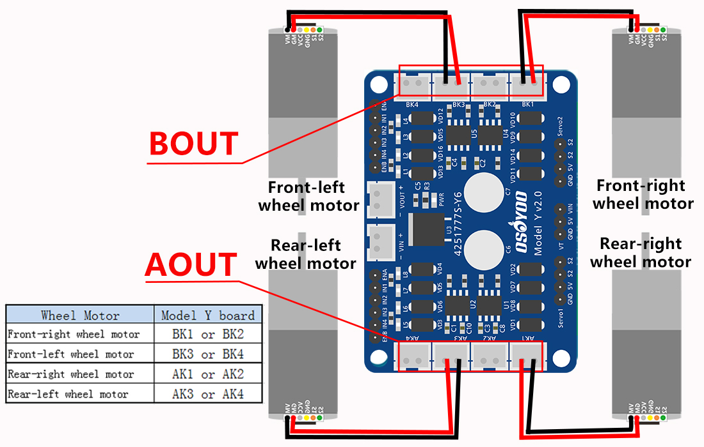

##

Initial draft -----, 2024

(This is a public document that can be modified by others who have access -- if anything doesn't make sense, please ignore. A year from now, for example, I may not be aware of the full contents of this document any longer or what is still current.) (No use of high voltage or anything dangerous is or should be specified in this document.) (Any illustrations are my own, generated by OpenAI GPT4 and modified by myself, or taken from open technical sites. Reproduction is limited for "fair use" or else not allowed if prohibited by law. Software/documentation/logo belongs/(c)/tm the PetitCat project/creators but is allowed for "fair use" or else not allowed if prohibited by law. Usage is "as is" -- user should consider and treat as experimental.)

(Questions, corrections, suggestions? -- please contact me: hschneidermd@alum.mit.edu  
Howard Schneider -- Feb 15, 2024)
##


# An Easy-to-Read Overview of the Robot Car ("PetitCat") Project
# Part III


-
 
-

<h2 style="font-size: 24px;">The PetitCat Project </h2>


The "Easy-to-Read Overview" of the project is divided into a number of parts:

**Part I:** The Basics: Assembly, Software and Using

**Part II:** Modifying the Robot Car for Python Control

**Part III:** Interfacing your Python Code with the PetitCat Project

**Part IV:** Modifying the C/C++ for your Selected Robotic Embodiment

**Part V:** Integration of PetitCat with a Causal Cognitive Architecture

**Part VI:** Integration of PetitCat with a Large Language Model

**Part VII:** Active Inference of the Robot Car


The PetitCat documentation is written so that anyone with a basic education can read it and understand it. Having a deeper breadth of knowledge in software development, AI, or cognitive science, can, of course, allow greater appreciation for certain aspects of the project.

-Part I does not require any specialized background knowledge. You should be familiar with moving files around in either your Windows, Mac or Linux desktop/laptop computer. Other than that, no specialized knoweldge is needed. Part I is perfectly fine for high school students and hobbyists.

-Part II may be fine for high school students, college students and hobbyists as well, given a willingness of some effort to learn things here and there. However, the documentation will guide you on this learning journey. The lower level software of the PetitCat project is written in C\C++ in the Arduino IDE. You don't need to know these languages or environment in order to use Python with the project. However, we provide a very basic C\C++\Arduino tutorial which may be sufficient for most readers who do want to have a bit more control over the Arduino board coding. We just touch upon the Python control of the project at the end of Part II, so you are not expected to have much Python knowledge in this part, unless you want to start modifying the Python files.

-Part III is where the PetitCat project becomes more useful -- interfacing the Python code of your AI/AGI project with the PetitCat projects.

-Part IV allows you to modify the Arduino C/C++ code to use other robotic embodiments than the default robot car, or to add addtional sensors and actuators to the robot car.

-In Part V and VI we will integrate the PetitCat project with a cognitive architecture and then a large language model. Again, in this part, only intermediate (or even novice) Python coding abilities are required. However, we will gently guide you through the project, so that you end up with a super-human intelligent grounded autonomous robot system.

-Part VII really only requires some knowledge of Python. You do not have to be an expert developer. More important, is perhaps a background in AI or cognitive science. However, there is no real background prerequisite here. Regardless of the reader's background, we provide gentle tutorials on a number of topics, and guide the learner through the concepts of active inference and implementing it in the PetitCat project.

-

-

# Part III: Interfacing your Python Code with the PetitCat Project

-
-

<h1 style="font-size: 24px;">Step #1 -- Time to Get Serious</h1>

Regardless of your skill level, you have made it this far -- you have built a robot car with your hands, you have learned how to move software around (Part I) and then you learned how to write some software in C/C++, build electronic circuits and make the software control the electronics (Part II). 

In Part I you became familiar with the hardware and software systems we are using. In this Part II you developed more experience with the software and you transitioned from the Osoyoo pre-canned demonstration programs to a more serious use of the robot car. At this point your robot car should be controllable from Python code running on your desktop/laptop. If not, then please go back to the previous Part II and make sure it is working, before continuing in this Part III.

Ok... you successfully completed Part II and have a robot car you can control from your Python code. Now here you are. In this Part III we will start doing a bit more serious work. But, regardless of your skill level or experience, do not worry -- this manual will gently guide you through the steps.

In this Part III we will explore a bit more the software we just finished compiling and installing in Part II. We will also further modify the robot car, starting with changing the wiring of the servomechanism shortly below. Then we will go on to further modify our robot car with a digital compass, inertial measurement unit and a color sensor. Then we will consider the Python code controlling all this. If you don't know how to code in Python there are many excellent free courses available and you can still do this project. (However, I am assuming anyone doing this project and wanting to interface real-world hardware with their Python code, knows how to code the latter.) Then we will move on to consider Active Inference and how the robot car demonstrates this important principle. 

You made it this far, and you will succeed again in this part.  Get on that horse. Saddle up!!  


<p align="center">
 
</p>


-

<h1 style="font-size: 24px;">Step #2 -- Rewiring the ServoMechanism</h1>


## The head servo is overheating


# thinking..... writing..... thinking..... writing....


This may be because you left the servo head connected to Pin 13.
Please make sure you moved it to Pin 6 as explained in [Modify some wiring](Assemby-the-robot.md#modify-some-wiring).

Pin 13 is used to control the built-in LED of the Arduino board. 
The petitcat arduino code sends a fast on/off signal to Pin 13 to make the LED blink quickly to indicate that the robot is waiting for a wifi command. 
If Pin 13 is connected to the head servo, the servo won't move but will overheat. 

## The robot moves backward

In some versions of the Osoyoo robot, the wheel wiring is backward. 
You may invert the wheel wiring or set negative coefficients to wheels in `robot_define.h` like this:

```
#define REAR_RIGHT_WHEEL_COEF -1
#define REAR_LEFT_WHEEL_COEF -1
#define FRONT_RIGHT_WHEEL_COEF -1
#define FRONT_LEFT_WHEEL_COEF -1
```

## Optionally change the servo

The servo `LACC200610` provided by Osoyoo was jittering when the wheels were moving. I replaced it with the `SG90` servo from my Elegoo kit, which solved the problem.


# Modify some wiring

We have modified some wiring from the original osoyoo robot as listed in Table 1.

Table 1: Wiring modification

|Original |Modified ||
|---|---|---|
|5|23| Rear  Right Motor direction pin 1|
|6|25| Rear  Right Motor direction pin 2|
|13|6|Head servo pin|

Pins 5 and 6 were moved to 23 and 25 because they don't need the PWM functionality. These pins are declared in the file `Wheel.h`.

Pin 13 was moved to pin 6 because we are using the arduino onboard LED that is also connected to Pin 13. The head servo pin is declared in the file `Robot_define.h`.
-
-
-


.....


# thinking..... writing..... thinking..... writing....


**Step # --Installing the Digital Compass and Intertial Measurement Unit --**

.....

.....

-
-
-
-

**Step # --Installing the Color Sensor --**

......

......
-
-
-
-


**Step #  --Full Testing of the PetitCat Code: Python <--> Arduino --**

......

......
-
-
-
-

**Step --  --Using the PetitCat Code: Active Inference  --**
.....

.....
-
-
-


****

(This is a public document that can be modified by others who have access -- if anything doesn't make sense, please ignore.)
(No use of high voltage or anything dangerous is or should be specified in this document.)

-
-


<p align="center">
 
</p>


-
-


end of document
****
##


