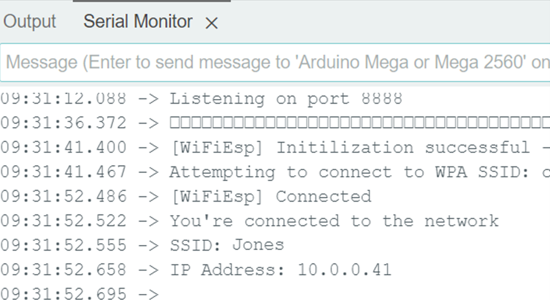
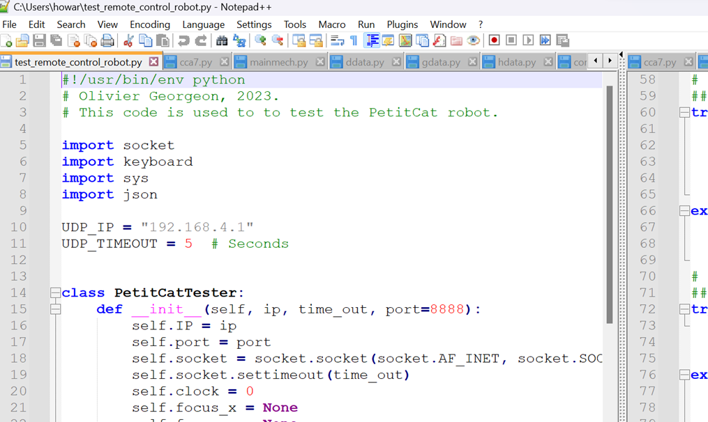
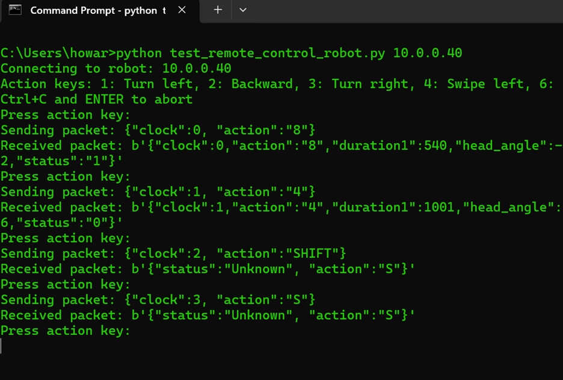

##

# PETITCAT PROJECT DISCLAIMER

**Date:** July 1, 2024

This is a public document that can be modified by others who have access. If anything doesn't make sense, please ignore it. Original contributors may not be aware of the full contents of this document or what is still current over time.

**Safety Notice:**
No use of high voltage or anything dangerous is or should be specified in this document. Any illustrations are or should be contributors' own, generated by ethical generative software and modified by themselves, or taken from open technical sites. No unethical content should be included. 

**Copyright and Fair Use:**
Reproduction is limited to "fair use" or otherwise not allowed if prohibited by law. Software, documentation, and logo belong to (c) and (tm) the PetitCat project and creators but are allowed for "fair use" or otherwise not allowed if prohibited by law. Usage is "as is"—users should consider and treat this project as experimental.

**Project Nature:**
This is a multiple-person open-source GitHub project. Note that this project is distributed in the hope that it will be useful, but WITHOUT ANY WARRANTY; without even the implied warranty of MERCHANTABILITY or FITNESS FOR A PARTICULAR PURPOSE. See the license indicated on the GitHub site for more information. If no license is specified, then by default the MIT License or the Apache-2 License applies:
- [MIT License](https://opensource.org/licenses/MIT)
- [Apache License](https://opensource.org/licenses/Apache-2.0)

**Content and Contributions:**
All content included in this project, such as code, documentation, and related materials, should be created by the contributors of this project or should be open-source software components. To the best of our knowledge, all content complies with copyright laws and is either original or used with permission. If any content should not be here, please advise, and a correction will be made in a suitable time period. Note that material in this project can be modified by members of the public once they join the project, and other members are not responsible for changes by one member.

**Patent Disclaimer:**
We, the contributors of this project, do not provide any warranty or guarantee that the use, distribution, or modification of this project does not infringe on any patents. It is the responsibility of the user or distributor of this project to ensure compliance with any applicable patent laws. This project should be used for non-commercial purposes only.

**Liability:**
By using this project, you agree that you are solely responsible for any legal issues or liabilities that may arise. The contributors of this project shall not be held liable for any direct, indirect, incidental, or consequential damages arising from the use, distribution, or modification of this project. Do NOT use this project for any mission-critical (including any health) projects.

**Contributions:**
If you contribute to this project, you assert that your contributions are given freely and are your original work and do not violate any third-party copyrights, patents, or other intellectual property rights. You grant permission for your contributions to be used in this project under the project's open-source license.

**Contact:**
If any content should not be here or if there are any legal concerns, please advise, and a correction will be made in a suitable time period.

##

# An Easy-to-Read Overview of the Robot Car ("PetitCat") Project
# Part III

-
 
-

<h2 style="font-size: 24px;">The PetitCat Project </h2>

---------------

Step by step explanations for beginners and researchers alike. The documentation is intended to give any user a pleasant experience with the project regardless of how seriously they intend to make use of the project. An issue for many researchers in using GitHub software is that it more often fails to work (or work properly) mainly because the thousands of litte things in the heads of the developers are not made clear to the non-involved user. Here we have gone to the other extreme, to make sure that the hardware and software will work for any user, although the more advanced topics are geared towards researchers rather than students. We have paid much attention to the main causes of poor GitHub and other open source software usability: incomplete documentation, dependency issues, environment configuration, version mismatches, non-graceful error handling, permissions and access, network/connectivity issues, stability, indadequate testing, user prerequisite knowledge. Easy-to-read, guaranteed-to-work and inexpensive may surprise you in producing an example of a superhuman AGI with robotic embodiment.

----------------

The "Easy-to-Read Overview" of the project is divided into a number of parts:

**Part I:** The Basics: Assembly, Software and Using

**Part II:** Modifying the Robot Car for Python Control

**Part III:** Interfacing your Python Code with the PetitCat Project

**Part IV:** Modifying the C/C++ for your Selected Robotic Embodiment

**Part V:** Integration of PetitCat with a Causal Cognitive Architecture

**Part VI:** Integration of PetitCat with a Large Language Model

**Part VII:** Active Inference of the Robot Car

The PetitCat documentation is written so that anyone with a basic education can read it and understand it. Having a deeper breadth of knowledge in software development, AI, or cognitive science, can, of course, allow greater appreciation for certain aspects of the project.

-Part I does not require any specialized background knowledge. You should be familiar with moving files around in either your Windows, Mac or Linux desktop/laptop computer. Other than that, no specialized knoweldge is needed. Part I is perfectly fine for high school students and hobbyists.

-Part II may be fine for high school students, college students and hobbyists as well, given a willingness of some effort to learn things here and there. However, the documentation will guide you on this learning journey. The lower level software of the PetitCat project is written in C\C++ in the Arduino IDE. You don't need to know these languages or environment in order to use Python with the project. However, we provide a very basic C\C++\Arduino tutorial which may be sufficient for most readers who do want to have a bit more control over the Arduino board coding. We just touch upon the Python control of the project at the end of Part II, so you are not expected to have much Python knowledge in this part, unless you want to start modifying the Python files.

-Part III is where the PetitCat project becomes more useful -- interfacing the Python code of your AI/AGI project with the PetitCat projects.

-Part IV allows you to modify the Arduino C/C++ code to use other robotic embodiments than the default robot car, or to add addtional sensors and actuators to the robot car.

-In Parts V and VI we will integrate the PetitCat project with a cognitive architecture and then a large language model. Again, in this part, only intermediate (or even novice) Python coding abilities are required. However, we will gently guide you through the project, so that you end up with a super-human intelligent grounded autonomous robot system.

-Part VII really only requires some knowledge of Python. You do not have to be an expert developer. More important, is perhaps a background in AI or cognitive science. However, there is no real background prerequisite here. Regardless of the reader's background, we provide gentle tutorials on a number of topics, and guide the learner through the concepts of active inference and implementing it in the PetitCat project.

-

# Part III: Interfacing your Python Code with the PetitCat Project

-
-

<h1 style="font-size: 24px;">Step #1 -- Time to Get Serious</h1>

Regardless of your skill level, you have made it this far -- you have built a robot car with your hands, you have learned how to move software around (Part I) and then you learned how to write some software in C/C++, build electronic circuits and make the software control the electronics (Part II). 

In Part I you became familiar with the hardware and software systems we are using. In Part II you developed more experience with the software and you transitioned from the Osoyoo pre-canned demonstration programs to a more serious use of the robot car. If you are an experienced researcher then this was largely a review of material you knew, albeit applied to a slightly different software/hardware environment. If you are student then this was an opportunity to learn a wide range of subject material that will benefit you regardless of your future endeavors.

At this point your robot car should be controllable from Python code running on your desktop/laptop. If not, then please go back to the previous Part II and make sure it is working, before continuing in this Part III. (Actually in the next Step we will verify this!!)

Ok... you successfully completed Part II and have a robot car you can control from your Python code. Now here you are. In this Part III we will start doing a bit more serious work. But, regardless of your skill level or experience, do not worry -- this manual will gently guide you through the steps.

In this Part III we will explore a bit more the software we just finished compiling and installing in Part II. We will transition to a Python module which you can use with your existing AI/AGI software, albeit, Python code. Thus, you will readily have a grounded embodiment for your AI/AGI code with a very reasonable learning curve. If you are a student and don't have pre-existing AI/AGI software, then we will create some. (In future parts you will be provided with the source code for a full cognitive architecture and can interface that code to the robotic car or other robotic embodiment you are using.)

You made it this far, and you will succeed again in this part.  Get on that horse. Saddle up!!  

 

-

-

<h1 style="font-size: 24px;">Step #2 -- Review of the Project Hardware and Software </h1>

In the 1950s a Japanese educator, Toru Kumon, developed a method to enable his own son to progress more rapidly through mathematics. In 1958 the Kumon Math teaching system was established and proved very successful compared to typical public school teaching methods in mathematics.

Ironically, the Kumon system focused on methods which are antithetical to the principles of mathematics -- memorization and review. However, the reality is that memorization and review of the foundational mathematical facts and procedures seem to work best for the human brain to then be in a stronger position to appreciate the true essence of the subject, i.e., discovering methods and theories, problem solving, logical reasoning and critical thinking.  And so, in this spirit, let's very quickly review the previous two parts in terms of the performance of the robotic car.

<h1 style="font-size: 24px;">i : Does Basic Robotic Car and Wi-Fi Control Work? </h1>
-
-Open the Arduino IDE.

-Click 'Open' and load in m2-lesson5b.ino 
-Then attach the USB cable to the Arduino board connector on the robot car.

-You may now need to tell the software what your Wi-Fi SSID and password are (if this isn't already there from Part II).

For example, if the name of the network you log into is "Jones" then your SSID is "Jones" and if the password to log into your Wi-Fi is "test1234" then your password is "test1234".

--> Look at lines 180 and 181 (or equivalent lines if the software has changed since the time of this writing).  Modify the lines as follows:

char ssid[] = "Jones"

char pass[] = "test1234"

-Now click the upload arrow (green arrow inside a circle at the top left corner).

-The software in m2-lesson5b.ino (modified with your Wi-Fi SSID and password) will now be uploaded to the Arduino board in your robotic car.

-Now open the Serial Monitor on the Arduino IDE. You will see something like this written:

Write down the IP address you, in this example, it would be "10.0.0.41" -- you will need this address for the App running on your smartphone -- it will tell the App where the robot car is connected.

--Phone APP software--

You have already downloaded the phone app in Part I and Part II. 

In case you did not do this or you un-installed the app from your phone:

-If you have an Apple phone then you will go to the Apple Store

-However, since I have an Android phone (Pixel 7) I will go to the Google Play store

-The Osoyoo Manual Lesson 5 advises to search "Osoyoo Wifi UDP Robot Car Controller"

-Unfortunately when I do this search (Feb 9, 2024) the only app that appears in the Google Play store is "Osoyoo IoT UDP Robot APP" -- well, better than nothing, and maybe it will do the same thing.... so this app is installed on my Android cellphone

---> Your smartphone App is installed. (Whether it is called "Osoyoo Wifi UDP Robot Car Controller" or "Osoyoo IoT UDP Robot APP").

Now we have to go to the settings section of the phone App.

-Ok we open the Osoyoo IoT UDP Robot APP

-Then go to Settings and enter the IP address we saw in the Serial Monitor. In this example, we would enter "10.0.0.41" (you will enter, of course, the IP address your Serial Monitor showed you -- this is the address the robot car is using).

-You can leave the other settings such as the default Ports unchanged

Your smartphone App should now be able to control your robot car. Let's try it out.

-Ok...now go to the main page of the app.

-Ok... turn on the robot car

-Now, let's click a button on the app.... go forward

The car goes forward.

Click backwards, left and right.

They all work .... we can control the robot car via Wi-Fi. Note that both the robot car and cellphone are attached to the same house/workplace Wi-Fi router.

(If this does not work, then go back to Parts 1 and 2 to troubleshoot any issues you may be having with your hardware, software or Wi-Fi environment.)

 

-

<h1 style="font-size: 24px;">ii : Does Robotic Car and Python Wi-Fi Control Work? </h1>

If you recall from Part II, the arduino_secrets.h file contains your home (or workplace) Wi-Fi identifying information and login password, hence its name and why it is kept separate from the other files in the GitHub repository.

--> You should have already copied "arduino_secrets.h" to \src\wifi of your Arduino PetitCat project. If not follow the steps below:

-------------------
(On my computer the Arduino Sketchbook is c:\Users\howar\OneDrive\Documents\Arduino. The full path to the wifi subfolder on my computer is : c:\Users\howar\OneDrive\Documents\Arduino\petitcat_arduino\src\wifi  -- your computer will have a different path, but it will also end with "\petitcat_arduino\src\wifi")

--> If you don't have a file "arduino_secrets.h" in the \src\wifi subfolder of your Arduino PetitCat project, then take a look again at Part II, or else just use any text or programmming editor to create a file "arduino_secrets.h" containing the following lines:

<b>#define SECRET_WIFI_TYPE "STA" // Access point : "AP" pr Station (through router): "STA"

#define SECRET_SSID "Your wifi SSID"

#define SECRET_PASS "Your password"</b>

--> Modify (and then save) the file "arduino_secrets.h" with the Wi-Fi information. For sake of example, below we are showing the same network info we used in the demo example in Step 2 above:

<b>#define SECRET_WIFI_TYPE "STA" // Access point : "AP" pr Station (through router): "STA"

#define SECRET_SSID "Jones"

#define SECRET_PASS "test1234"</b>

--> The PetitCat project file in the Arduino IDE (which will be uploaded to the robot car) now has your Wi-Fi network information required to attached to the same network your laptop/desktop computer is running (and from which you will communicate with the robot car via your Python programs).

-------------------
-
-

Go to the Arduino IDE. Click 'File', 'Sketchbook', 'Osoyoo'.  Open the project "petitcat_arduino.ino" 

(Or, click 'File', 'Open Recent' and you may see "petitcat_arduino.ino" there already -- click it.)

Make sure the robot car is plugged into the USB port of your computer.

Click the green circle with the right-pointing arrow (which actually is the second circle in the left-hand upper corner) -- the Arduino code will automatically compile and upload to the Arduino board of the robot car.

Click Serial Monitor. (If no IP address is shown in the Serial Monitor when we run our code then go back to Part II to troubleshoot this problem.)

Note the IP Address shown in the Serial Monitor.

-
-

You need to have a working copy of Python on your laptop/desktop computer and some sort of programming environment to use it in. You may be using an advanced IDE such as Visual Studio IDE or PyCharm or a more streamlined development environment (e.g., such as Notepad++ operating in the terminal, which is what I am using). 

Tip: Do not download the latest version. It may not be fully stable, as well as dependencies creep into your project, the latest version of Python often is not compatible with older dependencies whose developers have not updated them yet. Download a recent, stable version of Python. At the time of writing, I have Python 3.11.4 running on my computer although at python.org the latest release is at the time of writing version 3.12.2 (considered stable) or  version 3.13 (newest version available). 

Go to https://github.com/OlivierGeorgeon/osoyoo/tree/master/tests  and copy the file "test_remote_control_robot.py" into your Python environment.

In my case I loaded this file into my Python development tool Notepad++ :

-
Before running a Python program take a look at it quickly. What will it do? Anything strange to the system? What about imports? Are there any imports requring installation of libraries from PyPI or an external library? The import's of socket, keyboard, sys and json all come from the standard library, so nothing special for us to do.

-
-

-The Arduino code was successfully compiled and uploaded to the robot car. (Well... it indeed successfully compiled and uploaded. However, on the Serial Monitor we did not see the Wi-Fi/IP information that we expected it to display.)

-Ok.... now let's run the program test_remote_control_robot.py :

You need to provide this IP Address to the Python code so it knows how to address the PetitCat robot car.

For example, if the IP Address is 10.0.0.40 then at the command line write:

>python test_remote_control_robot.py 10.0.0.40

Ok, let's try it out....

-

-

Success!!  Everything seems to run ok.

Now let's try it out. Unplug the robot car from the USB and put it down on the floor. Enter an '8' into the keyboard attached to the computer running the Python code. The car goes forward. Then enter a '2' -- the car goes backwards.  Let's try moving the servomechansim -- that works also. Success!!

Ok.... we know that the basic hardware, software (both Arduino level and Python level) and Wi-Fi connectivity all work. 

(If this does not work, then go back to Part 2 to troubleshoot any issues you may be having with your hardware, software or Wi-Fi environment.)

---------------

Note regarding forward and reverse directions of the wheels. You may have found that in section i (i.e., Lesson 5.2b Osoyoo software) above the wheels were turning in the opposite direction of the remote control arrows but were no sure of the arrows direction -- actually the wheels were turning in the opposite direction. However, in this section ii (i.e., controlling the robotic car with the Python program via Wi-Fi, the wheels appear to following the correct directions. That is fine.

See Part II for troubleshooting regarding the wheel direction, if there is a problem. However, if wheel direction with the Python program is correct, that is fine.

---------------

 

-

<h1 style="font-size: 24px;">Step #3 -- Use the petitcat2.py Module to Interface Your AI/AGI Code with the Robotic Car" </h1>

-------------------

PENDING
WORK IS NOT COMPLETE

NOTE: THIS IS INCOMPLETE CODE QUICKLY WRITTEN IN 1/2 HOUR (however, it does work)
IT IS SIMPLY TO SHOW THE CONCEPT OF HAVING AN INTERFACE BETWEEN ONE'S AI/AGI PYTHON CODE AND A ROBOTIC EMBODIMENT

WORK PENDING TO COMPLETE THIS MODULE

-------------------

Go to https://github.com/OlivierGeorgeon/osoyoo/tree/master/tests  and copy the file "petitcat2.py" to your Python environment.

Now turn on the robotic car. If the same "petitcat_arduino.ino" code is still saved on the robotic car and if your router's IP addresses have not changed since you tried out the car above in Step #2, then there is nothing do other than turn on the car. 

(However, if you are not sure, plug the USB into the car and your computer. Open up the Arduino IDE. Upload the "petitcat_arduino.ino" code to the car. Look at the Serial Monitor for the IP address to use. If there are any issues with these steps please see the previous Step #2 or for further troubleshooting the documentation in Part #2. However, if you just completed Step #2 then this should work without problem.)

Now in your Python environment (e.g., in Windows I am using the terminal and will show examples from there), run the program "petitcat2.py". 

The demo program is self-explanatory and you can try it out.

Please see the screen capture of my Windows terminal to see what it should look like:

-

 

-

If you look at the Python code, you see that this module provides a class to control the PetitCat robotic device, which by default is the robotic car.

The purpose is to ground your AI/AGI project in the real world by providing access to such embodiments.

The PetitCat project has a number of more advanced modules allowing, for example, active inference. These are discussed later.

This module, however, is to provide the basics of providing your AI/AGI project with an embodiment.

Summary of Module: It allows sending motor commands and receiving sensory inputs to/from the robotic device.

Nomenclature of saved files: petitcatN.py   e.g., petitcat2.py
This file will on its own allow your AI/AGI project access to a robotic device embodiment.

Example usage:

    Run the program from the command line, optionally providing the IP address as a command-line argument:
    
    python petitcat2.py <robot_ip>

    If no IP address is provided on the command line, the program will prompt the user with the updated message to input the IP address.
    
    You can find this IP address from the Arduino serial monitor after the USB cable is plugged into the device and Arduino
    code is downloaded (or already on the robotic device)
    (This IP address will be fetched automatically in future enhancements to the project.)

    Example motor command
    
    motor_code = input("Enter motor command: ")
    
    response = controller.motor_command(motor_code)
    
    print("Motor Command Response:", response)
    

    Example sensory input request
    
    sensory_system = input("Enter sensory system (ultrasound/ir): ")
    
    response = controller.sensory_input(sensory_system)
    
    print("Sensory Input Response:", response)

-
-

You can try this module quickly out with any of your own Python code -- it should work without problem.

Consider this silly program "sillyHdemo.py" to have the robot car to trace out the letter "H". 

It uses the "petitcat2.py" module to interface to the robotic car and have it go through the silly motions of tracing out the letter "H".

Go to https://github.com/OlivierGeorgeon/osoyoo/tree/master/tests  and copy the file "sillyHdemo.py" to your Python environment.

Experiment a bit with the "petitcat2.py" module, and in the next Step we will consider its use in more depth in grounding your AI/AGI project.

-
-

<h1 style="font-size: 24px;">Step #4 --  Using the petitcat2.py Module in More Depth" </h1>
-

Ok... at this point you have used the "petitcat2.py" module to quickly interface your own Python code (or tried the litte demo code provided) to the robotic car.

Let's consider the "petitcat2.py" module in more detail here.

TO DO

PENDING

-
-

<h1 style="font-size: 24px;">Step #5 -- Advanced Features of the petitcat2.py Module" </h1>
-
TO DO

PENDING

-

<h1 style="font-size: 24px;">Steps #6,7,8 -- Installing PetitCatMain1.py </h1>

We will now install "PetitCatMain1.py".

Cloning of directory structure....

Perhaps introduce venv virtual environments?

Explaining what concepts code is working on.....

TO DO

PENDING

-

-

.....

--
--

 

-

 

-
-

end of document
****
##

