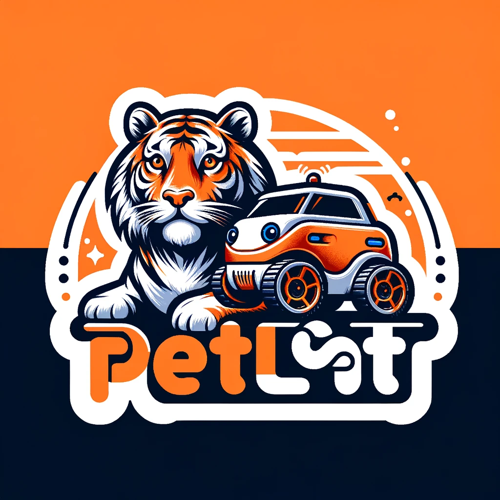

# PETITCAT PROJECT DISCLAIMER

**Date:** July 1, 2024

This is a public document that can be modified by others who have access. If anything doesn't make sense, please ignore it. Original contributors may not be aware of the full contents of this document or what is still current over time.

**Safety Notice:**
No use of high voltage or anything dangerous is or should be specified in this document. Any illustrations are or should be contributors' own, generated by ethical generative software and modified by themselves, or taken from open technical sites. No unethical content should be included. 

**Copyright and Fair Use:**
Reproduction is limited to "fair use" or otherwise not allowed if prohibited by law. Software, documentation, and logo belong to (c) and (tm) the PetitCat project and creators but are allowed for "fair use" or otherwise not allowed if prohibited by law. Usage is "as is"—users should consider and treat this project as experimental.

**Project Nature:**
This is a multiple-person open-source GitHub project. Note that this project is distributed in the hope that it will be useful, but WITHOUT ANY WARRANTY; without even the implied warranty of MERCHANTABILITY or FITNESS FOR A PARTICULAR PURPOSE. See the license indicated on the GitHub site for more information. If no license is specified, then by default the MIT License or the Apache-2 License applies:
- [MIT License](https://opensource.org/licenses/MIT)
- [Apache License](https://opensource.org/licenses/Apache-2.0)

**Content and Contributions:**
All content included in this project, such as code, documentation, and related materials, should be created by the contributors of this project or should be open-source software components. To the best of our knowledge, all content complies with copyright laws and is either original or used with permission. If any content should not be here, please advise, and a correction will be made in a suitable time period. Note that material in this project can be modified by members of the public once they join the project, and other members are not responsible for changes by one member.

**Patent Disclaimer:**
We, the contributors of this project, do not provide any warranty or guarantee that the use, distribution, or modification of this project does not infringe on any patents. It is the responsibility of the user or distributor of this project to ensure compliance with any applicable patent laws. This project should be used for non-commercial purposes only.

**Liability:**
By using this project, you agree that you are solely responsible for any legal issues or liabilities that may arise. The contributors of this project shall not be held liable for any direct, indirect, incidental, or consequential damages arising from the use, distribution, or modification of this project. Do NOT use this project for any mission-critical (including any health) projects.

**Contributions:**
If you contribute to this project, you assert that your contributions are given freely and are your original work and do not violate any third-party copyrights, patents, or other intellectual property rights. You grant permission for your contributions to be used in this project under the project's open-source license.

**Contact:**
If any content should not be here or if there are any legal concerns, please advise, and a correction will be made in a suitable time period.

## 

# An Easy-to-Read Overview of the Robot Car ("PetitCat") Project
# Part VII

## The PetitCat Project

---------------

Step by step explanations for beginners and researchers alike. The documentation is intended to give any user a pleasant experience with the project regardless of how seriously they intend to make use of the project. An issue for many researchers in using GitHub software is that it more often fails to work (or work properly) mainly because the thousands of litte things in the heads of the developers are not made clear to the non-involved user. Here we have gone to the other extreme, to make sure that the hardware and software will work for any user, although the more advanced topics are geared towards researchers rather than students. We have paid much attention to the main causes of poor GitHub and other open source software usability: incomplete documentation, dependency issues, environment configuration, version mismatches, non-graceful error handling, permissions and access, network/connectivity issues, stability, indadequate testing, user prerequisite knowledge. Easy-to-read, guaranteed-to-work and inexpensive may surprise you in producing an example of a superhuman AGI with robotic embodiment.

----------------

The "Easy-to-Read Overview" of the project is divided into a number of parts:

**Part I:** The Basics: Assembly, Software and Using

**Part II:** Modifying the Robot Car for Python Control

**Part III:** Interfacing your Python Code with the PetitCat Project

**Part IV:** Modifying the C/C++ for your Selected Robotic Embodiment

**Part V:** Integration of PetitCat with a Causal Cognitive Architecture

**Part VI:** Integration of PetitCat with a Large Language Model

**Part VII:** Active Inference of the Robot Car

The PetitCat documentation is written so that anyone with a basic education can read it and understand it. Having a deeper breadth of knowledge in software development, AI, or cognitive science, can, of course, allow greater appreciation for certain aspects of the project.

- Part I does not require any specialized background knowledge. You should be familiar with moving files around in either your Windows, Mac or Linux desktop/laptop computer. Other than that, no specialized knoweldge is needed. Part I is perfectly fine for high school students and hobbyists.

- Part II may be fine for high school students, college students and hobbyists as well, given a willingness of some effort to learn things here and there. However, the documentation will guide you on this learning journey. The lower level software of the PetitCat project is written in C\C++ in the Arduino IDE. You don't need to know these languages or environment in order to use Python with the project. However, we provide a very basic C\C++\Arduino tutorial which may be sufficient for most readers who do want to have a bit more control over the Arduino board coding. We just touch upon the Python control of the project at the end of Part II, so you are not expected to have much Python knowledge in this part, unless you want to start modifying the Python files.

- Part III is where the PetitCat project becomes more useful -- interfacing the Python code of your AI/AGI project with the PetitCat projects.

- Part IV allows you to modify the Arduino C/C++ code to use other robotic embodiments than the default robot car, or to add addtional sensors and actuators to the robot car.

- In Parts V and VI we will integrate the PetitCat project with a cognitive architecture and then a large language model. Again, in this part, only intermediate (or even novice) Python coding abilities are required. However, we will gently guide you through the project, so that you end up with a super-human intelligent grounded autonomous robot system.

- Part VII really only requires some knowledge of Python. You do not have to be an expert developer. More important, is perhaps a background in AI or cognitive science. However, there is no real background prerequisite here. Regardless of the reader's background, we provide gentle tutorials on a number of topics, and guide the learner through the concepts of active inference and implementing it in the PetitCat project.

# Part VII: Active Inference with the PetitCat Project

-
-
-

## Step #1 -- 

-

Pending documentation....

-

 

.....

# pensant.... écrivant.... pensant.... écrivant...

(Yes..... borrowed from Proust's A la recherche du temps perdu -- something we all can relate to. Humans are not LLM's. Our ways of thinking and communicating (i.e., writing) are deeply human in method, and create our representation of the world around us with regard to space, time and memories of time.)

(Let us hope that future is human AGI and not alien AGI --  https://link.springer.com/chapter/10.1007/978-3-031-33469-6_24 )

-

-

-

-

.....

.....

# thinking..... writing..... thinking..... writing....

-
-
-

.....

.....

-
-
-

****

(This is a public document that can be modified by others who have access -- if anything doesn't make sense, please ignore.)
(No use of high voltage or anything dangerous is or should be specified in this document.)

-
-

 

-
-

end of document
****
