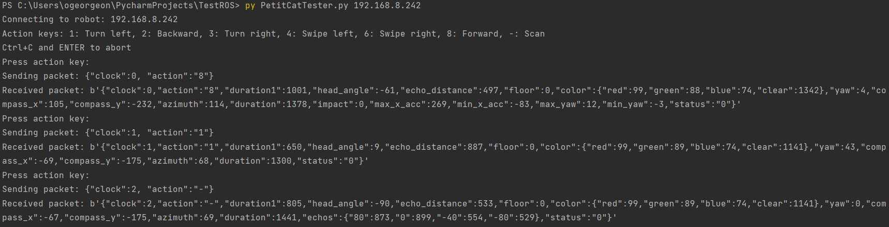

# Test the wifi connection with Robot

This page explains how to test the [PetitCat](https://github.com/OlivierGeorgeon/osoyoo/wiki) robot using the [test_remote_control_robot.py](../../tests/test_remote_control_robot.py) file. 
Alternatively, you can use the [test_remote_control_robot.ipynb](../../tests/test_remote_control_robot.ipynb) notebook.

## Run the test

Switch on the robot and read its IP address in the Arduino IDE terminal.

Make sure your PC is connected to the same wifi as the robot.

Clone this project or download the file [test_remote_control_robot.py](../../tests/test_remote_control_robot.py).

Run `test_remote_control_robot.py` with the IP address of you robot as an argument. For example: 

```
py test_remote_control_robot.py 192.168.8.242
```

Press the action keys (Table 1). The robot executes your commands. Your python terminal displays the logs as in Figure 1. 


Figure 1: The trace showing the enaction of three interactions

When you press a key, the program sends the command packet to the robot via UDP. The field `"clock"` is an incremental number. The field `"action"` is your key.
The robot executes your command and returns the outcome packet.  

If the wifi connection fails, the timeout is triggered and the outcome packet is `None`. The clock is not incremented.

If the robot receives a command packet containing a clock equal to the clock previously received, it does not re-execute the command, and it immediately resends the latest outcome packet.

Table 1 summarizes the recognized actions. The choice of keys was made for a standard keyboard numerical pad. 
These actions are interrupted if the robot detects a black line on the floor or an impact against an obstacle.

Table 1: Main recognized commands

|Action key| Command|
|---|---|
| 1 | Turn in the spot to the left by 45°|
| 2 | Move backward during 1000ms|
| 3 | Turn in the spot to the right by 45°|
| 4 | Swipe left during 1000ms|
| 6 | Swipe right during 1000ms|
| 8 | Move forward during 1000ms|
| - | Scan the environment with the head|

# Main command fields

Table 2 summarizes the main fields of the command packet sent to the robot. 
To try the optional fields, you must modify `test_remote_control_robot.py`.
Some optional fields only apply to some commands indicated in the _Command_ column.

|Field| Command | Status | Description |
|---|---|---|---|
| `"clock"` | all | Required | The incremental number of the interaction since startup. | 
| `"action"` | all | Required | The action code | 
| `"focus_x"` | all except -| Optional | The x coordinates of the focus point in mm |
| `"focus_y"` | all except -| Optional | The y coordinates of the focus point in mm |
| `"color"` | all | Optional | The color code of the emotion led: 0: off, 1: white, 2: green, 3: bleue, 4: red, 5: orange. |
| `"duration"` | 2, 4, 8| Optional | The duration of the translation in milliseconds| 
| `"angle"` | 1 | Optional | The angle of rotation in degrees. Negative angles turn right |
| `"span"` | - | Optional | The span of the saccades during the scan in degrees |
| `"caution"` | 8 | Optional | =1: move cautiously means stopping when touching an object|

During the interaction, the robot will keep its head towards the focus point defined by `"focus_x"` and `"focus_y"` coordinates. 

# Main outcome fields

Table 3 summarizes the main fields sent by the robots in the outcome packet.
Some fields are not returned for all the interactions.

Table 3: Main outcome fields.

|Field| Description |
|---|---|
| `"clock"` | The clock sent back for checking | 
| `"action"` | The action sent back for checking | 
| `"yaw"` | The angle of rotation during the interaction | 
| `"duration1"` | The duration of the interaction before interruption due to black line or impact | 
| `"head_angle"` | The direction of the head in degrees at the end of the interaction. 0° is forward. | 
| `"echo_distance"` | The distance of the ultrasonic echo in mm at the end of the interaction. | 
| `"floor"` | Black line detection event: 0: None, 1: right, 2: left, 3: front. | 
| `"color"` | RGB+Clear color measured by the floor color sensor at the end of the interaction| 
| `"azimuth"` | The azimuth in degrees (angle from North) measured by the compass in the IMU board | 
| `"duration"` | Total duration of the interaction in ms. | 
| `"impact"` | Impact event triggered by the IMU board: 0: None, 1: left, 2: right, 3: front. | 
| `"echoes"` | The array of echoes gathered during scanning. | 
| `"touch"` | The touch sensor senses an object in front of the robot (to be documented)|
