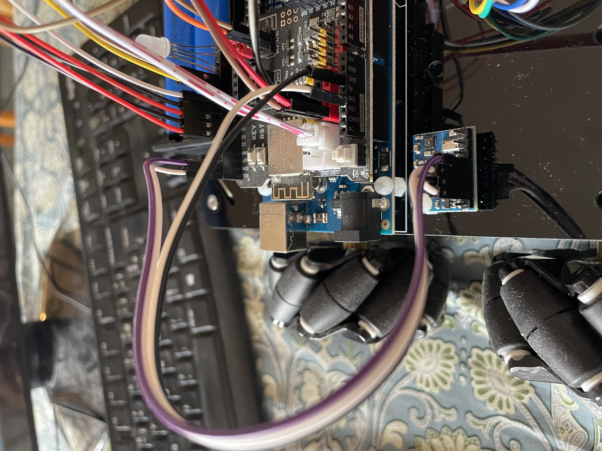

# Assembly the robot

Follow the instructions provided by OSOYOO: 
* [Model 1](https://osoyoo.com/2019/11/08/omni-direction-mecanum-wheel-robotic-kit-v1/)
* [Model 2](https://osoyoo.com/2022/07/05/v2-metal-mecanum-wheel-robotic-lesson1-robot-car-assembly-model-2021006600/)

## Optionally change the servo

The servo `LACC200610` provided by Osoyoo was jittering when the wheels were moving. I replaced it with the `SG90` servo from my Elegoo kit, which solved the problem.

# Modify some wiring

We have modified some wiring from the original osoyoo robot as listed in Table 1.

Table 1: Wiring modification

|Original |Modified ||
|---|---|---|
|5|23| Rear  Right Motor direction pin 1|
|6|25| Rear  Right Motor direction pin 2|
|13|6|Head servo pin|

Pins 5 and 6 were moved to 23 and 25 because they don't need the PWM functionality. These pins are declared in the file `Wheel.h`.

Pin 13 was moved to pin 6 because we are using the arduino onboard LED that is also connected to Pin 13. The head servo pin is declared in the file `Robot_define.h`.

# Connect the IMU card

Connect the IMU card to the wifi Shield following Table 2 and Figure 1. 
Note that the calibration offset varies significantly depending on the position of the card on the robot. 

Table 2: IMU Wiring

|GY-86 Imu|MEGA2560 Wifi Shield|
|---|---|
|Vcc|3v3|
|GND|GND|
|SCL|SCL|
|SDA|SDA|

Figure 1: wiring of GY-86 imu

# Connect the color sensor

Use the "long" two-hole version of the TCS34725. It has two LEDs, and the holes miraculously match holes on the robot platform (Figure 4).
Wire it to the Arduino MEGA according to Table 3. 
Use PINs 20 and 21 for SDA and SCL because the other SDA and SCL PINs are used for the IMU. They are the same. 
For the power line, I used the 3v yellow PINs on the Wifi Shield. 
Alternatively, the VIN PIN can be connected to a 5V PIN (red).

Figure 4: TCS34725 color sensor mounted on two 40 mm pillars between the front wheel motors

.jpg)
Figure 5: TCS34725 color sensor to Arduino MEGA wiring

Table 3: TCS34725 PIN connection

|TCS34725 |MEGA2560 ||
|---|---|---|
|3v3|3v| On the Wifi Shield, yellow slots|
|GND|GND| On the Wifi Shield, black|
|SDA|SDA 20| |
|SCL|SCL 21| |
|LED|53|Digital output|

More information on the [TCS34725 adafruit webpage](https://learn.adafruit.com/adafruit-color-sensors/overview).

# The emotion LED

Install a common cathode RGB LED as shown below. 

Figure 5: RGB LED with flat side on the left. The cathode is the longest lead.

Table 4: RGB LED connections

|RGB LED | |MEGA2560 / Wifi shield|
|---|---|---|
|Blue|| 2 |
|Green|| 3 |
|GND|10kΩ resistor| GND |
|Red|| 5 |

.jpg)
Figure 6: The common cathode RGB LED on pins 2, 3, 5, and its cathode connected to the ground via a 10kΩ resistor. Flat side on the right.