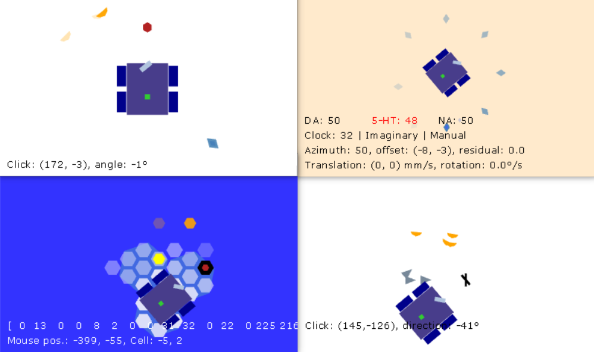

# Piloting PetitCat

Run `main.py` on a PC to open the windows shown in Figure 1. For example:

```
py -m main chezOlivier 1
```


Figure 1: Graphic User Interface

## Remote control the robot

Select any window of the PetitCat project and 
Press the control keys:

* `8` Move forward
* `2` Backward
* `4` Swipe left
* `6` Swipe right
* `1` Turn right
* `3` Turn left
* `-` Scan

The simulator shows the movement in the windows as the robot moves.
When the PC recieves the outcome from the robot, the views are updated to match the actual outcome.
The PC does not receive the outcome after a timeout, it resent the command. 
To stop the PC from resending the command, press `C` (Clear).

 
## Simulator

To enter simulator mode, select the window `Body memory` and press key `I` (Imagine).
The window displays `| Imaginary |`
Press the control keys. The commands will be simulated but not sent to the robot.